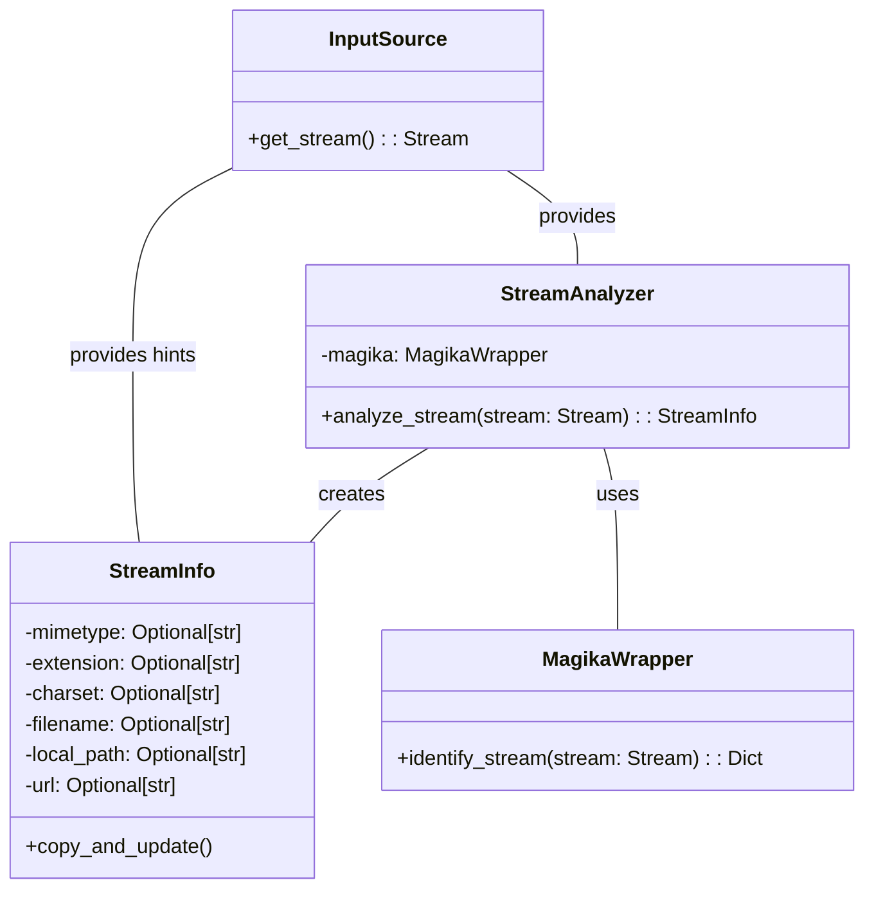

## Stream Analyzer Component Overview

This component analyzes input streams to determine their characteristics (MIME type, file extension, charset) using content-based analysis (Magika) and filename/URL hints. It provides educated guesses about the stream's nature to guide converter selection.

### Component Descriptions:

*   **StreamInfo**: A data class that stores information about an input stream, including its mimetype, extension, charset, filename, local path, and URL. It's used to determine the input type and how to convert it. It interacts with `StreamAnalyzer` by being created and populated with the analysis results.
    *   Relevant source files: `repos.markitdown.packages.markitdown.src.markitdown._stream_info.StreamInfo`

*   **StreamAnalyzer**: This component orchestrates the stream analysis process. It receives a stream from an `InputSource`, uses `MagikaWrapper` to identify the stream's content type, and creates/updates a `StreamInfo` object with the analysis results. It uses hints from the `InputSource` (filename, URL) to refine the analysis.
    *   Relevant source files: (Hypothetical) `repos.markitdown.packages.markitdown.src.markitdown.stream_analyzer.StreamAnalyzer`

*   **MagikaWrapper**: A wrapper around the Magika library, responsible for performing content-based analysis of the input stream. It takes a stream as input and returns a dictionary containing the identified MIME type and other relevant information. It's used by `StreamAnalyzer` to determine the stream's content type.
    *   Relevant source files: (Hypothetical) `repos.markitdown.packages.markitdown.src.markitdown.magika_wrapper.MagikaWrapper`

*   **InputSource**: Represents the source of the input stream (e.g., a file, a URL). It provides the stream to the `StreamAnalyzer` and may also provide hints about the stream's type (filename, URL). It interacts with `StreamAnalyzer` by providing the input stream and related hints.
    *   Relevant source files: (Hypothetical) `repos.markitdown.packages.markitdown.src.markitdown.input_source.InputSource`