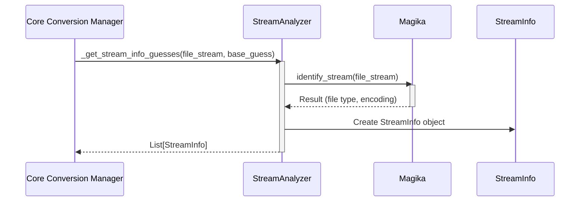

## Stream Analyzer Component Overview

The `Stream Analyzer` component is responsible for analyzing the input stream to determine its format and encoding. It provides crucial information to the `Core Conversion Manager` (represented by the `MarkItDown` class), enabling it to select the correct converter. The `StreamAnalyzer` uses `Magika` to identify the file type and encoding of the input stream.

**Component Details:**

- **StreamAnalyzer:** This component analyzes the input stream to determine its format and encoding. It uses `Magika` to identify the file type and encoding of the input stream and returns a list of `StreamInfo` objects.
  - *Purpose*: Analyzes the input stream and provides format/encoding information.
  - *Functionality*: Uses `Magika` to identify the stream's characteristics.
  - *Interaction*: Receives the stream from `MarkItDown` and returns a list of `StreamInfo` objects.
  - *Relevant source files*: `repos.markitdown.packages.markitdown.src.markitdown._markitdown.MarkItDown._get_stream_info_guesses`

- **Magika:** Used to identify the file type and encoding of the input stream. It helps in making informed decisions about which converter to use.
  - *Purpose*: Identifies file type and encoding.
  - *Functionality*: Analyzes the stream content.
  - *Interaction*: Called by `StreamAnalyzer`.
  - *Relevant source files*: `magika.Magika`

- **StreamInfo:** A data class to store and manage information about the input stream, such as mimetype, extension, charset, filename, local_path, and URL. It's used to pass stream metadata between different parts of the conversion process.
  - *Purpose*: Stores stream metadata.
  - *Functionality*: Holds information about the stream.
  - *Interaction*: Created and returned by `StreamAnalyzer`.
  - *Relevant source files*: `repos.markitdown.packages.markitdown.src.markitdown._stream_info.StreamInfo`

- **MarkItDown:** The main class responsible for converting Markdown content from various sources. It calls the `StreamAnalyzer` to get stream information.
  - *Purpose*: Orchestrates the conversion process.
  - *Functionality*: Calls `StreamAnalyzer` and selects appropriate converters.
  - *Interaction*: Calls `StreamAnalyzer` with the input stream.
  - *Relevant source files*: `repos.markitdown.packages.markitdown.src.markitdown._markitdown.MarkItDown`
