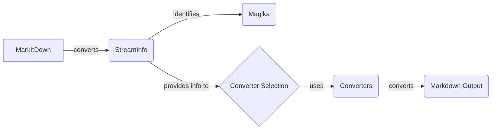

```markdown


## Components Description:

**Component:** `MarkItDown`
   - *Description*: The main class responsible for converting various input types to Markdown. It creates a `StreamInfo` object to store information about the input stream.
   - *Interaction*: Converts input to a stream and creates a `StreamInfo` object, passing it to subsequent components.
   - *Relevant Files*: `repos.markitdown.packages.markitdown.src.markitdown._markitdown.MarkItDown`

**Component:** `StreamInfo`
   - *Description*: A class that stores information about the input stream, such as MIME type, charset, filename, and URL. It uses `magika` to identify stream content and enhance stream information guesses.
   - *Interaction*: Receives the input stream and uses `Magika` to identify its type. Provides stream information to the `Converter Selection` component.
   - *Relevant Files*: `repos.markitdown.packages.markitdown.src.markitdown._stream_info.StreamInfo`

**Component:** `Magika`
   - *Description*: An external tool used to identify the MIME type and other information about the input stream.
   - *Interaction*: Called by `StreamInfo` to identify the stream's content.
   - *Relevant Files*: N/A (External dependency)

**Component:** `Converter Selection`
   - *Description*: Determines the appropriate converter based on the stream information.
   - *Interaction*: Receives stream information from `StreamInfo` and selects the appropriate converter from the `Converters` component.
   - *Relevant Files*: `repos.markitdown.packages.markitdown.src.markitdown._markitdown.MarkItDown._convert` (implicitly within the `_convert` method)

**Component:** `Converters`
   - *Description*: A package containing different converters for specific file types (e.g., PPTX, EPUB, HTML, ZIP).
   - *Interaction*: Receives the input stream and stream information from the `Converter Selection` component and converts the stream to Markdown.
   - *Relevant Files*: `repos.markitdown.packages.markitdown.src.markitdown.converters._pptx_converter.PptxConverter`, `repos.markitdown.packages.markitdown.src.markitdown.converters._epub_converter.EpubConverter`, `repos.markitdown.packages.markitdown.src.markitdown.converters._html_converter.HtmlConverter`, `repos.markitdown.packages.markitdown.src.markitdown.converters._zip_converter.ZipConverter`

**Component:** `Markdown Output`
   - *Description*: The final Markdown output generated by the converters.
   - *Interaction*: The final result of the conversion process.
   - *Relevant Files*: N/A (Output)
```