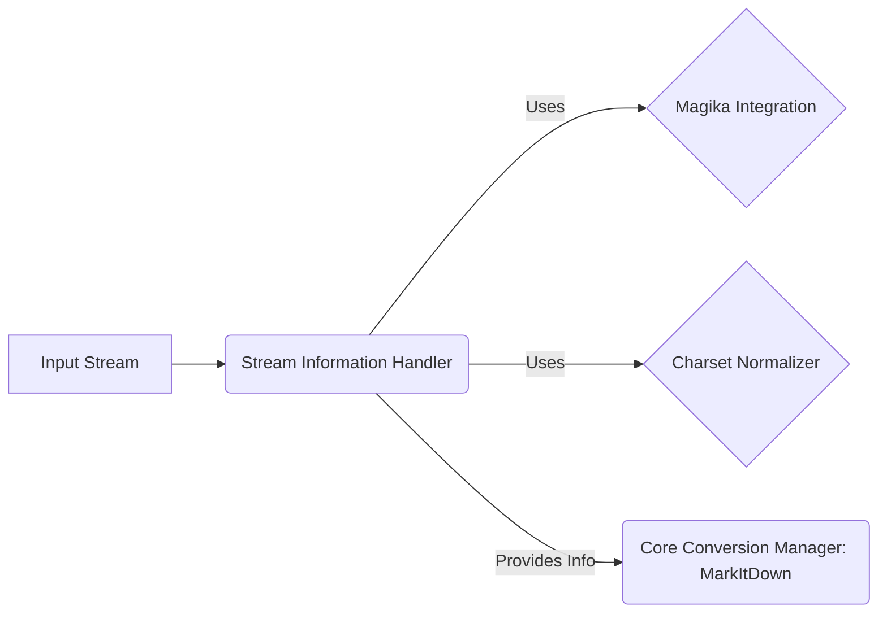

### Component Descriptions:

**A: Input Stream**
*Description*: Represents the data stream to be converted. This could be a file, a network stream, or any other source of data.
*Functionality*: Provides the raw data to the `Stream Information Handler` for analysis.
*Related Files*: N/A - Represents external input.

**B: Stream Information Handler**
*Description*: Analyzes the input stream to determine its type (e.g., MIME type, file extension) and character encoding. It provides this information to the Core Conversion Manager, enabling it to select the appropriate converter.
*Functionality*: Determines the stream's metadata, including MIME type, file extension, and character encoding.
*Related Files*:
    *   `repos.markitdown.packages.markitdown.src.markitdown._stream_info.StreamInfo`
    *   `repos.markitdown.packages.markitdown.src.markitdown._markitdown.MarkItDown._get_stream_info_guesses`
    *   `repos.markitdown.packages.markitdown.src.markitdown._markitdown.MarkItDown._normalize_charset`

**C: Magika Integration**
*Description*: Uses the `magika` library to identify the file type and encoding of the input stream.
*Functionality*: Provides accurate file type and encoding predictions based on the stream's content.
*Related Files*: `magika` library (external).

**D: Charset Normalizer**
*Description*: Employs the `charset_normalizer` library to detect and normalize the character encoding of text-based input streams.
*Functionality*: Ensures proper text conversion by detecting and normalizing character encoding.
*Related Files*: `charset_normalizer` library (external).

**E: Core Conversion Manager: MarkItDown**
*Description*: The main class responsible for converting various input formats to markdown. It uses the information provided by the `Stream Information Handler` to select the appropriate converter.
*Functionality*: Orchestrates the conversion process.
*Related Files*:
    *   `repos.markitdown.packages.markitdown.src.markitdown._markitdown.MarkItDown`
