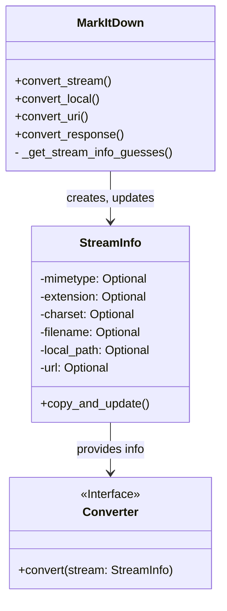

## Stream Information Handler Overview

The `Stream Information Handler` is responsible for managing and inferring information about the input stream. This information includes MIME type, extension, and charset, which are crucial for selecting the appropriate converter and processing the stream correctly. The central component is the `StreamInfo` data class, which stores all the relevant stream metadata.

### Component Description

**StreamInfo**
*   **Purpose**: A data class that holds information about the input stream, such as mimetype, extension, charset, filename, local path, and URL.
*   **Functionality**: Stores stream metadata. Provides a `copy_and_update` method to create a new `StreamInfo` instance with updated values.
*   **Interaction**: `MarkItDown` creates and updates `StreamInfo` instances. Converters use `StreamInfo` to determine how to process the input stream.
*   **Source Files**: `repos.markitdown.packages.markitdown.src.markitdown._stream_info.StreamInfo`

**MarkItDown**
*   **Purpose**: Orchestrates the conversion process.
*   **Functionality**: Creates and updates the `StreamInfo` object using `_get_stream_info_guesses` based on the input stream. Passes the `StreamInfo` object to the selected converter.
*   **Interaction**: Creates and updates `StreamInfo`. Uses the `StreamInfo` object to select the appropriate converter.
*   **Source Files**: `repos.markitdown.packages.markitdown.src.markitdown._markitdown.MarkItDown`

**Converter**
*   **Purpose**: Converts a specific file type to markdown.
*   **Functionality**: Takes a stream and `StreamInfo` as input and returns the markdown output.
*   **Interaction**: Uses the `StreamInfo` object to determine the input type and how to process it.
*   **Source Files**: `repos.markitdown.packages.markitdown.src.markitdown.converters._pptx_converter.PptxConverter`, `repos.markitdown.packages.markitdown.src.markitdown.converters._epub_converter.EpubConverter`, `repos.markitdown.packages.markitdown.src.markitdown.converters._html_converter.HtmlConverter`, `repos.markitdown.packages.markitdown.src.markitdown.converters._zip_converter.ZipConverter`
