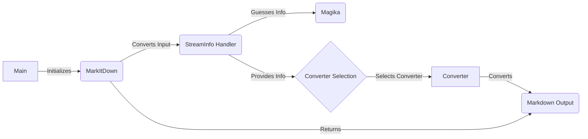

```mermaid
graph LR
    A[Main] -- Initializes --> B(MarkItDown)
    B -- Converts Input --> C(StreamInfo Handler)
    C -- Guesses Info --> D(Magika)
    C -- Provides Info --> E{Converter Selection}
    E -- Selects Converter --> F[Converter]
    F -- Converts --> G(Markdown Output)
    B -- Returns --> G


```

