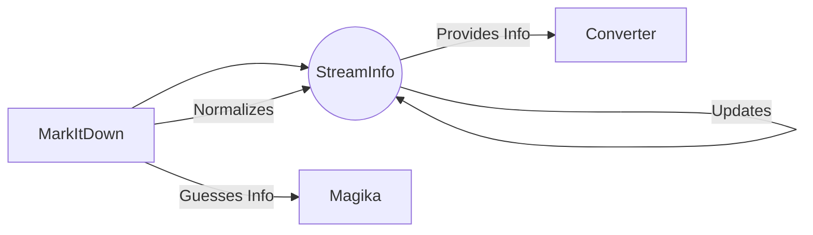

```markdown
## Stream Information Handler Overview

The `Stream Information Handler` is responsible for managing and inferring information about the input stream. It encapsulates stream metadata and facilitates converter selection and processing. The central component is the [`StreamInfo`](https://github.com/CodeBoarding/GeneratedOnBoardings/blob/main/markitdown//Stream Information Handler.md) data class, which stores information such as mimetype, extension, charset, filename, local path, and URL.

Here's a data flow diagram illustrating how the `StreamInfo` component interacts with other components:



**Component Descriptions:**

*   **MarkItDown**: The main class that orchestrates the conversion process. It calls `Magika` to guess the mimetype and normalizes the charset. It creates and updates `StreamInfo` objects.
    *   Purpose: Orchestrates the conversion process from various input types to markdown.
    *   Interaction: Creates, updates, and uses `StreamInfo` objects to pass stream metadata to converters.
    *   Relevant source files: `repos.markitdown.packages.markitdown.src.markitdown._markitdown.MarkItDown`
*   **StreamInfo**: A data class that holds information about the input stream.
    *   Purpose: Encapsulates stream metadata, such as mimetype, extension, charset, filename, local path, and URL.
    *   Interaction: Provides stream information to converters and is updated by `MarkItDown` with guesses from `Magika` and normalized charset.
    *   Relevant source files: `repos.markitdown.packages.markitdown.src.markitdown._stream_info.StreamInfo`
*   **Converter**: Abstract base class for converters.
    *   Purpose: Converts specific input formats to markdown.
    *   Interaction: Receives `StreamInfo` from `MarkItDown` to determine if it can handle the stream and to access stream metadata during conversion.
    *   Relevant source files: `repos.markitdown.packages.markitdown.src.markitdown.converters._html_converter.HtmlConverter`, `repos.markitdown.packages.markitdown.src.markitdown.converters._epub_converter.EpubConverter`, `repos.markitdown.packages.markitdown.src.markitdown.converters._pptx_converter.PptxConverter`, `repos.markitdown.packages.markitdown.src.markitdown.converters._zip_converter.ZipConverter`
*   **Magika**: Utilizes the `Magika` library to identify the file type based on its content.
    *   Purpose: Guesses the mimetype of the input stream.
    *   Interaction: Called by `MarkItDown` to guess the mimetype, which is then used to update the `StreamInfo` object.
    *   Relevant source files: `magika.Magika`
```