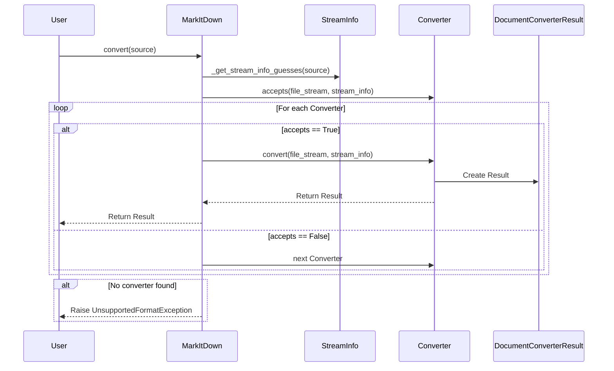
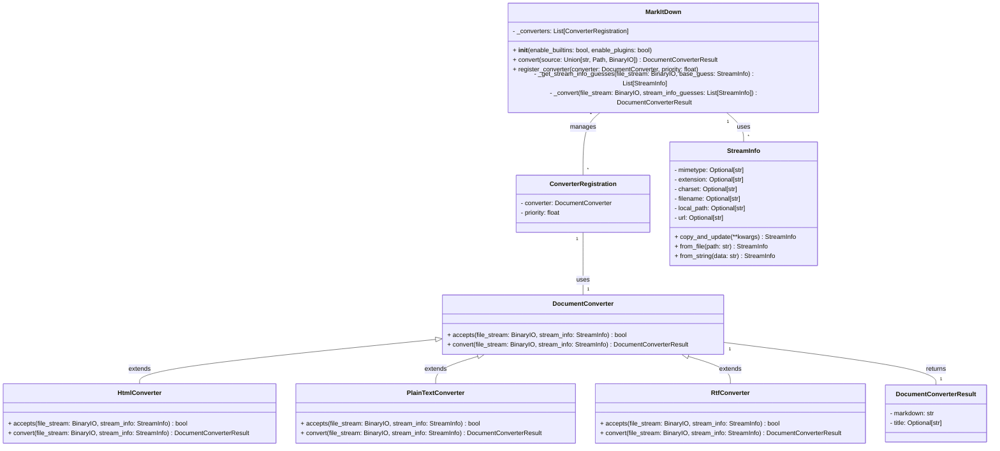

Based on the investigation, here's a refined overview of the `MarkItDown` component:

**Component Description:**

The `MarkItDown` component is a versatile document conversion tool that transforms various file types and web content into Markdown format. It employs a flexible architecture based on pluggable converters, allowing it to support a wide range of document formats. The core of the component is the `MarkItDown` class, which orchestrates the conversion process by identifying the appropriate converter for a given input and applying it to generate the Markdown output. The `StreamInfo` class encapsulates metadata about the input stream, aiding in converter selection. `DocumentConverter` is an abstract base class for all converters.

**Main Classes and Their Purposes:**

*   **`MarkItDown`**: The central orchestrator. It manages converter registration, input stream analysis, converter selection, and the overall conversion process.
*   **`DocumentConverter`**: An abstract base class that defines the interface for all document converters. Concrete converters inherit from this class and implement the `accepts` and `convert` methods.
*   **`StreamInfo`**: A data class that encapsulates information about the input stream, such as MIME type, file extension, charset, filename, and URL. This information is used to determine the appropriate converter to use.
*   **`HtmlConverter`**: A concrete `DocumentConverter` that handles HTML files. It uses `BeautifulSoup` to parse the HTML and converts it to Markdown.
*   **`PlainTextConverter`**: A concrete `DocumentConverter` that handles plain text files. It simply reads the content and returns it as Markdown.
*   **`RtfConverter`**: A concrete `DocumentConverter` that handles RTF files (example plugin).

**Main Flow (Sequence Diagram):**

**Component Structure (Class Diagram):**

