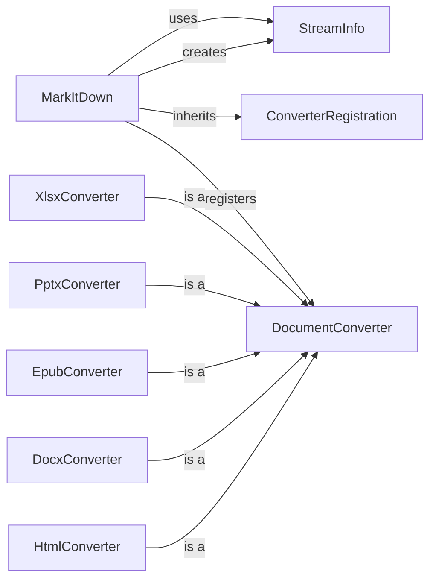

## Component Details

### StreamInfo
A data class that stores information about the input stream, such as its URI, content type, charset, filename, and extension. It's used to pass metadata between different parts of the conversion process. It also provides a method to copy and update its attributes, ensuring that the correct metadata is associated with the input being processed.
- **Related Classes/Methods**: `repos.markitdown.packages.markitdown.src.markitdown._stream_info.StreamInfo`

### MarkItDown
The central class responsible for converting various input formats (local files, URIs, streams, responses) to Markdown. It utilizes different converters based on the input type and StreamInfo to manage stream metadata. It inherits from ConverterRegistration to register available converters.
- **Related Classes/Methods**: `repos.markitdown.packages.markitdown.src.markitdown._markitdown.MarkItDown`

### DocumentConverter
Abstract base class for all converters. Defines the interface for converting documents to markdown. All specific converters inherit from this class.
- **Related Classes/Methods**: `repos.markitdown.packages.markitdown.src.markitdown._base_converter.DocumentConverter`

### ConverterRegistration
A mixin class that provides methods for registering converters. It allows the MarkItDown class to dynamically register different document converters.
- **Related Classes/Methods**: `repos.markitdown.packages.markitdown.src.markitdown._markitdown.ConverterRegistration`

### HtmlConverter
Converter for HTML content. It converts HTML strings to Markdown using a markdownify library. It inherits from DocumentConverter.
- **Related Classes/Methods**: `repos.markitdown.packages.markitdown.src.markitdown.converters._html_converter.HtmlConverter`

### DocxConverter
Converter for DOCX files. It converts DOCX files to HTML, then converts HTML to Markdown. It inherits from DocumentConverter.
- **Related Classes/Methods**: `repos.markitdown.packages.markitdown.src.markitdown.converters._docx_converter.DocxConverter`

### EpubConverter
Converter for EPUB files. It extracts the content and converts it to Markdown. It inherits from DocumentConverter.
- **Related Classes/Methods**: `repos.markitdown.packages.markitdown.src.markitdown.converters._epub_converter.EpubConverter`

### PptxConverter
Converter for PPTX files. It extracts the content and converts it to Markdown. It inherits from DocumentConverter.
- **Related Classes/Methods**: `repos.markitdown.packages.markitdown.src.markitdown.converters._pptx_converter.PptxConverter`

### XlsxConverter
Converter for XLSX files. It converts XLSX files to HTML, then converts HTML to Markdown. It inherits from DocumentConverter.
- **Related Classes/Methods**: `repos.markitdown.packages.markitdown.src.markitdown.converters._xlsx_converter.XlsxConverter`
