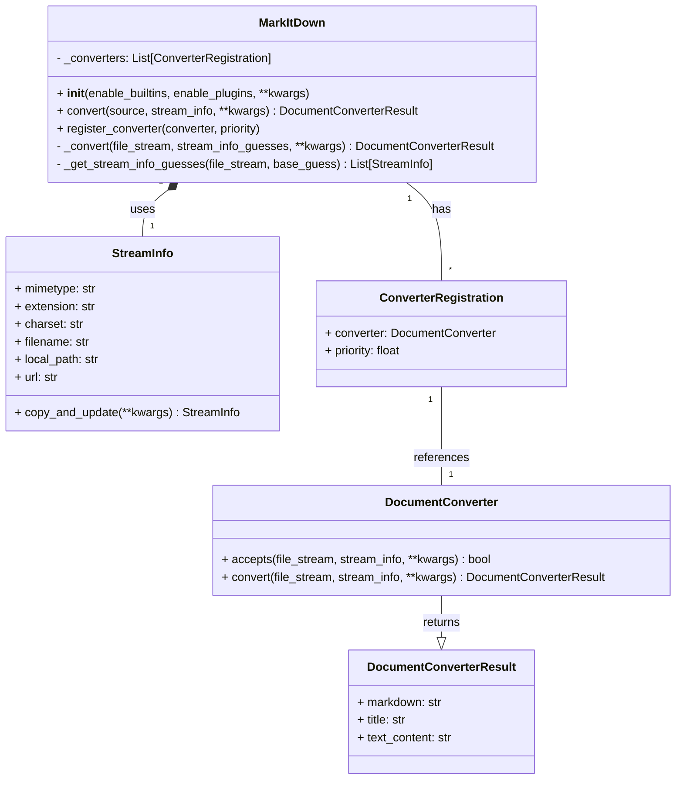

Based on the investigation, here's an overview of the `markitdown` component:

**Description:**

The `markitdown` component is designed to convert various document types and web resources into Markdown format. It provides a flexible and extensible framework that supports built-in converters and allows for the registration of custom converters via plugins. The core functionality revolves around the `MarkItDown` class, which orchestrates the conversion process by identifying the input type, selecting an appropriate converter, and producing a `DocumentConverterResult` containing the Markdown output.

**Main Classes and Their Purposes:**

*   **`MarkItDown`**: This is the central class responsible for managing the conversion process. It handles input from various sources (files, URLs, streams), determines the file type, selects the appropriate converter, and returns the converted Markdown. It also manages the registration of built-in and plugin converters.
*   **`DocumentConverter`**: An abstract base class for all converters. Concrete converter implementations (e.g., `DocxConverter`, `PdfConverter`, `HtmlConverter`) inherit from this class and provide the logic for converting specific file types to Markdown. The `accepts` method determines if a converter can handle a given input, and the `convert` method performs the actual conversion.
*   **`DocumentConverterResult`**: A data class that encapsulates the result of a document conversion. It contains the converted Markdown text and an optional title.
*   **`StreamInfo`**: A data class that stores information about the input stream, such as MIME type, file extension, charset, filename, and URL. This information is used to determine the appropriate converter and to provide context for the conversion process.

**Main Flow (Sequence Diagram):**

```mermaid
sequenceDiagram
    participant User
    participant MarkItDown
    participant StreamInfo
    participant Converter
    participant DocumentConverterResult

    User->>MarkItDown: convert(source, stream_info)
    MarkItDown->>MarkItDown: convert_local | convert_uri | convert_stream | convert_response
    MarkItDown->>StreamInfo: _get_stream_info_guesses(file_stream, base_guess)
    MarkItDown->>MarkItDown: _convert(file_stream, stream_info_guesses)
    loop For each stream_info_guess
        loop For each registered converter
            Converter->>Converter: accepts(file_stream, stream_info, **kwargs)
            alt accepts == True
                Converter->>Converter: convert(file_stream, stream_info, **kwargs)
                Converter-->>MarkItDown: DocumentConverterResult
                MarkItDown->>DocumentConverterResult: Normalize content
                MarkItDown-->>User: DocumentConverterResult
                break
            else accepts == False
            end
        end
    end
    alt No converter found
        MarkItDown-->>User: Error
    end
```

**Component Structure (Class Diagram):**

