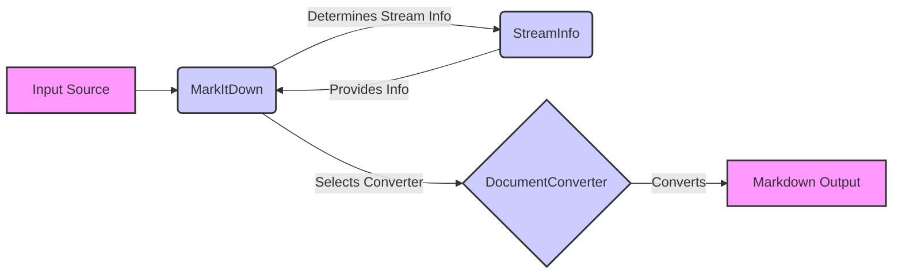

### Component Descriptions:

*   **Input Source:** Represents the source of the document to be converted. This could be a local file, a URL, a stream, or a response object. It initiates the conversion process by providing the input to the `MarkItDown` component.
    *   **Relevant source files:** N/A (External Input)

*   **MarkItDown:** The core component that orchestrates the conversion process. It receives the input source, determines the stream information using the `StreamInfo` component, selects the appropriate `DocumentConverter`, and converts the document to markdown.
    *   **Relevant source files:** `repos.markitdown.packages.markitdown.src.markitdown._markitdown.MarkItDown`

*   **StreamInfo:** Manages information about the input stream, including filename, extension, MIME type, and URL. It helps in determining the input format and selecting the appropriate converter. The `MarkItDown` component uses this information to choose the correct converter.
    *   **Relevant source files:** `repos.markitdown.packages.markitdown.src.markitdown._stream_info.StreamInfo`

*   **DocumentConverter:** An abstract base class for converters. Concrete converter implementations (e.g., `HtmlConverter`, `DocxConverter`) inherit from this class. The `MarkItDown` component uses a specific `DocumentConverter` to convert the document to markdown.
    *   **Relevant source files:** `repos.markitdown.packages.markitdown.src.markitdown._base_converter.DocumentConverter`

*   **Markdown Output:** Represents the final markdown output generated by the conversion process. This is the result of the `DocumentConverter` converting the input document.
    *   **Relevant source files:** N/A (Output)
