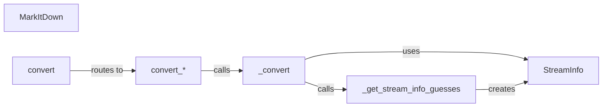

## Component Details

The MarkItDown component is responsible for converting various input types (local files, streams, URLs, URIs, and responses) into Markdown format. It determines the appropriate conversion method based on the input type and utilizes stream information to handle encoding and MIME types correctly. The core conversion logic resides in the `_convert` method, which takes a stream and stream information as input. The `StreamInfo` class stores information about the stream, and the `_get_stream_info_guesses` method attempts to infer this information when it's not explicitly provided. The `MarkItDown` class acts as the central entry point, routing the input to the correct conversion method and ensuring that the conversion process is handled efficiently.

### MarkItDown
The main class responsible for converting different types of input into Markdown format. It acts as the entry point for the conversion process, routing input to the appropriate conversion methods.
- **Related Classes/Methods**: `markitdown.packages.markitdown.src.markitdown._markitdown.MarkItDown`

### convert
The main public method of the `MarkItDown` class that takes a generic input and routes it to the appropriate conversion method based on the input type.
- **Related Classes/Methods**: `markitdown.packages.markitdown.src.markitdown._markitdown.MarkItDown:convert`

### convert_*
A set of methods (`convert_local`, `convert_stream`, `convert_url`, `convert_uri`, `convert_response`) responsible for handling specific input types. Each method prepares the input and calls the `_convert` method to perform the actual conversion.
- **Related Classes/Methods**: `markitdown.packages.markitdown.src.markitdown._markitdown.MarkItDown:convert_local`, `markitdown.packages.markitdown.src.markitdown._markitdown.MarkItDown:convert_stream`, `markitdown.packages.markitdown.src.markitdown._markitdown.MarkItDown:convert_url`, `markitdown.packages.markitdown.src.markitdown._markitdown.MarkItDown:convert_uri`, `markitdown.packages.markitdown.src.markitdown._markitdown.MarkItDown:convert_response`

### _convert
The core conversion logic that takes a stream and stream information and performs the actual Markdown conversion. It utilizes the `StreamInfo` object and calls `_get_stream_info_guesses` to determine stream information if not provided.
- **Related Classes/Methods**: `markitdown.packages.markitdown.src.markitdown._markitdown.MarkItDown:_convert`

### _get_stream_info_guesses
Guesses the stream information (encoding, MIME type, etc.) based on the input. This is used when stream information is not explicitly provided.
- **Related Classes/Methods**: `markitdown.packages.markitdown.src.markitdown._markitdown.MarkItDown:_get_stream_info_guesses`

### StreamInfo
A data class that stores information about a stream, such as encoding and MIME type. This information is crucial for determining the appropriate converter to use.
- **Related Classes/Methods**: `markitdown.packages.markitdown.src.markitdown._stream_info.StreamInfo`
