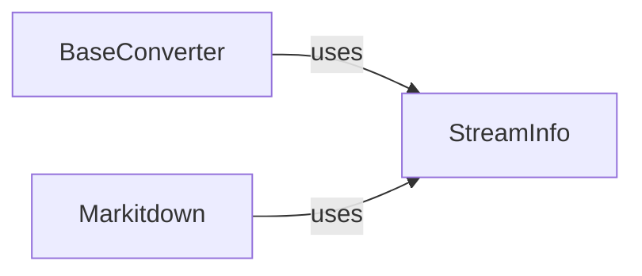

## Component Details

This graph illustrates the core components involved in managing stream information within the Markitdown project. The central component, `StreamInfo`, is a dataclass responsible for encapsulating metadata about input data streams. Other components, such as `BaseConverter` and `Markitdown`, interact with `StreamInfo` to access and utilize this crucial stream metadata for accurate document interpretation and conversion processes.

### StreamInfo
A dataclass that stores various metadata for input data streams, including mimetype, extension, charset, filename, local path, and URL. It provides a structured way to manage stream-related information and includes a method to create new instances by copying and updating existing attributes.

**Related Classes/Methods**:

- <a href="https://github.com/microsoft/markitdown/blob/master/packages/markitdown/src/markitdown/_stream_info.py#L6-L32" target="_blank" rel="noopener noreferrer">`markitdown._stream_info.StreamInfo` (6:32)</a>
- <a href="https://github.com/microsoft/markitdown/blob/master/packages/markitdown/src/markitdown/_stream_info.py#L20-L32" target="_blank" rel="noopener noreferrer">`markitdown._stream_info.StreamInfo:copy_and_update` (20:32)</a>

### BaseConverter
Represents a foundational component for converting input streams, relying on StreamInfo to manage and access stream-specific metadata during conversion processes.

**Related Classes/Methods**:

- `markitdown._base_converter` (full file reference)

### Markitdown
The primary Markitdown conversion utility, which utilizes StreamInfo to handle and interpret detailed information about input data streams for accurate document processing.

**Related Classes/Methods**:

- `markitdown._markitdown` (full file reference)

### [FAQ](https://github.com/CodeBoarding/GeneratedOnBoardings/tree/main?tab=readme-ov-file#faq)