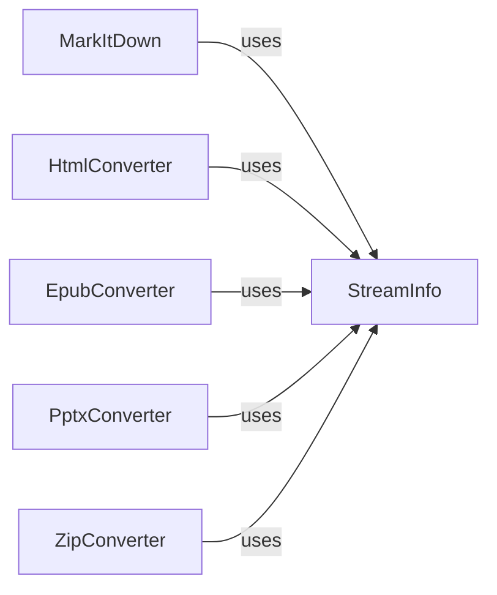

## Component Details

### StreamInfo
Data class that stores information about the input stream, such as encoding, declared media type, and sniffed media type. It helps in determining the correct conversion method.
- **Related Classes/Methods**: `repos.markitdown.packages.markitdown.src.markitdown._stream_info.StreamInfo`

### MarkItDown
Core class responsible for converting various input types (local files, streams, URIs, responses) to markdown. Uses StreamInfo to determine the correct conversion method.
- **Related Classes/Methods**: `repos.markitdown.packages.markitdown.src.markitdown._markitdown.MarkItDown`

### HtmlConverter
Converter class responsible for converting HTML strings to markdown. Uses StreamInfo to get information about the stream.
- **Related Classes/Methods**: `repos.markitdown.packages.markitdown.src.markitdown.converters._html_converter.HtmlConverter`

### EpubConverter
Converter class responsible for converting EPUB files to markdown. Uses StreamInfo to get information about the stream.
- **Related Classes/Methods**: `repos.markitdown.packages.markitdown.src.markitdown.converters._epub_converter.EpubConverter`

### PptxConverter
Converter class responsible for converting PPTX files to markdown. Uses StreamInfo to get information about the stream.
- **Related Classes/Methods**: `repos.markitdown.packages.markitdown.src.markitdown.converters._pptx_converter.PptxConverter`

### ZipConverter
Converter class responsible for converting ZIP archives to markdown. Uses StreamInfo to get information about the stream.
- **Related Classes/Methods**: `repos.markitdown.packages.markitdown.src.markitdown.converters._zip_converter.ZipConverter`
