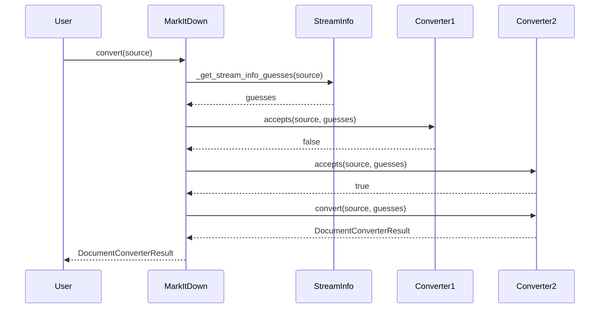
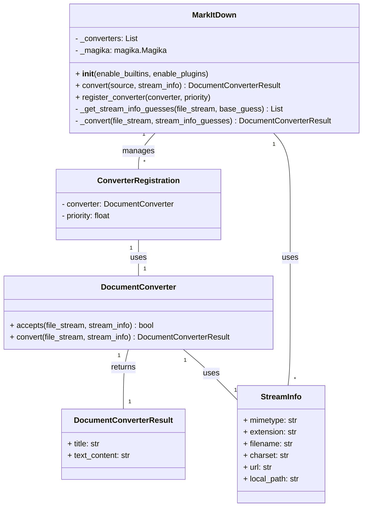

Based on the provided information and the source code, here's an overview of the `markitdown` component:

**Description:**

The `markitdown` component is designed to convert various document formats and web resources into Markdown. It provides a flexible and extensible framework that supports built-in converters and allows for the registration of custom converters via plugins. The core functionality revolves around identifying the input type, selecting an appropriate converter, and then executing the conversion process.

**Main Classes and Their Purposes:**

1.  **`MarkItDown`**: This is the central class that orchestrates the conversion process. It manages converter registration, stream information detection, and the overall conversion workflow. It handles different input types (local files, URLs, streams) and delegates the actual conversion to registered `DocumentConverter` instances.
2.  **`DocumentConverter`**: This is an abstract base class for all converters. Subclasses implement the `accepts()` method to determine if they can handle a given input and the `convert()` method to perform the actual conversion to Markdown.
3.  **`StreamInfo`**: This class encapsulates metadata about the input stream, such as MIME type, file extension, filename, and charset. It's used to help select the appropriate converter and pass relevant information to the conversion process.

**Main Flow:**

The main flow within the `markitdown` component can be summarized as follows:

1.  The `MarkItDown.convert()` method receives the input (file path, URL, or stream).
2.  `MarkItDown` determines the input type and creates a `StreamInfo` object, guessing the file type using `magika` if necessary.
3.  `MarkItDown` iterates through registered `DocumentConverter` instances, sorted by priority.
4.  For each converter, the `accepts()` method is called to check if the converter can handle the input based on the `StreamInfo`.
5.  If a converter accepts the input, its `convert()` method is called to perform the conversion.
6.  The converted Markdown content is returned as a `DocumentConverterResult`.

**Sequence Diagram:**

**Class Diagram:**

