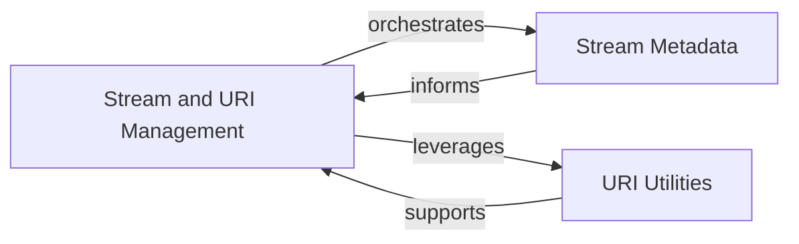

## Component Details

This graph provides an overview of the 'Stream and URI Management' subsystem, detailing its role in handling input streams and URIs, inferring metadata, and providing utility functions for parsing various URI schemes. It highlights the interaction between the core management logic and its specialized sub-components for stream metadata and URI parsing.

### Stream and URI Management
The primary component responsible for orchestrating the inference of stream-related metadata and the parsing and retrieval of content from diverse Uniform Resource Identifiers (URIs) and binary streams. It acts as the central point for managing stream and URI-related operations within the system.

**Related Classes/Methods**:

- <a href="https://github.com/microsoft/markitdown/blob/master/packages/markitdown/src/markitdown/_stream_info.py#L6-L32" target="_blank" rel="noopener noreferrer">`markitdown.packages.markitdown.src.markitdown._stream_info.StreamInfo` (6:32)</a>
- <a href="https://github.com/microsoft/markitdown/blob/master/packages/markitdown/src/markitdown/_stream_info.py#L20-L32" target="_blank" rel="noopener noreferrer">`markitdown.packages.markitdown.src.markitdown._stream_info.StreamInfo:copy_and_update` (20:32)</a>
- <a href="https://github.com/microsoft/markitdown/blob/master/packages/markitdown/src/markitdown/_uri_utils.py#L8-L16" target="_blank" rel="noopener noreferrer">`markitdown.packages.markitdown.src.markitdown._uri_utils.file_uri_to_path` (8:16)</a>
- <a href="https://github.com/microsoft/markitdown/blob/master/packages/markitdown/src/markitdown/_uri_utils.py#L19-L52" target="_blank" rel="noopener noreferrer">`markitdown.packages.markitdown.src.markitdown._uri_utils.parse_data_uri` (19:52)</a>

### Stream Metadata
A dedicated data class that encapsulates and manages all inferred and provided metadata pertaining to an input stream, including its MIME type, file extension, character set, filename, local path, and URL. It offers methods for updating and copying this information.

**Related Classes/Methods**:

- <a href="https://github.com/microsoft/markitdown/blob/master/packages/markitdown/src/markitdown/_stream_info.py#L6-L32" target="_blank" rel="noopener noreferrer">`markitdown.packages.markitdown.src.markitdown._stream_info.StreamInfo` (6:32)</a>
- <a href="https://github.com/microsoft/markitdown/blob/master/packages/markitdown/src/markitdown/_stream_info.py#L20-L32" target="_blank" rel="noopener noreferrer">`markitdown.packages.markitdown.src.markitdown._stream_info.StreamInfo:copy_and_update` (20:32)</a>

### URI Utilities
A collection of utility functions specifically designed for the robust parsing and conversion of various Uniform Resource Identifiers (URIs), such as `file://` and `data://` schemes, into actionable local paths or raw data.

**Related Classes/Methods**:

- <a href="https://github.com/microsoft/markitdown/blob/master/packages/markitdown/src/markitdown/_uri_utils.py#L8-L16" target="_blank" rel="noopener noreferrer">`markitdown.packages.markitdown.src.markitdown._uri_utils.file_uri_to_path` (8:16)</a>
- <a href="https://github.com/microsoft/markitdown/blob/master/packages/markitdown/src/markitdown/_uri_utils.py#L19-L52" target="_blank" rel="noopener noreferrer">`markitdown.packages.markitdown.src.markitdown._uri_utils.parse_data_uri` (19:52)</a>

### [FAQ](https://github.com/CodeBoarding/GeneratedOnBoardings/tree/main?tab=readme-ov-file#faq)