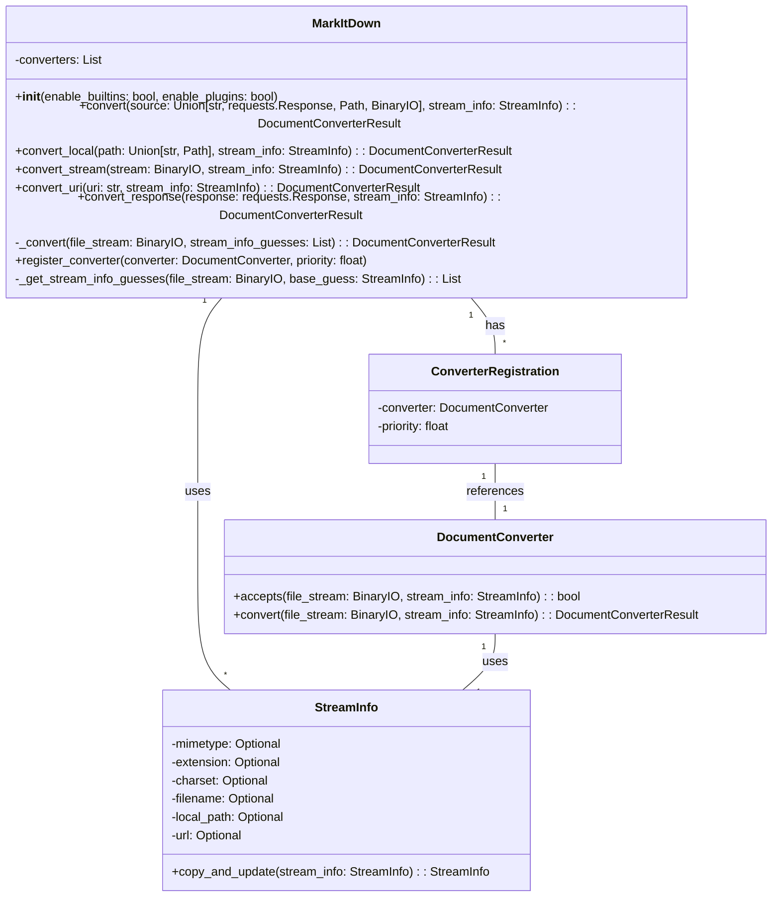

Okay, I have examined the source code of the core components. Here's a refined overview of the `MarkItDown` component:

**Description:**

The `MarkItDown` component is a versatile document conversion tool that transforms various file formats and web resources into Markdown. It orchestrates the conversion process by identifying the input type, selecting an appropriate converter, and applying it to generate Markdown output. The core of this component lies in its ability to handle different input sources (local files, streams, URLs, and responses), manage a registry of converters, and intelligently choose the best converter for a given input.

**Main Classes and Their Purposes:**

*   **`MarkItDown`**: This is the central class responsible for managing the conversion process. It initializes and registers converters (built-in and plugins), handles different input types, and orchestrates the conversion by delegating to the appropriate converter.
*   **`DocumentConverter`**: An abstract base class that defines the interface for all converters. Subclasses implement the `accepts()` method to determine if they can handle a given input and the `convert()` method to perform the actual conversion to Markdown.
*   **`StreamInfo`**: A data class that encapsulates metadata about the input stream, such as MIME type, file extension, charset, filename, and URL. It helps in selecting the appropriate converter and providing context for the conversion process.
*   **`ConverterRegistration`**: A data class that associates a `DocumentConverter` with a priority. This allows the `MarkItDown` class to sort the converters and try them in the correct order.

**Main Flow:**

1.  The `MarkItDown` class receives a source to convert (file path, URL, stream, etc.).
2.  It determines the input type and creates a `StreamInfo` object to store metadata about the input.
3.  It uses `magika` to guess the file type from the stream content.
4.  It iterates through registered converters, sorted by priority.
5.  For each converter, it calls the `accepts()` method to check if the converter can handle the input.
6.  If a converter accepts the input, its `convert()` method is called to generate Markdown.
7.  If the conversion is successful, the Markdown output is returned.
8.  If no converter accepts the input or the conversion fails, an exception is raised.

**Visualization:**

I will use a class diagram to represent the structure of the `MarkItDown` component, highlighting the main classes and their relationships.

