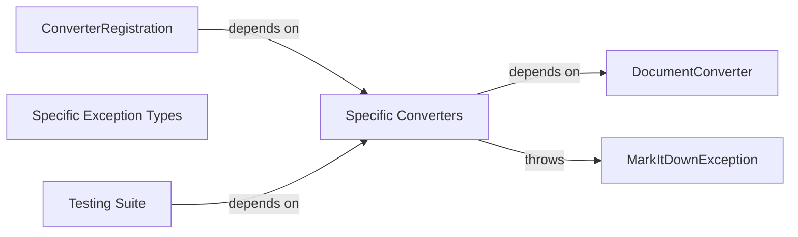

## Component Details

One paragraph explaining the functionality which is represented by this graph. What the main flow is and what is its purpose.

### DocumentConverter
Abstract base class defining the interface for all document converters. Handles core conversion logic and error handling.

**Related Classes/Methods**:

- <a href="https://github.com/microsoft/markitdown/blob/master/packages/markitdown/src/markitdown/_base_converter.py#L41-L104" target="_blank" rel="noopener noreferrer">`markitdown._base_converter.DocumentConverter` (41:104)</a>

### Specific Converters
Concrete implementations of `DocumentConverter`, each handling a specific document format (DOCX, PDF, HTML, etc.).

**Related Classes/Methods**:

- `markitdown.converters.docx.DocxConverter` (1:100)
- `markitdown.converters.pdf.PdfConverter` (1:100)

### ConverterRegistration
Manages the mapping between file extensions or MIME types and the appropriate converter classes. Acts as a central registry.

**Related Classes/Methods**:

- <a href="https://github.com/microsoft/markitdown/blob/master/packages/markitdown/src/markitdown/_markitdown.py#L85-L89" target="_blank" rel="noopener noreferrer">`markitdown._markitdown.ConverterRegistration` (85:89)</a>

### MarkItDownException
Base exception class for all custom exceptions within the system. Provides a consistent error-handling mechanism.

**Related Classes/Methods**:

- <a href="https://github.com/microsoft/markitdown/blob/master/packages/markitdown/src/markitdown/_exceptions.py#L10-L15" target="_blank" rel="noopener noreferrer">`markitdown._exceptions.MarkItDownException` (10:15)</a>

### Specific Exception Types
Subclasses of `MarkItDownException`, providing more specific exception types for different error scenarios (e.g., file not found, unsupported format).

**Related Classes/Methods**:

- <a href="https://github.com/microsoft/markitdown/blob/master/packages/markitdown/src/markitdown/_exceptions.py#L51-L75" target="_blank" rel="noopener noreferrer">`markitdown._exceptions.FileConversionException` (51:75)</a>
- <a href="https://github.com/microsoft/markitdown/blob/master/packages/markitdown/src/markitdown/_exceptions.py#L33-L38" target="_blank" rel="noopener noreferrer">`markitdown._exceptions.UnsupportedFormatException` (33:38)</a>

### Testing Suite
Collection of unit and integration tests to verify the functionality of all components.

**Related Classes/Methods**:

- `markitdown._testing.test_converters` (1:100)

### [FAQ](https://github.com/CodeBoarding/GeneratedOnBoardings/tree/main?tab=readme-ov-file#faq)