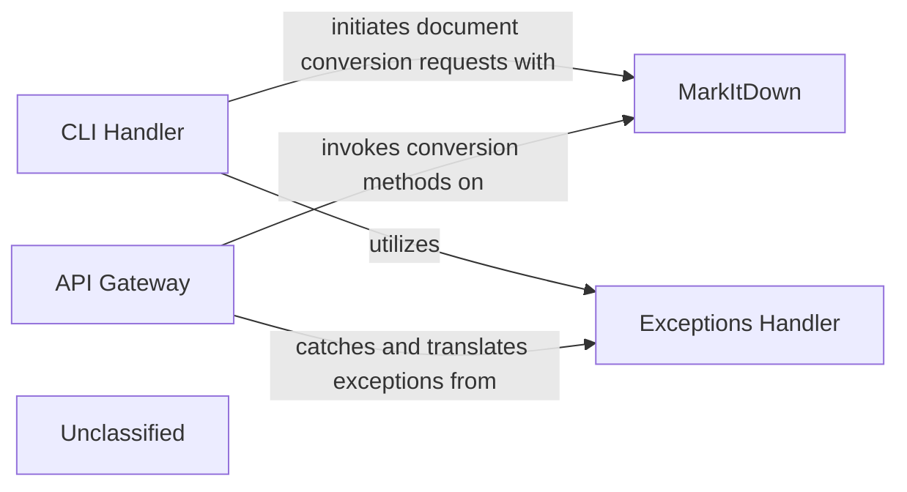

## Details

The `markitdown` system is structured around a central `MarkItDown` conversion engine, accessible via two primary interfaces: a `CLI Handler` for direct user interaction and an `API Gateway` for programmatic access. Both entry points delegate document conversion tasks to the `MarkItDown` component. A dedicated `Exceptions Handler` ensures robust error management, providing consistent feedback to users and external systems regardless of the interaction method. This architecture promotes modularity, allowing for independent development and scaling of the core conversion logic and its access mechanisms.

### CLI Handler
This component provides the command-line interface for the `markitdown` tool. It is responsible for parsing command-line arguments, managing user input, and displaying conversion results and errors. It acts as the direct interface for users interacting with the utility via the terminal.

**Related Classes/Methods**:

- <a href="https://github.com/microsoft/markitdown/blob/main/packages/markitdown/src/markitdown/__main__.py" target="_blank" rel="noopener noreferrer">`markitdown.__main__`</a>

### API Gateway
This component exposes a web-based API for initiating document conversions. It handles incoming HTTP requests, validates parameters, and orchestrates the conversion process by interacting with the core `MarkItDown` component. It provides a programmatic interface for external systems or applications to utilize the conversion capabilities.

**Related Classes/Methods**:

- <a href="https://github.com/microsoft/markitdown/blob/main/packages/markitdown-mcp/src/markitdown_mcp/__main__.py" target="_blank" rel="noopener noreferrer">`markitdown_mcp.__main__`</a>

### MarkItDown
This is the core conversion engine of the system. It encapsulates the logic for converting various document formats into markdown. It can leverage different conversion strategies, including offline conversion and external Document Intelligence services, and can also integrate with third-party plugins.

**Related Classes/Methods**:

- <a href="https://github.com/microsoft/markitdown/blob/main/packages/markitdown/src/markitdown/_markitdown.py" target="_blank" rel="noopener noreferrer">`markitdown._markitdown.MarkItDown`</a>

### Exceptions Handler
This component is responsible for centralizing and standardizing the handling of errors and exceptions across the application. It ensures that errors are caught, processed, and presented to the user or calling system in a consistent and informative manner.

**Related Classes/Methods**:

- <a href="https://github.com/microsoft/markitdown/blob/main/packages/markitdown/src/markitdown/__main__.py" target="_blank" rel="noopener noreferrer">`markitdown.__main__._exit_with_error`</a>

### Unclassified
Component for all unclassified files and utility functions (Utility functions/External Libraries/Dependencies)

**Related Classes/Methods**: _None_

### [FAQ](https://github.com/CodeBoarding/GeneratedOnBoardings/tree/main?tab=readme-ov-file#faq)