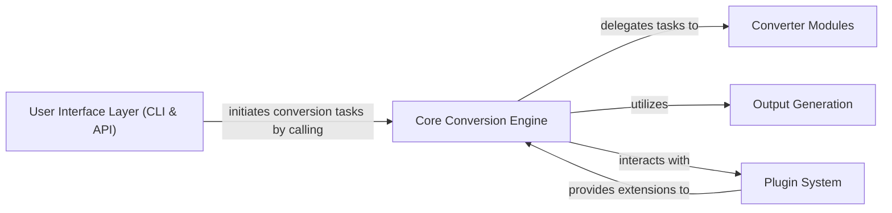

## Details

The `markitdown` project functions as a robust document conversion system, with its core logic residing within the `markitdown_mcp` package. The process begins at the `User Interface Layer (CLI & API)`, which serves as the primary entry point for users and other applications to initiate conversion tasks. These requests are then handled by the `Core Conversion Engine`, which orchestrates the entire transformation workflow. This engine intelligently delegates specific conversion responsibilities to various `Converter Modules`, each specialized in handling different input document types. Once the conversion is complete, the `Output Generation` component takes over, ensuring the transformed data is correctly formatted and delivered to the desired destination. The system's flexibility and extensibility are significantly enhanced by the `Plugin System`, which allows for the seamless integration of new functionalities, custom conversion rules, or alternative output renderers without altering the core engine.

### User Interface Layer (CLI & API) [[Expand]](./User_Interface_Layer_CLI_API_.md)
Offers multiple interaction points for users and other applications. This component includes a command-line interface for direct user interaction and a web-based API for programmatic access, enabling integration with other applications or services.

**Related Classes/Methods**:

- <a href="https://github.com/microsoft/markitdown/blob/main/packages/markitdown/src/markitdown/__main__.py" target="_blank" rel="noopener noreferrer">`packages.markitdown.src.markitdown.__main__.main`</a>
- <a href="https://github.com/microsoft/markitdown/blob/main/packages/markitdown-mcp/src/markitdown_mcp/__main__.py" target="_blank" rel="noopener noreferrer">`packages.markitdown-mcp.src.markitdown_mcp.__main__.main`</a>
- <a href="https://github.com/microsoft/markitdown/blob/main/packages/markitdown-mcp/src/markitdown_mcp/__main__.py" target="_blank" rel="noopener noreferrer">`packages.markitdown-mcp.src.markitdown_mcp.__main__.convert_to_markdown`</a>

### Core Conversion Engine
The central processing unit responsible for orchestrating the document transformation process. It receives input from the UI layer, delegates conversion tasks to specific converter modules, and manages the overall flow of data transformation.

**Related Classes/Methods**:

### Converter Modules
A set of specialized modules, each responsible for converting specific input document types or formats into an intermediate representation or directly into the target markdown format. These modules encapsulate the logic for handling different source document structures.

**Related Classes/Methods**:

### Output Generation
Handles the final formatting and output of the converted markdown content. This component ensures that the transformed data is presented in the desired structure and can be saved to various destinations or returned via the API.

**Related Classes/Methods**:

### Plugin System [[Expand]](./Plugin_System.md)
Provides an extensible framework allowing developers to add new functionalities, such as support for new input formats, custom conversion rules, or alternative output renderers, without modifying the core engine.

**Related Classes/Methods**:

### [FAQ](https://github.com/CodeBoarding/GeneratedOnBoardings/tree/main?tab=readme-ov-file#faq)