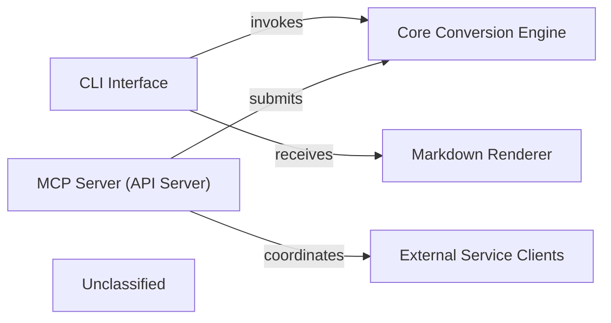

## Details

The `markitdown` project provides two primary interfaces for markdown conversion: a `CLI Interface` for direct user interaction and an `MCP Server (API Server)` for programmatic access by `External Service Clients`. Both interfaces leverage a `Core Conversion Engine` to perform the actual conversion of various input formats into markdown. The `CLI Interface` then passes the converted content to a `Markdown Renderer` for output to files or standard output. The `MCP Server (API Server)` coordinates with `External Service Clients` to receive conversion requests and deliver the processed markdown. This architecture ensures flexible access to the conversion capabilities, supporting both interactive command-line usage and integration into other applications.

### CLI Interface
Provides the command-line entry point for users to interact directly with the `markitdown` conversion capabilities. It parses arguments, configures the conversion process, and presents results.

**Related Classes/Methods**:

- <a href="https://github.com/microsoft/markitdown/blob/mainpackages/markitdown/src/markitdown/__main__.py#L13-L200" target="_blank" rel="noopener noreferrer">`markitdown.__main__.main`:13-200</a>

### MCP Server (API Server)
Offers a dedicated API endpoint for external applications to programmatically submit conversion requests and retrieve processed outputs. It acts as a multi-conversion proxy, handling server-side logic for API interactions.

**Related Classes/Methods**:

- <a href="https://github.com/microsoft/markitdown/blob/mainpackages/markitdown-mcp/src/markitdown_mcp/__main__.py#L82-L123" target="_blank" rel="noopener noreferrer">`markitdown_mcp.__main__.main`:82-123</a>

### Core Conversion Engine [[Expand]](./Core_Conversion_Engine.md)
Encapsulates the core logic for converting various input formats into markdown. It handles the actual conversion process, potentially utilizing plugins or external document intelligence services.

**Related Classes/Methods**:

- <a href="https://github.com/microsoft/markitdown/blob/mainpackages/markitdown/src/markitdown/_markitdown.py#L93-L776" target="_blank" rel="noopener noreferrer">`markitdown._markitdown.MarkItDown`:93-776</a>

### Markdown Renderer
Responsible for formatting and outputting the generated markdown content. This includes writing to files or standard output, ensuring proper encoding and handling of data URIs.

**Related Classes/Methods**:

- <a href="https://github.com/microsoft/markitdown/blob/mainpackages/markitdown/src/markitdown/__main__.py#L203-L214" target="_blank" rel="noopener noreferrer">`markitdown.__main__._handle_output`:203-214</a>

### External Service Clients
Represents external systems or applications that interact with the `MCP Server (API Server)` to submit conversion requests and receive markdown outputs. These clients communicate via HTTP/SSE.

**Related Classes/Methods**:

- <a href="https://github.com/microsoft/markitdown/blob/main." target="_blank" rel="noopener noreferrer">`mcp.server.fastmcp.FastMCP`</a>
- <a href="https://github.com/microsoft/markitdown/blob/main." target="_blank" rel="noopener noreferrer">`mcp.server.streamable_http_manager.StreamableHTTPSessionManager`</a>

### Unclassified
Component for all unclassified files and utility functions (Utility functions/External Libraries/Dependencies)

**Related Classes/Methods**: _None_

### [FAQ](https://github.com/CodeBoarding/GeneratedOnBoardings/tree/main?tab=readme-ov-file#faq)