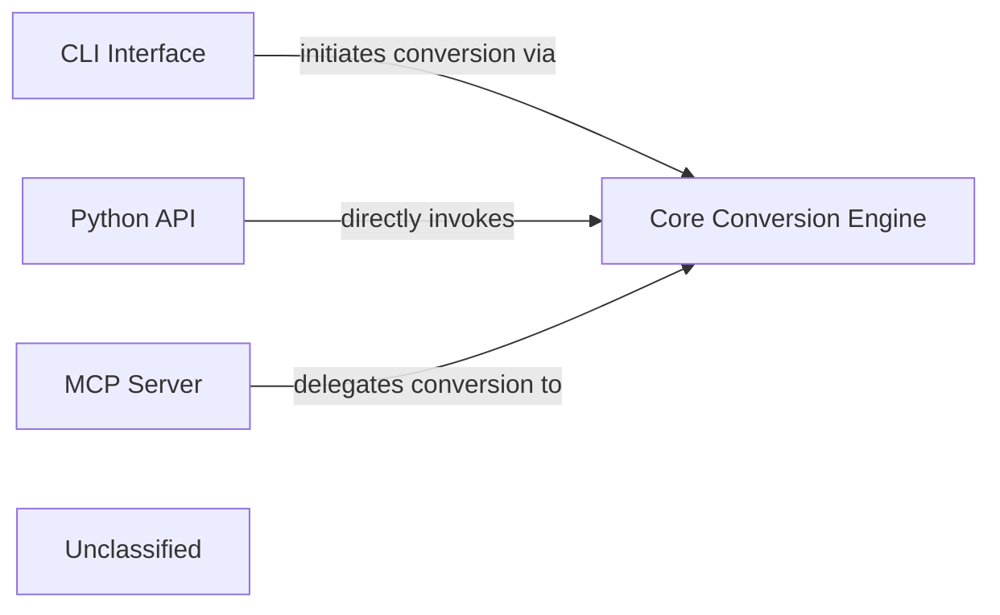

## Details

The `markitdown` project is structured around a central `Core Conversion Engine` responsible for transforming various document formats into markdown. This engine, primarily embodied by the `markitdown.MarkItDown` class, offers its capabilities through multiple interfaces. The `CLI Interface` provides a direct command-line entry point for users to perform conversions, parsing arguments and orchestrating calls to the `Core Conversion Engine`. For developers, the `Python API` exposes the `MarkItDown` class directly, allowing programmatic integration into other Python applications. Additionally, the `MCP Server` acts as a network gateway, enabling remote clients to access the conversion functionality via an API, delegating these requests to the `Core Conversion Engine` for processing. This architecture ensures flexible access to the core conversion logic across different interaction paradigms.

### CLI Interface
Serves as the primary command-line entry point, allowing users to initiate document conversions, specify input/output, and configure processing options directly from the terminal. It translates command-line arguments into calls to the core conversion logic.

**Related Classes/Methods**:

- <a href="https://github.com/microsoft/markitdown/blob/mainpackages/markitdown/src/markitdown/__main__.py#L13-L200" target="_blank" rel="noopener noreferrer">`markitdown.__main__.main`:13-200</a>

### Python API
Provides a programmatic interface for developers, enabling them to integrate `markitdown`'s conversion capabilities into other Python applications. This component exposes the `MarkItDown` class and its methods for direct use.

**Related Classes/Methods**:

- <a href="https://github.com/microsoft/markitdown/blob/mainpackages/markitdown/src/markitdown/_markitdown.py#L93-L776" target="_blank" rel="noopener noreferrer">`markitdown.MarkItDown`:93-776</a>

### MCP Server
Functions as a network service, exposing `markitdown`'s conversion functionality via an API (likely HTTP/REST). This allows remote clients to submit conversion requests and receive results, acting as an API gateway for the core system. It handles network communication and delegates requests to the core conversion logic.

**Related Classes/Methods**:

- <a href="https://github.com/microsoft/markitdown/blob/mainpackages/markitdown-mcp/src/markitdown_mcp/__main__.py#L82-L123" target="_blank" rel="noopener noreferrer">`markitdown_mcp.__main__.main`:82-123</a>

### Core Conversion Engine [[Expand]](./Core_Conversion_Engine.md)
Encapsulates the core logic for converting various document formats to markdown. It provides the fundamental conversion capabilities utilized by the CLI, Python API, and MCP Server.

**Related Classes/Methods**:

- <a href="https://github.com/microsoft/markitdown/blob/mainpackages/markitdown/src/markitdown/_markitdown.py#L93-L776" target="_blank" rel="noopener noreferrer">`markitdown.MarkItDown`:93-776</a>

### Unclassified
Component for all unclassified files and utility functions (Utility functions/External Libraries/Dependencies)

**Related Classes/Methods**: _None_

### [FAQ](https://github.com/CodeBoarding/GeneratedOnBoardings/tree/main?tab=readme-ov-file#faq)