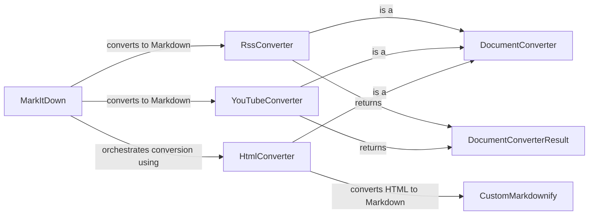

## Component Details

### MarkItDown
The central component responsible for orchestrating the conversion of various document types into Markdown format. It acts as a facade, providing a unified interface for converting content from different sources, including web-based sources like YouTube videos and RSS/Atom feeds, local files, and streams. It selects the appropriate converter based on the input type and handles the overall conversion process.
- **Related Classes/Methods**: `repos.markitdown.packages.markitdown.src.markitdown._markitdown.MarkItDown`

### RssConverter
This component specializes in converting RSS and Atom feeds into Markdown. It retrieves feed content, parses it to extract relevant data such as titles, descriptions, and links, and then formats this information into Markdown. It supports various feed types and handles different content structures within the feeds.
- **Related Classes/Methods**: `repos.markitdown.packages.markitdown.src.markitdown.converters._rss_converter.RssConverter`

### YouTubeConverter
This component is responsible for converting YouTube video pages into Markdown. It extracts video information, such as the title, description, and video URL, from the YouTube page and generates Markdown output that can be used to embed the video or link to it. It interacts with external web services to retrieve the video data.
- **Related Classes/Methods**: `repos.markitdown.packages.markitdown.src.markitdown.converters._youtube_converter.YouTubeConverter`

### DocumentConverter
This abstract component defines the interface for all converters within the system. It provides a common base class for converting different document types to Markdown, ensuring that all converters adhere to a consistent structure and provide a standard way to perform conversions.
- **Related Classes/Methods**: `repos.markitdown.packages.markitdown.src.markitdown._base_converter.DocumentConverter`

### DocumentConverterResult
This data class encapsulates the result of a document conversion. It contains the generated Markdown content, along with any metadata associated with the conversion, such as the title or author of the document. It serves as a standardized way to return conversion results from the different converters.
- **Related Classes/Methods**: `repos.markitdown.packages.markitdown.src.markitdown._base_converter.DocumentConverterResult`

### HtmlConverter
This component handles the conversion of HTML content to Markdown. It leverages the CustomMarkdownify component to parse the HTML and generate the corresponding Markdown output. It provides a way to convert web pages or HTML snippets into a more readable and portable format.
- **Related Classes/Methods**: `repos.markitdown.packages.markitdown.src.markitdown.converters._html_converter.HtmlConverter`

### CustomMarkdownify
This component is a custom implementation of Markdownify, a library used for converting HTML to Markdown. It provides specific rules and customizations for handling different HTML elements and attributes, ensuring that the resulting Markdown is accurate and well-formatted.
- **Related Classes/Methods**: `repos.markitdown.packages.markitdown.src.markitdown.converters._markdownify._CustomMarkdownify`
