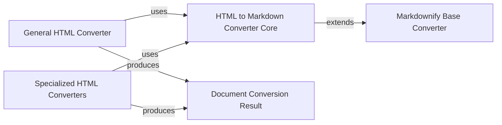

## Component Details

The `_CustomMarkdownify` component, serving as the HTML to Markdown Converter Core, is a fundamental utility within the `markitdown` project. It provides the essential, customizable logic for transforming HTML content into Markdown, acting as a central dependency for various specialized converters.

### HTML to Markdown Converter Core
This is the foundational utility, implemented by `_CustomMarkdownify` in `markitdown.converters._markdownify.py`. It extends `markdownify.MarkdownConverter` with custom rules for handling HTML elements like headings, links (e.g., removing JavaScript links), and image data URIs, ensuring a tailored and robust HTML-to-Markdown conversion.

**Related Classes/Methods**:

- <a href="https://github.com/microsoft/markitdown/blob/master/packages/markitdown/src/markitdown/converters/_markdownify.py#L7-L110" target="_blank" rel="noopener noreferrer">`markitdown.converters._markdownify._CustomMarkdownify` (7:110)</a>

### Markdownify Base Converter
This refers to the `markdownify.MarkdownConverter` class from the external `markdownify` library. It provides the base functionality for converting HTML to Markdown, which `_CustomMarkdownify` extends and customizes.

**Related Classes/Methods**:

- `markdownify.MarkdownConverter` (1:1)

### Document Conversion Result
A standardized data structure, `DocumentConverterResult` (found in `markitdown._base_converter.py`), used to encapsulate the output of any document conversion. It typically holds the converted Markdown content and can include additional metadata or status information.

**Related Classes/Methods**:

- <a href="https://github.com/microsoft/markitdown/blob/master/packages/markitdown/src/markitdown/_base_converter.py#L4-L38" target="_blank" rel="noopener noreferrer">`markitdown._base_converter.DocumentConverterResult` (4:38)</a>

### General HTML Converter
A versatile converter (`HtmlConverter` in `markitdown.converters._html_converter.py`) designed to transform any arbitrary HTML content into Markdown. It serves as a general-purpose entry point for HTML conversion.

**Related Classes/Methods**:

- <a href="https://github.com/microsoft/markitdown/blob/master/packages/markitdown/src/markitdown/converters/_html_converter.py#L19-L89" target="_blank" rel="noopener noreferrer">`markitdown.converters._html_converter.HtmlConverter` (19:89)</a>

### Specialized HTML Converters
This category includes converters like `BingSerpConverter`, `WikipediaConverter`, and `RssFeedConverter`. They specialize in converting HTML content from specific sources (e.g., Bing SERPs, Wikipedia pages, RSS feeds) into Markdown. They pre-process their source-specific HTML before delegating the core conversion to the `HTML to Markdown Converter Core`.

**Related Classes/Methods**:

- <a href="https://github.com/microsoft/markitdown/blob/master/packages/markitdown/src/markitdown/converters/_bing_serp_converter.py#L22-L119" target="_blank" rel="noopener noreferrer">`markitdown.converters._bing_serp_converter.BingSerpConverter` (22:119)</a>
- <a href="https://github.com/microsoft/markitdown/blob/master/packages/markitdown/src/markitdown/converters/_wikipedia_converter.py#L19-L86" target="_blank" rel="noopener noreferrer">`markitdown.converters._wikipedia_converter.WikipediaConverter` (19:86)</a>
- `markitdown.converters._rss_feed_converter.RssFeedConverter` (1:1)

### [FAQ](https://github.com/CodeBoarding/GeneratedOnBoardings/tree/main?tab=readme-ov-file#faq)