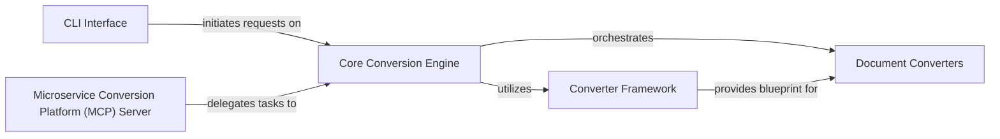

## Details

The `markitdown` architecture is designed for extensibility and modularity, embodying a plugin architecture and strategy pattern. At its core, the Core Conversion Engine acts as a central facade, responsible for receiving conversion requests from either the CLI Interface or the Microservice Conversion Platform (MCP) Server. Upon receiving a request, the Core Conversion Engine leverages the Converter Framework to identify the appropriate Document Converters based on the input type. Each Document Converter then processes its specific format, transforming it into Markdown, adhering to the standardized interface defined by the Converter Framework. This design allows for easy addition of new document formats by simply implementing the DocumentConverter interface and registering it with the Core Conversion Engine, ensuring a highly adaptable and robust document processing utility.

### Core Conversion Engine
The central orchestrator of all conversion processes.

**Related Classes/Methods**:

- <a href="https://github.com/microsoft/markitdown/blob/main/packages/markitdown/src/markitdown/_markitdown.py" target="_blank" rel="noopener noreferrer">`markitdown._markitdown`</a>

### Converter Framework
Defines the abstract interface and common utilities for all document converters, including input stream management.

**Related Classes/Methods**:

- <a href="https://github.com/microsoft/markitdown/blob/main/packages/markitdown/src/markitdown/_base_converter.py" target="_blank" rel="noopener noreferrer">`markitdown._base_converter`</a>
- <a href="https://github.com/microsoft/markitdown/blob/main/packages/markitdown/src/markitdown/_stream_info.py" target="_blank" rel="noopener noreferrer">`markitdown._stream_info`</a>
- <a href="https://github.com/microsoft/markitdown/blob/main/packages/markitdown/src/markitdown/_uri_utils.py" target="_blank" rel="noopener noreferrer">`markitdown._uri_utils`</a>

### Document Converters
A modular collection of format-specific converters responsible for transforming various document types into Markdown.

**Related Classes/Methods**:

- <a href="https://github.com/microsoft/markitdown/blob/main/packages/markitdown/src/markitdown/converters/_image_converter.py" target="_blank" rel="noopener noreferrer">`markitdown.converters._image_converter`</a>
- <a href="https://github.com/microsoft/markitdown/blob/main/packages/markitdown/src/markitdown/converters/_docx_converter.py" target="_blank" rel="noopener noreferrer">`markitdown.converters._docx_converter`</a>
- <a href="https://github.com/microsoft/markitdown/blob/main/packages/markitdown/src/markitdown/converters/_pptx_converter.py" target="_blank" rel="noopener noreferrer">`markitdown.converters._pptx_converter`</a>
- <a href="https://github.com/microsoft/markitdown/blob/main/packages/markitdown/src/markitdown/converters/_xlsx_converter.py" target="_blank" rel="noopener noreferrer">`markitdown.converters._xlsx_converter`</a>
- <a href="https://github.com/microsoft/markitdown/blob/main/packages/markitdown/src/markitdown/converters/_html_converter.py" target="_blank" rel="noopener noreferrer">`markitdown.converters._html_converter`</a>
- <a href="https://github.com/microsoft/markitdown/blob/main/packages/markitdown/src/markitdown/converters/_youtube_converter.py" target="_blank" rel="noopener noreferrer">`markitdown.converters._youtube_converter`</a>
- <a href="https://github.com/microsoft/markitdown/blob/main/packages/markitdown/src/markitdown/converters/_bing_serp_converter.py" target="_blank" rel="noopener noreferrer">`markitdown.converters._bing_serp_converter`</a>
- <a href="https://github.com/microsoft/markitdown/blob/main/packages/markitdown/src/markitdown/converters/_pdf_converter.py" target="_blank" rel="noopener noreferrer">`markitdown.converters._pdf_converter`</a>
- <a href="https://github.com/microsoft/markitdown/blob/main/packages/markitdown/src/markitdown/converters/_ipynb_converter.py" target="_blank" rel="noopener noreferrer">`markitdown.converters._ipynb_converter`</a>
- <a href="https://github.com/microsoft/markitdown/blob/main/packages/markitdown/src/markitdown/converters/_outlook_msg_converter.py" target="_blank" rel="noopener noreferrer">`markitdown.converters._outlook_msg_converter`</a>
- <a href="https://github.com/microsoft/markitdown/blob/main/packages/markitdown/src/markitdown/converters/_audio_converter.py" target="_blank" rel="noopener noreferrer">`markitdown.converters._audio_converter`</a>
- <a href="https://github.com/microsoft/markitdown/blob/main/packages/markitdown/src/markitdown/converters/_epub_converter.py" target="_blank" rel="noopener noreferrer">`markitdown.converters._epub_converter`</a>
- <a href="https://github.com/microsoft/markitdown/blob/main/packages/markitdown/src/markitdown/converters/_doc_intel_converter.py" target="_blank" rel="noopener noreferrer">`markitdown.converters._doc_intel_converter`</a>

### CLI Interface
Provides direct command-line access for users to initiate conversions.

**Related Classes/Methods**:

- <a href="https://github.com/microsoft/markitdown/blob/main/packages/markitdown/src/markitdown/__main__.py" target="_blank" rel="noopener noreferrer">`markitdown.__main__`</a>

### Microservice Conversion Platform (MCP) Server
Exposes conversion capabilities as a web service for external system integration.

**Related Classes/Methods**:

- <a href="https://github.com/microsoft/markitdown/blob/main/packages/markitdown-mcp/src/markitdown_mcp/__main__.py" target="_blank" rel="noopener noreferrer">`markitdown_mcp.__main__`</a>

### [FAQ](https://github.com/CodeBoarding/GeneratedOnBoardings/tree/main?tab=readme-ov-file#faq)