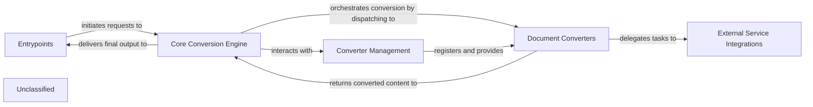

## Details

The `markitdown` project is structured around a core document conversion engine, accessible through various entry points. The `Entrypoints` component serves as the primary interface, allowing users to initiate conversion tasks via command-line tools or a web API. These requests are then handled by the `Core Conversion Engine`, which orchestrates the entire conversion process. The `Core Conversion Engine` relies heavily on the `Converter Management` component to discover, load, and register specialized `Document Converters`. These converters are responsible for transforming specific document formats (e.g., images, PowerPoint, DOCX) into Markdown. The `Converter Management` component ensures that both built-in converters and those provided by third-party plugins are available for use. For advanced processing, certain `Document Converters` interact with `External Service Integrations`. These integrations handle communication with `External Services` such as Large Language Models (LLMs) for content description or Azure Document Intelligence for sophisticated parsing and Optical Character Recognition (OCR). Once a document is converted, the `Document Converters` return the processed content to the `Core Conversion Engine`, which then delivers the final Markdown output back to the `Entrypoints` for the user. This modular design allows for flexible extension and integration with various document types and external AI capabilities.

### Entrypoints
Provides the primary interfaces for users to interact with the `markitdown` library, encompassing both command-line and web API access.

**Related Classes/Methods**:

- <a href="https://github.com/microsoft/markitdown/blob/mainpackages/markitdown/src/markitdown/__main__.py#L13-L200" target="_blank" rel="noopener noreferrer">`markitdown.__main__.main`:13-200</a>
- <a href="https://github.com/microsoft/markitdown/blob/mainpackages/markitdown-mcp/src/markitdown_mcp/__main__.py#L82-L123" target="_blank" rel="noopener noreferrer">`markitdown_mcp.__main__.main`:82-123</a>

### Core Conversion Engine
The central orchestrator that manages the overall document conversion workflow, from receiving input to dispatching to specific converters and returning the final Markdown output.

**Related Classes/Methods**:

- <a href="https://github.com/microsoft/markitdown/blob/mainpackages/markitdown/src/markitdown/_markitdown.py#L93-L776" target="_blank" rel="noopener noreferrer">`markitdown._markitdown.MarkItDown`:93-776</a>
- <a href="https://github.com/microsoft/markitdown/blob/mainpackages/markitdown/src/markitdown/_markitdown.py" target="_blank" rel="noopener noreferrer">`markitdown._markitdown.MarkItDown.convert`</a>

### Converter Management
Responsible for the discovery, loading, and registration of all available document converters, including built-in types and those provided via plugins.

**Related Classes/Methods**:

- <a href="https://github.com/microsoft/markitdown/blob/mainpackages/markitdown/src/markitdown/_markitdown.py" target="_blank" rel="noopener noreferrer">`markitdown._markitdown.MarkItDown.enable_builtins`</a>
- <a href="https://github.com/microsoft/markitdown/blob/mainpackages/markitdown/src/markitdown/_markitdown.py" target="_blank" rel="noopener noreferrer">`markitdown._markitdown.MarkItDown.enable_plugins`</a>
- <a href="https://github.com/microsoft/markitdown/blob/mainpackages/markitdown/src/markitdown/_markitdown.py" target="_blank" rel="noopener noreferrer">`markitdown._markitdown.MarkItDown.register_converter`</a>

### Document Converters
A collection of specialized modules, each designed to convert a particular document format (e.g., image, PowerPoint, DOCX) into Markdown. This component also includes format-specific utilities like DOCX math pre-processing.

**Related Classes/Methods**:

- <a href="https://github.com/microsoft/markitdown/blob/mainpackages/markitdown/src/markitdown/converters/_image_converter.py#L16-L138" target="_blank" rel="noopener noreferrer">`markitdown.converters._image_converter.ImageConverter`:16-138</a>
- <a href="https://github.com/microsoft/markitdown/blob/mainpackages/markitdown/src/markitdown/converters/_doc_intel_converter.py#L130-L254" target="_blank" rel="noopener noreferrer">`markitdown.converters._doc_intel_converter.DocumentIntelligenceConverter`:130-254</a>
- <a href="https://github.com/microsoft/markitdown/blob/mainpackages/markitdown/src/markitdown/converters/_pptx_converter.py#L34-L264" target="_blank" rel="noopener noreferrer">`markitdown.converters._pptx_converter.PptxConverter`:34-264</a>
- <a href="https://github.com/microsoft/markitdown/blob/mainpackages/markitdown/src/markitdown/converter_utils/docx/pre_process.py#L118-L156" target="_blank" rel="noopener noreferrer">`markitdown.converter_utils.docx.pre_process.pre_process_docx`:118-156</a>
- <a href="https://github.com/microsoft/markitdown/blob/mainpackages/markitdown-sample-plugin/src/markitdown_sample_plugin/_plugin.py#L34-L71" target="_blank" rel="noopener noreferrer">`markitdown_sample_plugin._plugin.RtfConverter`:34-71</a>

### External Service Integrations
Modules that facilitate communication with external AI/ML services, such as Large Language Models (LLMs) for content description or Azure Document Intelligence for advanced parsing and OCR.

**Related Classes/Methods**:

- <a href="https://github.com/microsoft/markitdown/blob/mainpackages/markitdown/src/markitdown/converters/_image_converter.py" target="_blank" rel="noopener noreferrer">`markitdown.converters._image_converter.ImageConverter._get_llm_description`</a>
- <a href="https://github.com/microsoft/markitdown/blob/mainpackages/markitdown/src/markitdown/converters/_doc_intel_converter.py" target="_blank" rel="noopener noreferrer">`markitdown.converters._doc_intel_converter.DocumentIntelligenceConverter._analysis_features`</a>

### Unclassified
Component for all unclassified files and utility functions (Utility functions/External Libraries/Dependencies)

**Related Classes/Methods**: _None_

### [FAQ](https://github.com/CodeBoarding/GeneratedOnBoardings/tree/main?tab=readme-ov-file#faq)