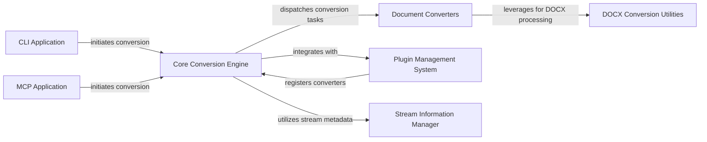

## Component Details

The `markitdown` project provides a versatile document conversion tool, primarily converting various formats into Markdown. Its main flow involves a central `Core Conversion Engine` that orchestrates the conversion process by dispatching tasks to specialized `Document Converters` based on input type, while also integrating with a `Plugin Management System` for extensibility and utilizing a `Stream Information Manager` for metadata handling. The conversion can be initiated either through a `CLI Application` for direct user interaction or an `MCP Application` for service-oriented integration within a multi-cloud environment.

### Core Conversion Engine
The central orchestrator for document conversion, managing converter registration, handling various input types (files, streams, URIs), dispatching tasks to specialized converters, and enabling built-in/plugin converters. It also performs stream information guessing.

**Related Classes/Methods**:

- <a href="https://github.com/microsoft/markitdown/blob/master/packages/markitdown/src/markitdown/_markitdown.py#L93-L771" target="_blank" rel="noopener noreferrer">`packages.markitdown.src.markitdown._markitdown.MarkItDown` (93:771)</a>
- <a href="https://github.com/microsoft/markitdown/blob/master/packages/markitdown/src/markitdown/_markitdown.py#L97-L130" target="_blank" rel="noopener noreferrer">`packages.markitdown.src.markitdown._markitdown.MarkItDown:__init__` (97:130)</a>
- <a href="https://github.com/microsoft/markitdown/blob/master/packages/markitdown/src/markitdown/_markitdown.py#L132-L221" target="_blank" rel="noopener noreferrer">`packages.markitdown.src.markitdown._markitdown.MarkItDown:enable_builtins` (132:221)</a>
- <a href="https://github.com/microsoft/markitdown/blob/master/packages/markitdown/src/markitdown/_markitdown.py#L223-L241" target="_blank" rel="noopener noreferrer">`packages.markitdown.src.markitdown._markitdown.MarkItDown:enable_plugins` (223:241)</a>
- <a href="https://github.com/microsoft/markitdown/blob/master/packages/markitdown/src/markitdown/_markitdown.py#L243-L291" target="_blank" rel="noopener noreferrer">`packages.markitdown.src.markitdown._markitdown.MarkItDown:convert` (243:291)</a>
- <a href="https://github.com/microsoft/markitdown/blob/master/packages/markitdown/src/markitdown/_markitdown.py#L293-L328" target="_blank" rel="noopener noreferrer">`packages.markitdown.src.markitdown._markitdown.MarkItDown:convert_local` (293:328)</a>
- <a href="https://github.com/microsoft/markitdown/blob/master/packages/markitdown/src/markitdown/_markitdown.py#L330-L375" target="_blank" rel="noopener noreferrer">`packages.markitdown.src.markitdown._markitdown.MarkItDown:convert_stream` (330:375)</a>
- <a href="https://github.com/microsoft/markitdown/blob/master/packages/markitdown/src/markitdown/_markitdown.py#L377-L394" target="_blank" rel="noopener noreferrer">`packages.markitdown.src.markitdown._markitdown.MarkItDown:convert_url` (377:394)</a>
- <a href="https://github.com/microsoft/markitdown/blob/master/packages/markitdown/src/markitdown/_markitdown.py#L396-L455" target="_blank" rel="noopener noreferrer">`packages.markitdown.src.markitdown._markitdown.MarkItDown:convert_uri` (396:455)</a>
- <a href="https://github.com/microsoft/markitdown/blob/master/packages/markitdown/src/markitdown/_markitdown.py#L457-L527" target="_blank" rel="noopener noreferrer">`packages.markitdown.src.markitdown._markitdown.MarkItDown:convert_response` (457:527)</a>
- <a href="https://github.com/microsoft/markitdown/blob/master/packages/markitdown/src/markitdown/_markitdown.py#L621-L627" target="_blank" rel="noopener noreferrer">`packages.markitdown.src.markitdown._markitdown.MarkItDown:register_page_converter` (621:627)</a>
- <a href="https://github.com/microsoft/markitdown/blob/master/packages/markitdown/src/markitdown/_markitdown.py#L629-L659" target="_blank" rel="noopener noreferrer">`packages.markitdown.src.markitdown._markitdown.MarkItDown:register_converter` (629:659)</a>
- <a href="https://github.com/microsoft/markitdown/blob/master/packages/markitdown/src/markitdown/_markitdown.py#L661-L760" target="_blank" rel="noopener noreferrer">`packages.markitdown.src.markitdown._markitdown.MarkItDown:_get_stream_info_guesses` (661:760)</a>
- <a href="https://github.com/microsoft/markitdown/blob/master/packages/markitdown/src/markitdown/_markitdown.py#L762-L771" target="_blank" rel="noopener noreferrer">`packages.markitdown.src.markitdown._markitdown.MarkItDown._normalize_charset` (762:771)</a>
- <a href="https://github.com/microsoft/markitdown/blob/master/packages/markitdown/src/markitdown/_markitdown.py#L529-L619" target="_blank" rel="noopener noreferrer">`packages.markitdown.src.markitdown._markitdown.MarkItDown._convert` (529:619)</a>

### Document Converters
A collection of specialized modules, each responsible for transforming a specific document format (e.g., DOCX, EPUB, HTML, Images, Jupyter, Outlook MSG, PowerPoint, RSS, YouTube) into Markdown. They implement `accepts` and `convert` methods.

**Related Classes/Methods**:

- <a href="https://github.com/microsoft/markitdown/blob/master/packages/markitdown/src/markitdown/converters/_doc_intel_converter.py#L125-L249" target="_blank" rel="noopener noreferrer">`packages.markitdown.src.markitdown.converters._doc_intel_converter.DocumentIntelligenceConverter` (125:249)</a>
- <a href="https://github.com/microsoft/markitdown/blob/master/packages/markitdown/src/markitdown/converters/_doc_intel_converter.py#L184-L200" target="_blank" rel="noopener noreferrer">`packages.markitdown.src.markitdown.converters._doc_intel_converter.DocumentIntelligenceConverter:accepts` (184:200)</a>
- <a href="https://github.com/microsoft/markitdown/blob/master/packages/markitdown/src/markitdown/converters/_doc_intel_converter.py#L202-L230" target="_blank" rel="noopener noreferrer">`packages.markitdown.src.markitdown.converters._doc_intel_converter.DocumentIntelligenceConverter:_analysis_features` (202:230)</a>
- <a href="https://github.com/microsoft/markitdown/blob/master/packages/markitdown/src/markitdown/converters/_doc_intel_converter.py#L232-L249" target="_blank" rel="noopener noreferrer">`packages.markitdown.src.markitdown.converters._doc_intel_converter.DocumentIntelligenceConverter:convert` (232:249)</a>
- <a href="https://github.com/microsoft/markitdown/blob/master/packages/markitdown/src/markitdown/converters/_doc_intel_converter.py#L101-L122" target="_blank" rel="noopener noreferrer">`packages.markitdown.src.markitdown.converters._doc_intel_converter._get_file_extensions` (101:122)</a>
- <a href="https://github.com/microsoft/markitdown/blob/master/packages/markitdown/src/markitdown/converters/_doc_intel_converter.py#L71-L98" target="_blank" rel="noopener noreferrer">`packages.markitdown.src.markitdown.converters._doc_intel_converter._get_mime_type_prefixes` (71:98)</a>
- <a href="https://github.com/microsoft/markitdown/blob/master/packages/markitdown/src/markitdown/converters/_epub_converter.py#L26-L146" target="_blank" rel="noopener noreferrer">`packages.markitdown.src.markitdown.converters._epub_converter.EpubConverter` (26:146)</a>
- <a href="https://github.com/microsoft/markitdown/blob/master/packages/markitdown/src/markitdown/converters/_epub_converter.py#L53-L130" target="_blank" rel="noopener noreferrer">`packages.markitdown.src.markitdown.converters._epub_converter.EpubConverter:convert` (53:130)</a>
- <a href="https://github.com/microsoft/markitdown/blob/master/packages/markitdown/src/markitdown/converters/_epub_converter.py#L132-L138" target="_blank" rel="noopener noreferrer">`packages.markitdown.src.markitdown.converters._epub_converter.EpubConverter:_get_text_from_node` (132:138)</a>
- <a href="https://github.com/microsoft/markitdown/blob/master/packages/markitdown/src/markitdown/converters/_epub_converter.py#L140-L146" target="_blank" rel="noopener noreferrer">`packages.markitdown.src.markitdown.converters._epub_converter.EpubConverter:_get_all_texts_from_nodes` (140:146)</a>
- <a href="https://github.com/microsoft/markitdown/blob/master/packages/markitdown/src/markitdown/converters/_html_converter.py#L20-L90" target="_blank" rel="noopener noreferrer">`packages.markitdown.src.markitdown.converters._html_converter.HtmlConverter` (20:90)</a>
- <a href="https://github.com/microsoft/markitdown/blob/master/packages/markitdown/src/markitdown/converters/_html_converter.py#L73-L90" target="_blank" rel="noopener noreferrer">`packages.markitdown.src.markitdown.converters._html_converter.HtmlConverter:convert_string` (73:90)</a>
- <a href="https://github.com/microsoft/markitdown/blob/master/packages/markitdown/src/markitdown/converters/_html_converter.py#L41-L71" target="_blank" rel="noopener noreferrer">`packages.markitdown.src.markitdown.converters._html_converter.HtmlConverter:convert` (41:71)</a>
- <a href="https://github.com/microsoft/markitdown/blob/master/packages/markitdown/src/markitdown/converters/_image_converter.py#L16-L138" target="_blank" rel="noopener noreferrer">`packages.markitdown.src.markitdown.converters._image_converter.ImageConverter` (16:138)</a>
- <a href="https://github.com/microsoft/markitdown/blob/master/packages/markitdown/src/markitdown/converters/_image_converter.py#L39-L85" target="_blank" rel="noopener noreferrer">`packages.markitdown.src.markitdown.converters._image_converter.ImageConverter:convert` (39:85)</a>
- <a href="https://github.com/microsoft/markitdown/blob/master/packages/markitdown/src/markitdown/converters/_image_converter.py#L87-L138" target="_blank" rel="noopener noreferrer">`packages.markitdown.src.markitdown.converters._image_converter.ImageConverter:_get_llm_description` (87:138)</a>
- <a href="https://github.com/microsoft/markitdown/blob/master/packages/markitdown/src/markitdown/converters/_ipynb_converter.py#L15-L96" target="_blank" rel="noopener noreferrer">`packages.markitdown.src.markitdown.converters._ipynb_converter.IpynbConverter` (15:96)</a>
- <a href="https://github.com/microsoft/markitdown/blob/master/packages/markitdown/src/markitdown/converters/_ipynb_converter.py#L46-L55" target="_blank" rel="noopener noreferrer">`packages.markitdown.src.markitdown.converters._ipynb_converter.IpynbConverter:convert` (46:55)</a>
- <a href="https://github.com/microsoft/markitdown/blob/master/packages/markitdown/src/markitdown/converters/_ipynb_converter.py#L57-L96" target="_blank" rel="noopener noreferrer">`packages.markitdown.src.markitdown.converters._ipynb_converter.IpynbConverter:_convert` (57:96)</a>
- <a href="https://github.com/microsoft/markitdown/blob/master/packages/markitdown/src/markitdown/converters/_outlook_msg_converter.py#L24-L149" target="_blank" rel="noopener noreferrer">`packages.markitdown.src.markitdown.converters._outlook_msg_converter.OutlookMsgConverter` (24:149)</a>
- <a href="https://github.com/microsoft/markitdown/blob/master/packages/markitdown/src/markitdown/converters/_outlook_msg_converter.py#L73-L125" target="_blank" rel="noopener noreferrer">`packages.markitdown.src.markitdown.converters._outlook_msg_converter.OutlookMsgConverter:convert` (73:125)</a>
- <a href="https://github.com/microsoft/markitdown/blob/master/packages/markitdown/src/markitdown/converters/_outlook_msg_converter.py#L127-L149" target="_blank" rel="noopener noreferrer">`packages.markitdown.src.markitdown.converters._outlook_msg_converter.OutlookMsgConverter:_get_stream_data` (127:149)</a>
- <a href="https://github.com/microsoft/markitdown/blob/master/packages/markitdown/src/markitdown/converters/_pptx_converter.py#L34-L252" target="_blank" rel="noopener noreferrer">`packages.markitdown.src.markitdown.converters._pptx_converter.PptxConverter` (34:252)</a>
- <a href="https://github.com/microsoft/markitdown/blob/master/packages/markitdown/src/markitdown/converters/_pptx_converter.py#L61-L188" target="_blank" rel="noopener noreferrer">`packages.markitdown.src.markitdown.converters._pptx_converter.PptxConverter:convert` (61:188)</a>
- <a href="https://github.com/microsoft/markitdown/blob/master/packages/markitdown/src/markitdown/converters/_pptx_converter.py#L190-L196" target="_blank" rel="noopener noreferrer">`packages.markitdown.src.markitdown.converters._pptx_converter.PptxConverter._is_picture` (190:196)</a>
- <a href="https://github.com/microsoft/markitdown/blob/master/packages/markitdown/src/markitdown/converters/_pptx_converter.py#L198-L201" target="_blank" rel="noopener noreferrer">`packages.markitdown.src.markitdown.converters._pptx_converter.PptxConverter._is_table` (198:201)</a>
- <a href="https://github.com/microsoft/markitdown/blob/master/packages/markitdown/src/markitdown/converters/_pptx_converter.py#L203-L221" target="_blank" rel="noopener noreferrer">`packages.markitdown.src.markitdown.converters._pptx_converter.PptxConverter._convert_table_to_markdown` (203:221)</a>
- <a href="https://github.com/microsoft/markitdown/blob/master/packages/markitdown/src/markitdown/converters/_pptx_converter.py#L223-L252" target="_blank" rel="noopener noreferrer">`packages.markitdown.src.markitdown.converters._pptx_converter.PptxConverter._convert_chart_to_markdown` (223:252)</a>
- `packages.markitdown.src.markitdown.converters._pptx_converter.PptxConverter.convert.get_shape_content` (full file reference)
- <a href="https://github.com/microsoft/markitdown/blob/master/packages/markitdown/src/markitdown/converters/_rss_converter.py#L29-L192" target="_blank" rel="noopener noreferrer">`packages.markitdown.src.markitdown.converters._rss_converter.RssConverter` (29:192)</a>
- <a href="https://github.com/microsoft/markitdown/blob/master/packages/markitdown/src/markitdown/converters/_rss_converter.py#L36-L61" target="_blank" rel="noopener noreferrer">`packages.markitdown.src.markitdown.converters._rss_converter.RssConverter:accepts` (36:61)</a>
- <a href="https://github.com/microsoft/markitdown/blob/master/packages/markitdown/src/markitdown/converters/_rss_converter.py#L63-L72" target="_blank" rel="noopener noreferrer">`packages.markitdown.src.markitdown.converters._rss_converter.RssConverter:_check_xml` (63:72)</a>
- <a href="https://github.com/microsoft/markitdown/blob/master/packages/markitdown/src/markitdown/converters/_rss_converter.py#L74-L82" target="_blank" rel="noopener noreferrer">`packages.markitdown.src.markitdown.converters._rss_converter.RssConverter:_feed_type` (74:82)</a>
- <a href="https://github.com/microsoft/markitdown/blob/master/packages/markitdown/src/markitdown/converters/_rss_converter.py#L84-L99" target="_blank" rel="noopener noreferrer">`packages.markitdown.src.markitdown.converters._rss_converter.RssConverter:convert` (84:99)</a>
- <a href="https://github.com/microsoft/markitdown/blob/master/packages/markitdown/src/markitdown/converters/_rss_converter.py#L101-L131" target="_blank" rel="noopener noreferrer">`packages.markitdown.src.markitdown.converters._rss_converter.RssConverter:_parse_atom_type` (101:131)</a>
- <a href="https://github.com/microsoft/markitdown/blob/master/packages/markitdown/src/markitdown/converters/_rss_converter.py#L133-L168" target="_blank" rel="noopener noreferrer">`packages.markitdown.src.markitdown.converters._rss_converter.RssConverter:_parse_rss_type` (133:168)</a>
- <a href="https://github.com/microsoft/markitdown/blob/master/packages/markitdown/src/markitdown/converters/_rss_converter.py#L179-L192" target="_blank" rel="noopener noreferrer">`packages.markitdown.src.markitdown.converters._rss_converter.RssConverter:_get_data_by_tag_name` (179:192)</a>
- <a href="https://github.com/microsoft/markitdown/blob/master/packages/markitdown/src/markitdown/converters/_rss_converter.py#L170-L177" target="_blank" rel="noopener noreferrer">`packages.markitdown.src.markitdown.converters._rss_converter.RssConverter:_parse_content` (170:177)</a>
- <a href="https://github.com/microsoft/markitdown/blob/master/packages/markitdown/src/markitdown/converters/_youtube_converter.py#L37-L238" target="_blank" rel="noopener noreferrer">`packages.markitdown.src.markitdown.converters._youtube_converter.YouTubeConverter` (37:238)</a>
- <a href="https://github.com/microsoft/markitdown/blob/master/packages/markitdown/src/markitdown/converters/_youtube_converter.py#L70-L197" target="_blank" rel="noopener noreferrer">`packages.markitdown.src.markitdown.converters._youtube_converter.YouTubeConverter:convert` (70:197)</a>
- <a href="https://github.com/microsoft/markitdown/blob/master/packages/markitdown/src/markitdown/converters/_youtube_converter.py#L211-L224" target="_blank" rel="noopener noreferrer">`packages.markitdown.src.markitdown.converters._youtube_converter.YouTubeConverter:_findKey` (211:224)</a>
- <a href="https://github.com/microsoft/markitdown/blob/master/packages/markitdown/src/markitdown/converters/_youtube_converter.py#L199-L209" target="_blank" rel="noopener noreferrer">`packages.markitdown.src.markitdown.converters._youtube_converter.YouTubeConverter:_get` (199:209)</a>
- <a href="https://github.com/microsoft/markitdown/blob/master/packages/markitdown/src/markitdown/converters/_youtube_converter.py#L226-L238" target="_blank" rel="noopener noreferrer">`packages.markitdown.src.markitdown.converters._youtube_converter.YouTubeConverter:_retry_operation` (226:238)</a>

### DOCX Conversion Utilities
Provides specialized utilities for DOCX conversion, primarily focusing on pre-processing mathematical equations (OMML to LaTeX) by manipulating the DOCX XML structure in memory.

**Related Classes/Methods**:

- `packages.markitdown.src.markitdown.converter_utils.docx.pre_process` (full file reference)
- <a href="https://github.com/microsoft/markitdown/blob/master/packages/markitdown/src/markitdown/converter_utils/docx/pre_process.py#L52-L71" target="_blank" rel="noopener noreferrer">`packages.markitdown.src.markitdown.converter_utils.docx.pre_process:_get_omath_tag_replacement` (52:71)</a>
- <a href="https://github.com/microsoft/markitdown/blob/master/packages/markitdown/src/markitdown/converter_utils/docx/pre_process.py#L33-L49" target="_blank" rel="noopener noreferrer">`packages.markitdown.src.markitdown.converter_utils.docx.pre_process:_convert_omath_to_latex` (33:49)</a>
- <a href="https://github.com/microsoft/markitdown/blob/master/packages/markitdown/src/markitdown/converter_utils/docx/pre_process.py#L74-L96" target="_blank" rel="noopener noreferrer">`packages.markitdown.src.markitdown.converter_utils.docx.pre_process:_replace_equations` (74:96)</a>
- <a href="https://github.com/microsoft/markitdown/blob/master/packages/markitdown/src/markitdown/converter_utils/docx/pre_process.py#L99-L115" target="_blank" rel="noopener noreferrer">`packages.markitdown.src.markitdown.converter_utils.docx.pre_process:_pre_process_math` (99:115)</a>
- <a href="https://github.com/microsoft/markitdown/blob/master/packages/markitdown/src/markitdown/converter_utils/docx/pre_process.py#L118-L156" target="_blank" rel="noopener noreferrer">`packages.markitdown.src.markitdown.converter_utils.docx.pre_process:pre_process_docx` (118:156)</a>
- `packages.markitdown.src.markitdown.converter_utils.docx.math.omml` (full file reference)
- <a href="https://github.com/microsoft/markitdown/blob/master/packages/markitdown/src/markitdown/converter_utils/docx/math/omml.py#L43-L46" target="_blank" rel="noopener noreferrer">`packages.markitdown.src.markitdown.converter_utils.docx.math.omml:load` (43:46)</a>
- <a href="https://github.com/microsoft/markitdown/blob/master/packages/markitdown/src/markitdown/converter_utils/docx/math/omml.py#L49-L52" target="_blank" rel="noopener noreferrer">`packages.markitdown.src.markitdown.converter_utils.docx.math.omml:load_string` (49:52)</a>
- <a href="https://github.com/microsoft/markitdown/blob/master/packages/markitdown/src/markitdown/converter_utils/docx/math/omml.py#L75-L124" target="_blank" rel="noopener noreferrer">`packages.markitdown.src.markitdown.converter_utils.docx.math.omml.Tag2Method` (75:124)</a>
- <a href="https://github.com/microsoft/markitdown/blob/master/packages/markitdown/src/markitdown/converter_utils/docx/math/omml.py#L86-L101" target="_blank" rel="noopener noreferrer">`packages.markitdown.src.markitdown.converter_utils.docx.math.omml.Tag2Method:process_children_list` (86:101)</a>
- <a href="https://github.com/microsoft/markitdown/blob/master/packages/markitdown/src/markitdown/converter_utils/docx/math/omml.py#L103-L110" target="_blank" rel="noopener noreferrer">`packages.markitdown.src.markitdown.converter_utils.docx.math.omml.Tag2Method:process_children_dict` (103:110)</a>
- <a href="https://github.com/microsoft/markitdown/blob/master/packages/markitdown/src/markitdown/converter_utils/docx/math/omml.py#L112-L121" target="_blank" rel="noopener noreferrer">`packages.markitdown.src.markitdown.converter_utils.docx.math.omml.Tag2Method:process_children` (112:121)</a>
- <a href="https://github.com/microsoft/markitdown/blob/master/packages/markitdown/src/markitdown/converter_utils/docx/math/omml.py#L76-L84" target="_blank" rel="noopener noreferrer">`packages.markitdown.src.markitdown.converter_utils.docx.math.omml.Tag2Method:call_method` (76:84)</a>
- <a href="https://github.com/microsoft/markitdown/blob/master/packages/markitdown/src/markitdown/converter_utils/docx/math/omml.py#L123-L124" target="_blank" rel="noopener noreferrer">`packages.markitdown.src.markitdown.converter_utils.docx.math.omml.Tag2Method:process_unknow` (123:124)</a>
- <a href="https://github.com/microsoft/markitdown/blob/master/packages/markitdown/src/markitdown/converter_utils/docx/math/omml.py#L127-L167" target="_blank" rel="noopener noreferrer">`packages.markitdown.src.markitdown.converter_utils.docx.math.omml.Pr` (127:167)</a>
- <a href="https://github.com/microsoft/markitdown/blob/master/packages/markitdown/src/markitdown/converter_utils/docx/math/omml.py#L136-L138" target="_blank" rel="noopener noreferrer">`packages.markitdown.src.markitdown.converter_utils.docx.math.omml.Pr:__init__` (136:138)</a>
- <a href="https://github.com/microsoft/markitdown/blob/master/packages/markitdown/src/markitdown/converter_utils/docx/math/omml.py#L143-L144" target="_blank" rel="noopener noreferrer">`packages.markitdown.src.markitdown.converter_utils.docx.math.omml.Pr:__unicode__` (143:144)</a>
- <a href="https://github.com/microsoft/markitdown/blob/master/packages/markitdown/src/markitdown/converter_utils/docx/math/omml.py#L140-L141" target="_blank" rel="noopener noreferrer">`packages.markitdown.src.markitdown.converter_utils.docx.math.omml.Pr.__str__` (140:141)</a>
- <a href="https://github.com/microsoft/markitdown/blob/master/packages/markitdown/src/markitdown/converter_utils/docx/math/omml.py#L170-L400" target="_blank" rel="noopener noreferrer">`packages.markitdown.src.markitdown.converter_utils.docx.math.omml.oMath2Latex` (170:400)</a>
- <a href="https://github.com/microsoft/markitdown/blob/master/packages/markitdown/src/markitdown/converter_utils/docx/math/omml.py#L179-L180" target="_blank" rel="noopener noreferrer">`packages.markitdown.src.markitdown.converter_utils.docx.math.omml.oMath2Latex:__init__` (179:180)</a>
- <a href="https://github.com/microsoft/markitdown/blob/master/packages/markitdown/src/markitdown/converter_utils/docx/math/omml.py#L185-L186" target="_blank" rel="noopener noreferrer">`packages.markitdown.src.markitdown.converter_utils.docx.math.omml.oMath2Latex:__unicode__` (185:186)</a>
- <a href="https://github.com/microsoft/markitdown/blob/master/packages/markitdown/src/markitdown/converter_utils/docx/math/omml.py#L182-L183" target="_blank" rel="noopener noreferrer">`packages.markitdown.src.markitdown.converter_utils.docx.math.omml.oMath2Latex.__str__` (182:183)</a>
- <a href="https://github.com/microsoft/markitdown/blob/master/packages/markitdown/src/markitdown/converter_utils/docx/math/omml.py#L188-L194" target="_blank" rel="noopener noreferrer">`packages.markitdown.src.markitdown.converter_utils.docx.math.omml.oMath2Latex:process_unknow` (188:194)</a>
- <a href="https://github.com/microsoft/markitdown/blob/master/packages/markitdown/src/markitdown/converter_utils/docx/math/omml.py#L200-L208" target="_blank" rel="noopener noreferrer">`packages.markitdown.src.markitdown.converter_utils.docx.math.omml.oMath2Latex:do_acc` (200:208)</a>
- <a href="https://github.com/microsoft/markitdown/blob/master/packages/markitdown/src/markitdown/converter_utils/docx/math/omml.py#L210-L217" target="_blank" rel="noopener noreferrer">`packages.markitdown.src.markitdown.converter_utils.docx.math.omml.oMath2Latex:do_bar` (210:217)</a>
- <a href="https://github.com/microsoft/markitdown/blob/master/packages/markitdown/src/markitdown/converter_utils/docx/math/omml.py#L219-L232" target="_blank" rel="noopener noreferrer">`packages.markitdown.src.markitdown.converter_utils.docx.math.omml.oMath2Latex:do_d` (219:232)</a>
- <a href="https://github.com/microsoft/markitdown/blob/master/packages/markitdown/src/markitdown/converter_utils/docx/math/omml.py#L240-L242" target="_blank" rel="noopener noreferrer">`packages.markitdown.src.markitdown.converter_utils.docx.math.omml.oMath2Latex:do_sub` (240:242)</a>
- <a href="https://github.com/microsoft/markitdown/blob/master/packages/markitdown/src/markitdown/converter_utils/docx/math/omml.py#L244-L246" target="_blank" rel="noopener noreferrer">`packages.markitdown.src.markitdown.converter_utils.docx.math.omml.oMath2Latex:do_sup` (244:246)</a>
- <a href="https://github.com/microsoft/markitdown/blob/master/packages/markitdown/src/markitdown/converter_utils/docx/math/omml.py#L248-L255" target="_blank" rel="noopener noreferrer">`packages.markitdown.src.markitdown.converter_utils.docx.math.omml.oMath2Latex:do_f` (248:255)</a>
- <a href="https://github.com/microsoft/markitdown/blob/master/packages/markitdown/src/markitdown/converter_utils/docx/math/omml.py#L257-L263" target="_blank" rel="noopener noreferrer">`packages.markitdown.src.markitdown.converter_utils.docx.math.omml.oMath2Latex:do_func` (257:263)</a>
- <a href="https://github.com/microsoft/markitdown/blob/master/packages/markitdown/src/markitdown/converter_utils/docx/math/omml.py#L265-L279" target="_blank" rel="noopener noreferrer">`packages.markitdown.src.markitdown.converter_utils.docx.math.omml.oMath2Latex:do_fname` (265:279)</a>
- <a href="https://github.com/microsoft/markitdown/blob/master/packages/markitdown/src/markitdown/converter_utils/docx/math/omml.py#L281-L288" target="_blank" rel="noopener noreferrer">`packages.markitdown.src.markitdown.converter_utils.docx.math.omml.oMath2Latex:do_groupchr` (281:288)</a>
- <a href="https://github.com/microsoft/markitdown/blob/master/packages/markitdown/src/markitdown/converter_utils/docx/math/omml.py#L290-L300" target="_blank" rel="noopener noreferrer">`packages.markitdown.src.markitdown.converter_utils.docx.math.omml.oMath2Latex:do_rad` (290:300)</a>
- <a href="https://github.com/microsoft/markitdown/blob/master/packages/markitdown/src/markitdown/converter_utils/docx/math/omml.py#L302-L310" target="_blank" rel="noopener noreferrer">`packages.markitdown.src.markitdown.converter_utils.docx.math.omml.oMath2Latex:do_eqarr` (302:310)</a>
- <a href="https://github.com/microsoft/markitdown/blob/master/packages/markitdown/src/markitdown/converter_utils/docx/math/omml.py#L312-L321" target="_blank" rel="noopener noreferrer">`packages.markitdown.src.markitdown.converter_utils.docx.math.omml.oMath2Latex:do_limlow` (312:321)</a>
- <a href="https://github.com/microsoft/markitdown/blob/master/packages/markitdown/src/markitdown/converter_utils/docx/math/omml.py#L323-L328" target="_blank" rel="noopener noreferrer">`packages.markitdown.src.markitdown.converter_utils.docx.math.omml.oMath2Latex:do_limupp` (323:328)</a>
- <a href="https://github.com/microsoft/markitdown/blob/master/packages/markitdown/src/markitdown/converter_utils/docx/math/omml.py#L330-L334" target="_blank" rel="noopener noreferrer">`packages.markitdown.src.markitdown.converter_utils.docx.math.omml.oMath2Latex:do_lim` (330:334)</a>
- <a href="https://github.com/microsoft/markitdown/blob/master/packages/markitdown/src/markitdown/converter_utils/docx/math/omml.py#L336-L346" target="_blank" rel="noopener noreferrer">`packages.markitdown.src.markitdown.converter_utils.docx.math.omml.oMath2Latex:do_m` (336:346)</a>
- <a href="https://github.com/microsoft/markitdown/blob/master/packages/markitdown/src/markitdown/converter_utils/docx/math/omml.py#L348-L354" target="_blank" rel="noopener noreferrer">`packages.markitdown.src.markitdown.converter_utils.docx.math.omml.oMath2Latex:do_mr` (348:354)</a>
- <a href="https://github.com/microsoft/markitdown/blob/master/packages/markitdown/src/markitdown/converter_utils/docx/math/omml.py#L356-L367" target="_blank" rel="noopener noreferrer">`packages.markitdown.src.markitdown.converter_utils.docx.math.omml.oMath2Latex:do_nary` (356:367)</a>
- <a href="https://github.com/microsoft/markitdown/blob/master/packages/markitdown/src/markitdown/converter_utils/docx/math/omml.py#L369-L379" target="_blank" rel="noopener noreferrer">`packages.markitdown.src.markitdown.converter_utils.docx.math.omml.oMath2Latex:do_r` (369:379)</a>
- <a href="https://github.com/microsoft/markitdown/blob/master/packages/markitdown/src/markitdown/converter_utils/docx/math/omml.py#L68-L72" target="_blank" rel="noopener noreferrer">`packages.markitdown.src.markitdown.converter_utils.docx.math.omml.get_val` (68:72)</a>
- <a href="https://github.com/microsoft/markitdown/blob/master/packages/markitdown/src/markitdown/converter_utils/docx/math/omml.py#L55-L65" target="_blank" rel="noopener noreferrer">`packages.markitdown.src.markitdown.converter_utils.docx.math.omml.escape_latex` (55:65)</a>

### CLI Application
The command-line interface for `markitdown`, handling argument parsing, error handling, and orchestrating conversions via the `Core Conversion Engine`. It supports various input/output options and configuration.

**Related Classes/Methods**:

- <a href="https://github.com/microsoft/markitdown/blob/master/packages/markitdown/src/markitdown/__main__.py#L13-L200" target="_blank" rel="noopener noreferrer">`packages.markitdown.src.markitdown.__main__:main` (13:200)</a>
- <a href="https://github.com/microsoft/markitdown/blob/master/packages/markitdown/src/markitdown/__main__.py#L217-L219" target="_blank" rel="noopener noreferrer">`packages.markitdown.src.markitdown.__main__._exit_with_error` (217:219)</a>
- <a href="https://github.com/microsoft/markitdown/blob/master/packages/markitdown/src/markitdown/__main__.py#L203-L214" target="_blank" rel="noopener noreferrer">`packages.markitdown.src.markitdown.__main__._handle_output` (203:214)</a>

### MCP Application
An alternative entry point for `markitdown` designed for multi-cloud platform integration, exposing conversion functionalities as an asynchronous HTTP/SSE service using `FastMCP` and `Starlette`.

**Related Classes/Methods**:

- <a href="https://github.com/microsoft/markitdown/blob/master/packages/markitdown-mcp/src/markitdown_mcp/__main__.py#L21-L23" target="_blank" rel="noopener noreferrer">`packages.markitdown-mcp.src.markitdown_mcp.__main__:convert_to_markdown` (21:23)</a>
- <a href="https://github.com/microsoft/markitdown/blob/master/packages/markitdown-mcp/src/markitdown_mcp/__main__.py#L82-L123" target="_blank" rel="noopener noreferrer">`packages.markitdown-mcp.src.markitdown_mcp.__main__:main` (82:123)</a>
- <a href="https://github.com/microsoft/markitdown/blob/master/packages/markitdown-mcp/src/markitdown_mcp/__main__.py#L26-L31" target="_blank" rel="noopener noreferrer">`packages.markitdown-mcp.src.markitdown_mcp.__main__.check_plugins_enabled` (26:31)</a>
- <a href="https://github.com/microsoft/markitdown/blob/master/packages/markitdown-mcp/src/markitdown_mcp/__main__.py#L34-L78" target="_blank" rel="noopener noreferrer">`packages.markitdown-mcp.src.markitdown_mcp.__main__.create_starlette_app` (34:78)</a>

### Plugin Management System
Provides the framework for extending `markitdown`'s capabilities through external plugins, enabling discovery, loading, and registration of custom `DocumentConverter` implementations with the `Core Conversion Engine`.

**Related Classes/Methods**:

- <a href="https://github.com/microsoft/markitdown/blob/master/packages/markitdown/src/markitdown/_markitdown.py#L223-L241" target="_blank" rel="noopener noreferrer">`packages.markitdown.src.markitdown._markitdown.MarkItDown.enable_plugins` (223:241)</a>
- <a href="https://github.com/microsoft/markitdown/blob/master/packages/markitdown/src/markitdown/_markitdown.py#L65-L82" target="_blank" rel="noopener noreferrer">`packages.markitdown.src.markitdown._markitdown._load_plugins` (65:82)</a>
- <a href="https://github.com/microsoft/markitdown/blob/master/packages/markitdown-sample-plugin/src/markitdown_sample_plugin/_plugin.py#L25-L31" target="_blank" rel="noopener noreferrer">`packages.markitdown-sample-plugin.src.markitdown_sample_plugin._plugin:register_converters` (25:31)</a>
- <a href="https://github.com/microsoft/markitdown/blob/master/packages/markitdown-sample-plugin/src/markitdown_sample_plugin/_plugin.py#L34-L71" target="_blank" rel="noopener noreferrer">`packages.markitdown-sample-plugin.src.markitdown_sample_plugin._plugin.RtfConverter` (34:71)</a>
- <a href="https://github.com/microsoft/markitdown/blob/master/packages/markitdown-sample-plugin/src/markitdown_sample_plugin/_plugin.py#L57-L71" target="_blank" rel="noopener noreferrer">`packages.markitdown-sample-plugin.src.markitdown_sample_plugin._plugin.RtfConverter:convert` (57:71)</a>
- <a href="https://github.com/microsoft/markitdown/blob/master/packages/markitdown/src/markitdown/_base_converter.py#L5-L39" target="_blank" rel="noopener noreferrer">`markitdown._base_converter.DocumentConverterResult` (5:39)</a>

### Stream Information Manager
Manages and updates metadata for input data streams, including character sets, content types, file extensions, and source details, which is vital for accurate document interpretation during conversion.

**Related Classes/Methods**:

- <a href="https://github.com/microsoft/markitdown/blob/master/packages/markitdown/src/markitdown/_stream_info.py#L6-L32" target="_blank" rel="noopener noreferrer">`packages.markitdown.src.markitdown._stream_info.StreamInfo` (6:32)</a>
- <a href="https://github.com/microsoft/markitdown/blob/master/packages/markitdown/src/markitdown/_stream_info.py#L20-L32" target="_blank" rel="noopener noreferrer">`packages.markitdown.src.markitdown._stream_info.StreamInfo:copy_and_update` (20:32)</a>

### [FAQ](https://github.com/CodeBoarding/GeneratedOnBoardings/tree/main?tab=readme-ov-file#faq)