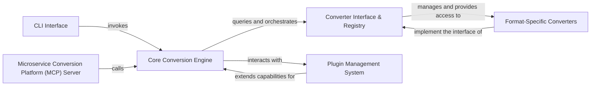

## Details

The `markitdown` architecture is centered around a `Core Conversion Engine` that acts as the primary orchestrator for document transformations. Users can interact with this engine either directly via the `CLI Interface` or programmatically through the `Microservice Conversion Platform (MCP) Server`. The `Core Conversion Engine` leverages a `Converter Interface & Registry` to dynamically discover and select appropriate `Format-Specific Converters` based on the input type. The system's extensibility is a core design principle, supported by a `Plugin Management System` that allows for the seamless integration of new or custom converters, enhancing the utility's adaptability to diverse document formats. This modular design ensures a clear separation of concerns and promotes maintainability and future expansion.

### CLI Interface
Provides the command-line entry point for user interaction, parsing arguments, and orchestrating conversion tasks.

**Related Classes/Methods**:

- <a href="https://github.com/microsoft/markitdown/blob/main/packages/markitdown/src/markitdown/__main__.py" target="_blank" rel="noopener noreferrer">`packages.markitdown.src.markitdown.__main__.main`</a>

### Core Conversion Engine
The central orchestrator of the document conversion process, managing input streams, dynamically selecting converters, and executing conversion logic.

**Related Classes/Methods**:

- <a href="https://github.com/microsoft/markitdown/blob/main/packages/markitdown/src/markitdown/_markitdown.py" target="_blank" rel="noopener noreferrer">`packages.markitdown.src.markitdown._markitdown.__init__`</a>
- <a href="https://github.com/microsoft/markitdown/blob/main/packages/markitdown/src/markitdown/_markitdown.py" target="_blank" rel="noopener noreferrer">`packages.markitdown.src.markitdown._markitdown.convert`</a>

### Converter Interface & Registry
Defines the standard `accepts` and `convert` interface for all document converters and manages their registration and lookup.

**Related Classes/Methods**:

- <a href="https://github.com/microsoft/markitdown/blob/main/packages/markitdown/src/markitdown/_base_converter.py" target="_blank" rel="noopener noreferrer">`packages.markitdown.src.markitdown._base_converter.accepts`</a>
- <a href="https://github.com/microsoft/markitdown/blob/main/packages/markitdown/src/markitdown/_markitdown.py" target="_blank" rel="noopener noreferrer">`packages.markitdown.src.markitdown._markitdown.register_converter`</a>

### Plugin Management System
Facilitates the discovery, loading, and integration of external, format-specific converter plugins, extending the utility's capabilities.

**Related Classes/Methods**:

- <a href="https://github.com/microsoft/markitdown/blob/main/packages/markitdown/src/markitdown/_markitdown.py" target="_blank" rel="noopener noreferrer">`packages.markitdown.src.markitdown._markitdown._load_plugins`</a>

### Format-Specific Converters
A collection of specialized modules, each implementing the `Converter Interface` to handle the conversion of a particular document or data format into markdown.

**Related Classes/Methods**:

- <a href="https://github.com/microsoft/markitdown/blob/main/packages/markitdown/src/markitdown/converters/_image_converter.py" target="_blank" rel="noopener noreferrer">`packages.markitdown.src.markitdown.converters._image_converter.convert`</a>
- <a href="https://github.com/microsoft/markitdown/blob/main/packages/markitdown/src/markitdown/converters/_doc_intel_converter.py" target="_blank" rel="noopener noreferrer">`packages.markitdown.src.markitdown.converters._doc_intel_converter.convert`</a>
- <a href="https://github.com/microsoft/markitdown/blob/main/packages/markitdown/src/markitdown/converters/_rss_converter.py" target="_blank" rel="noopener noreferrer">`packages.markitdown.src.markitdown.converters._rss_converter.convert`</a>

### Microservice Conversion Platform (MCP) Server
Exposes the `markitdown` conversion capabilities as a web service, allowing other applications to integrate and utilize the conversion engine via HTTP requests.

**Related Classes/Methods**:

- <a href="https://github.com/microsoft/markitdown/blob/main/packages/markitdown-mcp/src/markitdown_mcp/__main__.py" target="_blank" rel="noopener noreferrer">`packages.markitdown-mcp.src.markitdown_mcp.__main__.main`</a>
- <a href="https://github.com/microsoft/markitdown/blob/main/packages/markitdown-mcp/src/markitdown_mcp/__main__.py" target="_blank" rel="noopener noreferrer">`packages.markitdown-mcp.src.markitdown_mcp.__main__.convert_to_markdown`</a>

### [FAQ](https://github.com/CodeBoarding/GeneratedOnBoardings/tree/main?tab=readme-ov-file#faq)