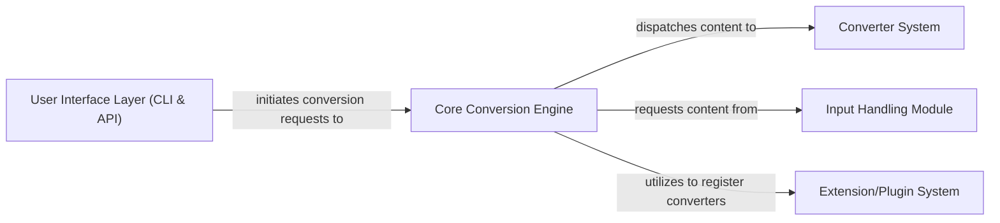

## Details

The `markitdown` project functions as a robust content conversion system, centralizing the transformation of diverse input formats into Markdown. The `Core Conversion Engine` acts as the primary orchestrator, receiving conversion requests and intelligently dispatching them. It leverages the `Input Handling Module` to acquire content from various sources (local files, URIs, streams) and then directs this content to the `Converter System` for the actual transformation. The `Converter System`, comprising a wide array of specialized converters, handles the format-specific conversion logic. An `Extension/Plugin System` allows for dynamic expansion of conversion capabilities, while the `User Interface Layer` provides accessible interaction points via CLI and API.

### Core Conversion Engine
The central orchestrator of the content conversion workflow. It manages the registration of both built-in and plugin converters, dispatches conversion requests to the appropriate handlers based on input type and content analysis, and oversees the overall conversion process. It embodies the Facade and Strategy patterns by providing a unified interface to a complex conversion system.

**Related Classes/Methods**:

- <a href="https://github.com/microsoft/markitdown/blob/main/packages/markitdown/src/markitdown/_markitdown.py" target="_blank" rel="noopener noreferrer">`packages.markitdown.src.markitdown._markitdown.markitdown.Markitdown`</a>
- <a href="https://github.com/microsoft/markitdown/blob/main/packages/markitdown/src/markitdown/_markitdown.py" target="_blank" rel="noopener noreferrer">`packages.markitdown.src.markitdown._markitdown.markitdown.Markitdown:__init__`</a>
- <a href="https://github.com/microsoft/markitdown/blob/main/packages/markitdown/src/markitdown/_markitdown.py" target="_blank" rel="noopener noreferrer">`packages.markitdown.src.markitdown._markitdown.markitdown.Markitdown:convert`</a>
- <a href="https://github.com/microsoft/markitdown/blob/main/packages/markitdown/src/markitdown/_markitdown.py" target="_blank" rel="noopener noreferrer">`packages.markitdown.src.markitdown._markitdown.markitdown.Markitdown:register_converter`</a>
- <a href="https://github.com/microsoft/markitdown/blob/main/packages/markitdown/src/markitdown/_markitdown.py" target="_blank" rel="noopener noreferrer">`packages.markitdown.src.markitdown._markitdown.markitdown.Markitdown:enable_builtins`</a>
- <a href="https://github.com/microsoft/markitdown/blob/main/packages/markitdown/src/markitdown/_markitdown.py" target="_blank" rel="noopener noreferrer">`packages.markitdown.src.markitdown._markitdown.markitdown.Markitdown:enable_plugins`</a>
- <a href="https://github.com/microsoft/markitdown/blob/main/packages/markitdown/src/markitdown/_markitdown.py" target="_blank" rel="noopener noreferrer">`packages.markitdown.src.markitdown._markitdown.markitdown.Markitdown:_convert`</a>
- <a href="https://github.com/microsoft/markitdown/blob/main/packages/markitdown/src/markitdown/_markitdown.py" target="_blank" rel="noopener noreferrer">`packages.markitdown.src.markitdown._markitdown.markitdown.Markitdown:_get_stream_info_guesses`</a>

### Converter System [[Expand]](./Converter_System.md)
Encapsulates all content transformation logic. This component defines the standard accepts and convert methods that all specific content converters must implement, ensuring a consistent interface. It includes foundational, generic converters (e.g., PlainText, HTML, Zip) and a wide array of specialized modules designed to process and transform content from particular source formats (e.g., DOCX, PDF, Images, Web Feeds, YouTube, RSS) into Markdown. It also incorporates pre-processing utilities for specific document formats, such as handling mathematical equations in DOCX.

**Related Classes/Methods**:

- <a href="https://github.com/microsoft/markitdown/blob/main/packages/markitdown/src/markitdown/_base_converter.py" target="_blank" rel="noopener noreferrer">`markitdown._base_converter.BaseConverter:accepts`</a>
- <a href="https://github.com/microsoft/markitdown/blob/main/packages/markitdown/src/markitdown/_base_converter.py" target="_blank" rel="noopener noreferrer">`markitdown._base_converter.BaseConverter:convert`</a>
- <a href="https://github.com/microsoft/markitdown/blob/main/packages/markitdown/src/markitdown/converters/doc_intel_converter.py" target="_blank" rel="noopener noreferrer">`markitdown.converters.doc_intel_converter.DocumentIntelligenceConverter`</a>
- <a href="https://github.com/microsoft/markitdown/blob/main/packages/markitdown/src/markitdown/converters/image_converter.py" target="_blank" rel="noopener noreferrer">`markitdown.converters.image_converter.ImageConverter`</a>
- <a href="https://github.com/microsoft/markitdown/blob/main/packages/markitdown/src/markitdown/converters/html_converter.py" target="_blank" rel="noopener noreferrer">`markitdown.converters.html_converter.HtmlConverter`</a>
- <a href="https://github.com/microsoft/markitdown/blob/main/packages/markitdown/src/markitdown/converters/rss_converter.py" target="_blank" rel="noopener noreferrer">`markitdown.converters.rss_converter.RssConverter`</a>
- <a href="https://github.com/microsoft/markitdown/blob/main/packages/markitdown/src/markitdown/converters/youtube_converter.py" target="_blank" rel="noopener noreferrer">`markitdown.converters.youtube_converter.YouTubeConverter`</a>
- <a href="https://github.com/microsoft/markitdown/blob/main/packages/markitdown/src/markitdown/converters/pptx_converter.py" target="_blank" rel="noopener noreferrer">`markitdown.converters.pptx_converter.PptxConverter`</a>
- <a href="https://github.com/microsoft/markitdown/blob/main/packages/markitdown/src/markitdown/converters/docx_converter.py" target="_blank" rel="noopener noreferrer">`markitdown.converters.docx_converter.DocxConverter`</a>
- <a href="https://github.com/microsoft/markitdown/blob/main/packages/markitdown/src/markitdown/converters/pdf_converter.py" target="_blank" rel="noopener noreferrer">`markitdown.converters.pdf_converter.PdfConverter`</a>
- <a href="https://github.com/microsoft/markitdown/blob/main/packages/markitdown/src/markitdown/converters/outlook_msg_converter.py" target="_blank" rel="noopener noreferrer">`markitdown.converters.outlook_msg_converter.OutlookMsgConverter`</a>
- <a href="https://github.com/microsoft/markitdown/blob/main/packages/markitdown/src/markitdown/converters/epub_converter.py" target="_blank" rel="noopener noreferrer">`markitdown.converters.epub_converter.EpubConverter`</a>
- <a href="https://github.com/microsoft/markitdown/blob/main/packages/markitdown/src/markitdown/converters/csv_converter.py" target="_blank" rel="noopener noreferrer">`markitdown.converters.csv_converter.CsvConverter`</a>
- <a href="https://github.com/microsoft/markitdown/blob/main/packages/markitdown/src/markitdown/converters/xlsx_converter.py" target="_blank" rel="noopener noreferrer">`markitdown.converters.xlsx_converter.XlsxConverter`</a>
- <a href="https://github.com/microsoft/markitdown/blob/main/packages/markitdown/src/markitdown/converters/xls_converter.py" target="_blank" rel="noopener noreferrer">`markitdown.converters.xls_converter.XlsConverter`</a>
- <a href="https://github.com/microsoft/markitdown/blob/main/packages/markitdown/src/markitdown/converters/ipynb_converter.py" target="_blank" rel="noopener noreferrer">`markitdown.converters.ipynb_converter.IpynbConverter`</a>
- <a href="https://github.com/microsoft/markitdown/blob/main/packages/markitdown/src/markitdown/converters/wikipedia_converter.py" target="_blank" rel="noopener noreferrer">`markitdown.converters.wikipedia_converter.WikipediaConverter`</a>
- <a href="https://github.com/microsoft/markitdown/blob/main/packages/markitdown/src/markitdown/converters/bing_serp_converter.py" target="_blank" rel="noopener noreferrer">`markitdown.converters.bing_serp_converter.BingSerpConverter`</a>
- <a href="https://github.com/microsoft/markitdown/blob/main/packages/markitdown/src/markitdown/converters/audio_converter.py" target="_blank" rel="noopener noreferrer">`markitdown.converters.audio_converter.AudioConverter`</a>
- <a href="https://github.com/microsoft/markitdown/blob/main/packages/markitdown/src/markitdown/converter_utils/docx/pre_process.py" target="_blank" rel="noopener noreferrer">`packages.markitdown.src.markitdown.converter_utils.docx.pre_process.pre_process_docx`</a>
- <a href="https://github.com/microsoft/markitdown/blob/main/packages/markitdown/src/markitdown/converter_utils/docx/math/omml.py" target="_blank" rel="noopener noreferrer">`markitdown.converter_utils.docx.math.omml.Omml`</a>

### Input Handling Module [[Expand]](./Input_Handling_Module.md)
Responsible for acquiring content from various input sources, including local file paths, diverse Uniform Resource Identifiers (URIs like HTTP/S, file:, data:), and raw binary streams. It handles the initial parsing and normalization of these sources to prepare them for the conversion pipeline.

**Related Classes/Methods**:

- <a href="https://github.com/microsoft/markitdown/blob/main/packages/markitdown/src/markitdown/_markitdown.py" target="_blank" rel="noopener noreferrer">`packages.markitdown.src.markitdown._markitdown.markitdown.Markitdown.convert_local`</a>
- <a href="https://github.com/microsoft/markitdown/blob/main/packages/markitdown/src/markitdown/_markitdown.py" target="_blank" rel="noopener noreferrer">`packages.markitdown.src.markitdown._markitdown.markitdown.Markitdown.convert_uri`</a>
- <a href="https://github.com/microsoft/markitdown/blob/main/packages/markitdown/src/markitdown/_markitdown.py" target="_blank" rel="noopener noreferrer">`packages.markitdown.src.markitdown._markitdown.markitdown.Markitdown.convert_response`</a>
- <a href="https://github.com/microsoft/markitdown/blob/main/packages/markitdown/src/markitdown/_markitdown.py" target="_blank" rel="noopener noreferrer">`packages.markitdown.src.markitdown._markitdown.markitdown.Markitdown.convert_stream`</a>
- <a href="https://github.com/microsoft/markitdown/blob/main/packages/markitdown/src/markitdown/uri/file.py" target="_blank" rel="noopener noreferrer">`markitdown.uri.file.file_uri_to_path`</a>
- <a href="https://github.com/microsoft/markitdown/blob/main/packages/markitdown/src/markitdown/uri/data.py" target="_blank" rel="noopener noreferrer">`markitdown.uri.data.parse_data_uri`</a>

### Extension/Plugin System [[Expand]](./Extension_Plugin_System.md)
Provides the infrastructure for dynamically loading and registering external converter plugins. This system allows for extending the core conversion capabilities without modifying the main codebase, adhering to a plugin architecture.

**Related Classes/Methods**:

- <a href="https://github.com/microsoft/markitdown/blob/main/packages/markitdown/src/markitdown/_markitdown.py" target="_blank" rel="noopener noreferrer">`packages.markitdown.src.markitdown._markitdown._load_plugins`</a>
- <a href="https://github.com/microsoft/markitdown/blob/main/packages/markitdown/src/markitdown/_markitdown.py" target="_blank" rel="noopener noreferrer">`packages.markitdown.src.markitdown._markitdown.markitdown.Markitdown.enable_plugins`</a>

### User Interface Layer (CLI & API) [[Expand]](./User_Interface_Layer_CLI_API_.md)
Offers multiple interaction points for users and other applications. This component includes a command-line interface for direct user interaction and a web-based API for programmatic access, enabling integration with other applications or services.

**Related Classes/Methods**:

- <a href="https://github.com/microsoft/markitdown/blob/main/packages/markitdown/src/markitdown/__main__.py" target="_blank" rel="noopener noreferrer">`packages.markitdown.src.markitdown.__main__.main`</a>
- <a href="https://github.com/microsoft/markitdown/blob/main/packages/markitdown-mcp/src/markitdown_mcp/__main__.py" target="_blank" rel="noopener noreferrer">`packages.markitdown-mcp.src.markitdown_mcp.__main__.main`</a>
- <a href="https://github.com/microsoft/markitdown/blob/main/packages/markitdown-mcp/src/markitdown_mcp/__main__.py" target="_blank" rel="noopener noreferrer">`packages.markitdown-mcp.src.markitdown_mcp.__main__.convert_to_markdown`</a>

### [FAQ](https://github.com/CodeBoarding/GeneratedOnBoardings/tree/main?tab=readme-ov-file#faq)