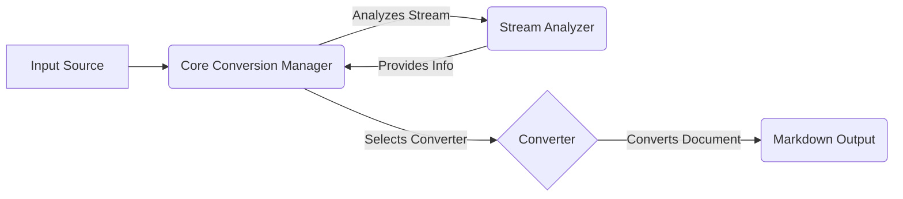

# MarkItDown: High-Level Data Flow Overview

MarkItDown is a versatile document conversion tool that transforms various file formats and online content into Markdown. It intelligently identifies the input type and applies the appropriate converter to produce clean, readable Markdown output.

## Component Descriptions:

**A. Input Source:** Represents the origin of the content to be converted. This could be a local file, a URL, a stream, or any other supported input method. It provides the raw data to the Core Conversion Manager.

**B. Core Conversion Manager:** This is the central orchestrator of the conversion process. It receives the input stream, analyzes it using the Stream Analyzer, selects the appropriate converter based on the stream's characteristics, and then delegates the actual conversion to the chosen converter. It relates to the Stream Analyzer by using it to determine the input type, and to the Converter by selecting and calling the appropriate one.

**C. Stream Analyzer:** Responsible for determining the characteristics of the input stream, such as its MIME type, file extension, and charset. It uses content-based analysis and filename/URL hints to make educated guesses about the stream's nature. It provides this information back to the Core Conversion Manager to aid in converter selection. It relates to the Core Conversion Manager by providing it with the stream information.

**D. Converter:** Represents the family of specialized converters responsible for converting specific file formats or content types into Markdown. The Core Conversion Manager selects the appropriate converter based on the input stream's characteristics. It relates to the Core Conversion Manager by receiving the document to convert, and to the Markdown Output by generating the final markdown.

**E. Markdown Output:** The final result of the conversion process, representing the input content in Markdown format. This is the desired output of the MarkItDown tool.