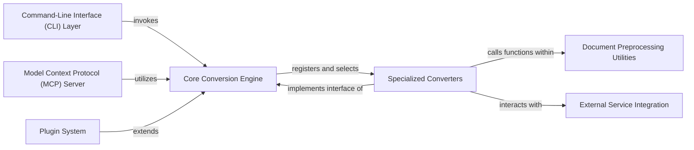

## Details

One paragraph explaining the functionality which is represented by this graph. What the main flow is and what is its purpose.

### Core Conversion Engine
The central facade and orchestrator for all document conversion processes, managing converter selection and input handling.

**Related Classes/Methods**:

- <a href="https://github.com/microsoft/markitdown/blob/main/packages/markitdown/src/markitdown/_markitdown.py#L1-L1" target="_blank" rel="noopener noreferrer">`packages/markitdown/src/markitdown/_markitdown.py` (1:1)</a>
- <a href="https://github.com/microsoft/markitdown/blob/main/packages/markitdown/src/markitdown/_base_converter.py#L1-L1" target="_blank" rel="noopener noreferrer">`packages/markitdown/src/markitdown/_base_converter.py` (1:1)</a>

### Specialized Converters
Modules responsible for the concrete conversion logic of specific document formats into markdown, adhering to a common interface.

**Related Classes/Methods**:

- <a href="https://github.com/microsoft/markitdown/blob/main/packages/markitdown/src/markitdown/converters/#L1-L1" target="_blank" rel="noopener noreferrer">`All files in packages/markitdown/src/markitdown/converters/` (1:1)</a>

### Command-Line Interface (CLI) Layer
Provides the user-facing command-line interface for initiating and configuring document conversions.

**Related Classes/Methods**:

- <a href="https://github.com/microsoft/markitdown/blob/main/packages/markitdown/src/markitdown/__main__.py#L1-L1" target="_blank" rel="noopener noreferrer">`packages/markitdown/src/markitdown/__main__.py` (1:1)</a>

### Plugin System
Manages the discovery, loading, and registration of external modules (plugins) to extend markitdown's conversion capabilities.

**Related Classes/Methods**: _None_

### Model Context Protocol (MCP) Server
Exposes markitdown's conversion functionalities as a network service for remote consumption by other applications.

**Related Classes/Methods**: _None_

### Document Preprocessing Utilities
Provides specialized functions for pre-processing complex document structures before their main conversion.

**Related Classes/Methods**:

- <a href="https://github.com/microsoft/markitdown/blob/main/packages/markitdown/src/markitdown/converter_utils/#L1-L1" target="_blank" rel="noopener noreferrer">`packages/markitdown/src/markitdown/converter_utils/` (1:1)</a>
- <a href="https://github.com/microsoft/markitdown/blob/main/packages/markitdown/src/markitdown/converter_utils/docx/pre_process.py#L1-L1" target="_blank" rel="noopener noreferrer">`packages/markitdown/src/markitdown/converter_utils/docx/pre_process.py` (1:1)</a>

### External Service Integration
Handles interactions with external APIs and services (e.g., Azure Document Intelligence, LLMs) to augment the conversion process.

**Related Classes/Methods**:

- <a href="https://github.com/microsoft/markitdown/blob/main/packages/markitdown/src/markitdown/converters/_doc_intel_converter.py#L1-L1" target="_blank" rel="noopener noreferrer">`packages/markitdown/src/markitdown/converters/_doc_intel_converter.py` (1:1)</a>
- <a href="https://github.com/microsoft/markitdown/blob/main/packages/markitdown/src/markitdown/converters/_bing_serp_converter.py#L1-L1" target="_blank" rel="noopener noreferrer">`packages/markitdown/src/markitdown/converters/_bing_serp_converter.py` (1:1)</a>
- <a href="https://github.com/microsoft/markitdown/blob/main/packages/markitdown/src/markitdown/converters/_llm_caption.py#L1-L1" target="_blank" rel="noopener noreferrer">`packages/markitdown/src/markitdown/converters/_llm_caption.py` (1:1)</a>

### [FAQ](https://github.com/CodeBoarding/GeneratedOnBoardings/tree/main?tab=readme-ov-file#faq)