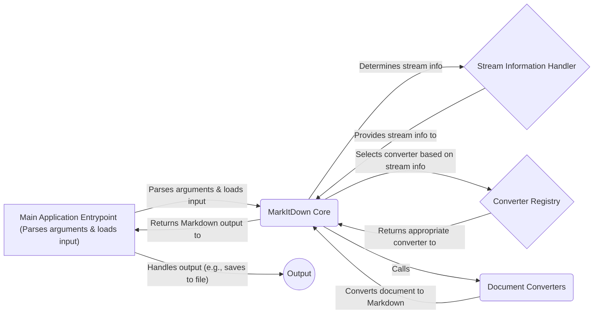

## MarkItDown: High-Level Data Flow Diagram

MarkItDown is a versatile document conversion tool that transforms various file formats, such as HTML, DOCX, PDF, PPTX, XLSX, images, audio, and YouTube videos, into Markdown. It leverages a modular architecture with specialized converters and a central core to manage the conversion process.

### Component Descriptions:

**Main Application Entrypoint:** This component serves as the entry point for the MarkItDown application. It parses command-line arguments to determine the input source (file, URL, etc.) and desired output format. It then initializes the `MarkItDown Core` component and passes the input stream to it. After the conversion, it receives the Markdown output from the `MarkItDown Core` and handles the output, such as saving it to a file or printing it to the console. It relates to `MarkItDown Core` by calling it to start the conversion process and receiving the final markdown output.

**MarkItDown Core:** This is the central component responsible for orchestrating the entire conversion process. It receives the input stream from the `Main Application Entrypoint`, determines the stream's information using the `Stream Information Handler`, selects the appropriate converter from the `Converter Registry`, and calls the selected `Document Converters` to perform the actual conversion. It then returns the resulting Markdown output back to the `Main Application Entrypoint`. It relates to `Stream Information Handler` by using it to determine the stream information, to `Converter Registry` by selecting the appropriate converter and to `Document Converters` by calling the selected converter.

**Stream Information Handler:** This component analyzes the input stream to determine its MIME type, extension, and charset. This information is crucial for the `MarkItDown Core` to select the correct converter. It provides this information back to the `MarkItDown Core`. It relates to `MarkItDown Core` by providing the stream information.

**Converter Registry:** This component maintains a list of all available document converters and their priorities. The `MarkItDown Core` queries this registry to find the most suitable converter for a given input stream based on its MIME type or extension. It returns the selected converter to the `MarkItDown Core`. It relates to `MarkItDown Core` by providing the appropriate converter.

**Document Converters:** This component represents a collection of specialized converters, each responsible for converting a specific document type (e.g., HTML, DOCX, PDF) to Markdown. These converters are called by the `MarkItDown Core` and perform the actual conversion logic. They receive the document content from the `MarkItDown Core` and return the Markdown output. It relates to `MarkItDown Core` by receiving the document content and returning the markdown output.