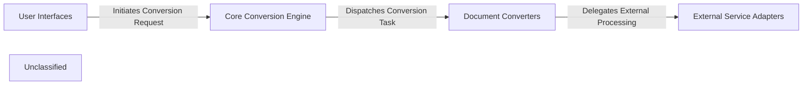

## Details

The `markitdown` project is structured around a central `Core Conversion Engine` that orchestrates the conversion of various document formats into Markdown. User interaction primarily occurs through `User Interfaces`, which can be either a command-line interface or an HTTP API. The `Core Conversion Engine` leverages a set of `Document Converters`, each specialized for a particular file type. For advanced processing or specific formats, these `Document Converters` delegate tasks to `External Service Adapters`, which in turn manage interactions with `External Services` like Azure Document Intelligence, Large Language Models, and the Exiftool utility. This modular design ensures extensibility and clear separation of concerns, facilitating both local and cloud-based document processing workflows.

### User Interfaces
The primary entry points for users to interact with `markitdown`, either through command-line commands or an HTTP API. These interfaces initiate conversion requests to the core engine.

**Related Classes/Methods**:

- <a href="https://github.com/microsoft/markitdown/blob/mainpackages/markitdown/src/markitdown/__main__.py" target="_blank" rel="noopener noreferrer">`markitdown.__main__:main`</a>
- <a href="https://github.com/microsoft/markitdown/blob/mainpackages/markitdown-mcp/src/markitdown_mcp/__main__.py" target="_blank" rel="noopener noreferrer">`markitdown_mcp.__main__:main`</a>

### Core Conversion Engine
The central orchestrator managing the entire document conversion workflow. It registers available converters, handles plugin management, and dispatches conversion tasks based on the input document's type.

**Related Classes/Methods**:

- <a href="https://github.com/microsoft/markitdown/blob/mainpackages/markitdown/src/markitdown/_markitdown.py" target="_blank" rel="noopener noreferrer">`markitdown._markitdown:MarkItDown`</a>

### Document Converters
A collection of specialized modules, each responsible for converting a specific document format (e.g., Image, PDF, HTML) into Markdown. These converters implement the core logic for transforming various inputs.

**Related Classes/Methods**:

- <a href="https://github.com/microsoft/markitdown/blob/mainpackages/markitdown/src/markitdown/converters/_image_converter.py" target="_blank" rel="noopener noreferrer">`markitdown.converters._image_converter:ImageConverter`</a>
- <a href="https://github.com/microsoft/markitdown/blob/mainpackages/markitdown/src/markitdown/converters/_doc_intel_converter.py" target="_blank" rel="noopener noreferrer">`markitdown.converters._doc_intel_converter:DocumentIntelligenceConverter`</a>
- <a href="https://github.com/microsoft/markitdown/blob/mainpackages/markitdown/src/markitdown/converters/_html_converter.py" target="_blank" rel="noopener noreferrer">`markitdown.converters._html_converter:HtmlConverter`</a>

### External Service Adapters
Modules that abstract and manage interactions with external third-party services. These adapters provide a standardized interface for `Document Converters` to utilize external capabilities like OCR, metadata extraction, or LLM-based descriptions.

**Related Classes/Methods**:

- <a href="https://github.com/microsoft/markitdown/blob/mainpackages/markitdown/src/markitdown/converters/_doc_intel_converter.py" target="_blank" rel="noopener noreferrer">`markitdown.converters._doc_intel_converter:DocumentIntelligenceConverter`</a>
- <a href="https://github.com/microsoft/markitdown/blob/mainpackages/markitdown/src/markitdown/converters/_image_converter.py" target="_blank" rel="noopener noreferrer">`markitdown.converters._image_converter:ImageConverter`</a>
- <a href="https://github.com/microsoft/markitdown/blob/mainpackages/markitdown/src/markitdown/converters/_exiftool.py" target="_blank" rel="noopener noreferrer">`markitdown.converters._exiftool:exiftool_metadata`</a>

### Unclassified
Component for all unclassified files and utility functions (Utility functions/External Libraries/Dependencies)

**Related Classes/Methods**: _None_

### [FAQ](https://github.com/CodeBoarding/GeneratedOnBoardings/tree/main?tab=readme-ov-file#faq)