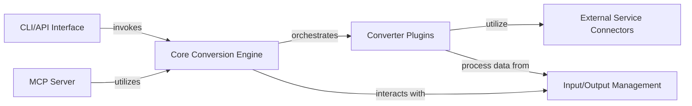

## Details

One paragraph explaining the functionality which is represented by this graph. What the main flow is and what is its purpose.

### CLI/API Interface
Provides the command-line and programmatic entry points for users to interact with the markitdown library, handling argument parsing and initiating conversion workflows.

**Related Classes/Methods**:

### Core Conversion Engine
The central orchestrator for document conversion. It manages the lifecycle of converters (including plugin loading and registration), dispatches conversion requests to appropriate converters, and handles the overall input/output flow.

**Related Classes/Methods**:

### Converter Plugins
A collection of specialized plugins, each responsible for converting a specific document type (e.g., PDF, DOCX, HTML, Images) into a standardized markdown format. These components encapsulate the logic for handling different file formats and implement the Base Converter Interface.

**Related Classes/Methods**:

### Input/Output Management
Manages the abstraction of input sources (files, URIs, streams) and output destinations, providing a unified way for the Core Conversion Engine to access and store data regardless of its origin or final destination.

**Related Classes/Methods**:

### External Service Connectors
Encapsulates interactions with third-party services, such as Azure Document Intelligence for advanced document analysis or OpenAI for LLM-based content generation.

**Related Classes/Methods**:

### MCP Server
Acts as a backend service, exposing an HTTP API to provide document conversion capabilities over a network, enabling remote access to the markitdown functionality.

**Related Classes/Methods**:

### [FAQ](https://github.com/CodeBoarding/GeneratedOnBoardings/tree/main?tab=readme-ov-file#faq)