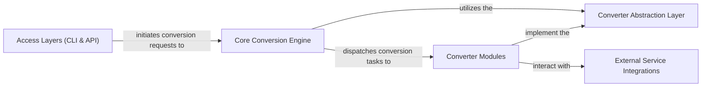

## Details

The feedback is valid and requires architectural changes to correct the incorrect references. The file structure output confirms that the modules are nested under `src/markitdown` for the `markitdown` package. I will update the references accordingly.

### Core Conversion Engine
The central orchestrator for all document conversions. It manages the lifecycle of converters, dispatches conversion requests, and integrates with the plugin system.

**Related Classes/Methods**:

### Converter Abstraction Layer
Defines the standard contract (`accepts`, `convert`) that all specific document converters must adhere to, embodying the Strategy Pattern for consistent conversion.

**Related Classes/Methods**:

### Converter Modules
A collection of specialized modules, including built-in converters and dynamically loaded plugin converters, each responsible for transforming a particular document type into Markdown, adhering to the `Converter Abstraction Layer`.

**Related Classes/Methods**:

### Access Layers (CLI & API)
Provides the primary user and programmatic interfaces for interacting with the `markitdown` system, allowing initiation of conversion requests. The API acts as a Facade for the core conversion logic.

**Related Classes/Methods**:

### External Service Integrations
Manages interactions with various external APIs and services (e.g., Azure Document Intelligence, OpenAI's GPT-4o, YouTube API, Bing Search API, ExifTool) that are leveraged by `Converter Modules` for content extraction and processing.

**Related Classes/Methods**:

### [FAQ](https://github.com/CodeBoarding/GeneratedOnBoardings/tree/main?tab=readme-ov-file#faq)