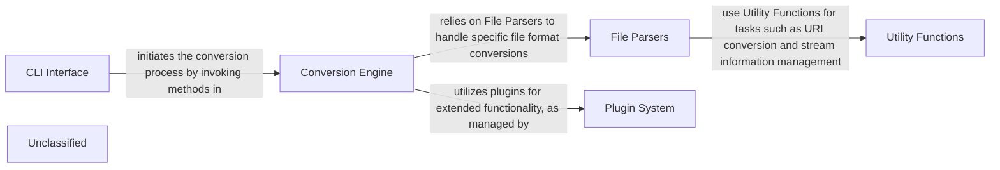

## Details

The `markitdown` project is structured around a central Conversion Engine that orchestrates the conversion of various document types into markdown. The CLI Interface serves as the entry point, parsing user commands and directing them to the appropriate conversion processes. File Parsers provide specialized handling for different file formats, while the Plugin System offers extensibility through third-party integrations. Utility Functions support these components by managing URIs and stream information, ensuring smooth data flow throughout the system. This architecture facilitates clear component boundaries and interaction pathways, making it suitable for both documentation and visual diagram generation.

### CLI Interface
Manages user interactions and command parsing.

**Related Classes/Methods**:

- <a href="https://github.com/microsoft/markitdown/blob/main/packages/markitdown/src/markitdown/__main__.py#L13-L200" target="_blank" rel="noopener noreferrer">`main`:13-200</a>

### Conversion Engine
Core logic for converting various document types.

**Related Classes/Methods**:

- <a href="https://github.com/microsoft/markitdown/blob/main/packages/markitdown/src/markitdown/_base_converter.py#L42-L105" target="_blank" rel="noopener noreferrer">`DocumentConverter`:42-105</a>
- <a href="https://github.com/microsoft/markitdown/blob/main/packages/markitdown/src/markitdown/_base_converter.py#L5-L39" target="_blank" rel="noopener noreferrer">`DocumentConverterResult`:5-39</a>

### File Parsers
Specialized modules for parsing different file formats.

**Related Classes/Methods**:

- <a href="https://github.com/microsoft/markitdown/blob/main/packages/markitdown/src/markitdown/converters/_image_converter.py#L16-L138" target="_blank" rel="noopener noreferrer">`ImageConverter`:16-138</a>

### Plugin System
Allows for extensibility and integration with additional converters.

**Related Classes/Methods**:

- <a href="https://github.com/microsoft/markitdown/blob/main/packages/markitdown/src/markitdown/__main__.py#L13-L200" target="_blank" rel="noopener noreferrer">`main`:13-200</a>

### Utility Functions
Provides helper functions for URI and stream management.

**Related Classes/Methods**:

- <a href="https://github.com/microsoft/markitdown/blob/main/packages/markitdown/src/markitdown/_uri_utils.py" target="_blank" rel="noopener noreferrer">`packages/markitdown/src/markitdown/_uri_utils.py`</a>
- <a href="https://github.com/microsoft/markitdown/blob/main/packages/markitdown/src/markitdown/_stream_info.py" target="_blank" rel="noopener noreferrer">`packages/markitdown/src/markitdown/_stream_info.py`</a>

### Unclassified
Component for all unclassified files and utility functions (Utility functions/External Libraries/Dependencies)

**Related Classes/Methods**: _None_

### [FAQ](https://github.com/CodeBoarding/GeneratedOnBoardings/tree/main?tab=readme-ov-file#faq)