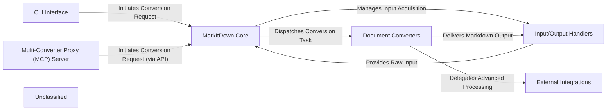

## Details

The `markitdown` architecture is centered around a pluggable conversion pipeline, designed for high modularity and extensibility. The **MarkItDown Core** acts as the central hub, orchestrating document transformations initiated by either the **CLI Interface** or the optional **Multi-Converter Proxy (MCP) Server**. It dynamically selects and dispatches tasks to specialized **Document Converters**, which are responsible for format-specific parsing. These converters can seamlessly integrate with **External Integrations** like Azure Document Intelligence or LLMs to enhance processing capabilities. All input acquisition and final Markdown output delivery are managed by the **Input/Output Handlers**, ensuring a clear separation of concerns and a streamlined data flow from diverse sources to a unified Markdown representation.

### CLI Interface
The primary user interaction point for the standalone tool, handling command-line arguments, user input, and displaying conversion results.

**Related Classes/Methods**:

- <a href="https://github.com/microsoft/markitdown/blob/main/packages/markitdown/src/markitdown/__main__.py" target="_blank" rel="noopener noreferrer">`packages/markitdown/src/markitdown/__main__.py`</a>

### MarkItDown Core
The central orchestration layer, managing converter registration, plugin loading, and dispatching conversion requests to the appropriate handlers.

**Related Classes/Methods**:

- <a href="https://github.com/microsoft/markitdown/blob/main/packages/markitdown/src/markitdown/_markitdown.py" target="_blank" rel="noopener noreferrer">`packages/markitdown/src/markitdown/_markitdown.py`</a>

### Document Converters
A collection of specialized modules, each responsible for converting a specific document format (e.g., PDF, DOCX, HTML) into Markdown, including pre-processing utilities.

**Related Classes/Methods**:

- <a href="https://github.com/microsoft/markitdown/blob/main/packages/markitdown/src/markitdown/converters/" target="_blank" rel="noopener noreferrer">`packages/markitdown/src/markitdown/converters/`</a>
- <a href="https://github.com/microsoft/markitdown/blob/main/packages/markitdown/src/markitdown/converter_utils/docx/" target="_blank" rel="noopener noreferrer">`packages/markitdown/src/markitdown/converter_utils/docx/`</a>

### External Integrations
Interfaces with external services such as Azure Document Intelligence for advanced document analysis and Large Language Models for content enrichment.

**Related Classes/Methods**:

- <a href="https://github.com/microsoft/markitdown/blob/main/packages/markitdown/src/markitdown/converters/_doc_intel_converter.py" target="_blank" rel="noopener noreferrer">`packages/markitdown/src/markitdown/converters/_doc_intel_converter.py`</a>
- <a href="https://github.com/microsoft/markitdown/blob/main/packages/markitdown/src/markitdown/converters/_image_converter.py" target="_blank" rel="noopener noreferrer">`packages/markitdown/src/markitdown/converters/_image_converter.py`</a>

### Input/Output Handlers
Manages reading various input sources (local files, URIs) and writing the final Markdown output to specified destinations.

**Related Classes/Methods**:

- <a href="https://github.com/microsoft/markitdown/blob/main/packages/markitdown/src/markitdown/_markitdown.py" target="_blank" rel="noopener noreferrer">`packages/markitdown/src/markitdown/_markitdown.py`</a>
- <a href="https://github.com/microsoft/markitdown/blob/main/packages/markitdown/src/markitdown/__main__.py" target="_blank" rel="noopener noreferrer">`packages/markitdown/src/markitdown/__main__.py`</a>

### Multi-Converter Proxy (MCP) Server
An optional server-side component that exposes the `markitdown` conversion capabilities via a web API, enabling remote or centralized conversion.

**Related Classes/Methods**:

- <a href="https://github.com/microsoft/markitdown/blob/main/packages/markitdown-mcp/src/markitdown_mcp/__main__.py" target="_blank" rel="noopener noreferrer">`packages/markitdown-mcp/src/markitdown_mcp/__main__.py`</a>

### Unclassified
Component for all unclassified files and utility functions (Utility functions/External Libraries/Dependencies)

**Related Classes/Methods**: _None_

### [FAQ](https://github.com/CodeBoarding/GeneratedOnBoardings/tree/main?tab=readme-ov-file#faq)