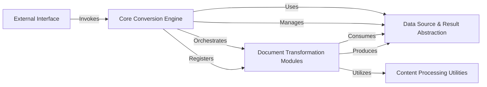

## Details

The `markitdown` project is architected as a modular and extensible document processing and conversion library, primarily designed for LLM data preparation. Its core functionality revolves around converting various document formats into Markdown, leveraging a plugin-based architecture.

### Core Conversion Engine
This is the central orchestrator of the `markitdown` library. It manages the lifecycle of document conversions, including the discovery and registration of both built-in and external converter plugins. It dispatches conversion requests to the appropriate transformation modules based on the input type and configuration.

**Related Classes/Methods**:

- <a href="https://github.com/microsoft/markitdown/packages/markitdown/src/markitdown/_markitdown.py#L1-L1000" target="_blank" rel="noopener noreferrer">`markitdown._markitdown` (1:1000)</a>

### Data Source & Result Abstraction
Provides a unified interface for handling diverse input data sources (local files, URIs, streams) and defines the standardized output format for conversion results. It abstracts the complexities of data access and ensures a consistent structure for converted Markdown content and associated metadata.

**Related Classes/Methods**:

- <a href="https://github.com/microsoft/markitdown/packages/markitdown/src/markitdown/_stream_info.py#L1-L1000" target="_blank" rel="noopener noreferrer">`markitdown._stream_info` (1:1000)</a>
- <a href="https://github.com/microsoft/markitdown/packages/markitdown/src/markitdown/_uri_utils.py#L1-L1000" target="_blank" rel="noopener noreferrer">`markitdown._uri_utils` (1:1000)</a>
- <a href="https://github.com/microsoft/markitdown/packages/markitdown/src/markitdown/_base_converter.py#L1-L1000" target="_blank" rel="noopener noreferrer">`markitdown._base_converter` (1:1000)</a>

### Document Transformation Modules
A collection of specialized modules, each responsible for transforming a specific document type (e.g., PDF, DOCX, HTML, Audio) into Markdown. These modules implement the common interface defined by the "Data Source & Result Abstraction" component and perform the actual content extraction and formatting. This component includes both built-in converters and externally loaded plugins.

**Related Classes/Methods**:

- `markitdown.converters` (1:1000)
- <a href="https://github.com/microsoft/markitdown/packages/markitdown-sample-plugin/src/markitdown_sample_plugin/_plugin.py#L1-L1000" target="_blank" rel="noopener noreferrer">`markitdown_sample_plugin._plugin` (1:1000)</a>
- <a href="https://github.com/microsoft/markitdown/packages/markitdown-mcp/src/markitdown_mcp/__main__.py#L20-L22" target="_blank" rel="noopener noreferrer">`markitdown_mcp.__main__.convert_to_markdown` (20:22)</a>

### Content Processing Utilities
Offers a suite of reusable helper functions and specialized sub-modules that assist the "Document Transformation Modules" in performing common content processing tasks. This includes markdownification of HTML, LLM-based captioning, audio transcription, and pre-processing of specific document elements like DOCX math equations.

**Related Classes/Methods**:

- <a href="https://github.com/microsoft/markitdown/packages/markitdown/src/markitdown/converters/_markdownify.py#L1-L1000" target="_blank" rel="noopener noreferrer">`markitdown.converters._markdownify` (1:1000)</a>
- <a href="https://github.com/microsoft/markitdown/packages/markitdown/src/markitdown/converters/_llm_caption.py#L1-L1000" target="_blank" rel="noopener noreferrer">`markitdown.converters._llm_caption` (1:1000)</a>
- <a href="https://github.com/microsoft/markitdown/packages/markitdown/src/markitdown/converters/_exiftool.py#L1-L1000" target="_blank" rel="noopener noreferrer">`markitdown.converters._exiftool` (1:1000)</a>
- <a href="https://github.com/microsoft/markitdown/packages/markitdown/src/markitdown/converters/_transcribe_audio.py#L1-L1000" target="_blank" rel="noopener noreferrer">`markitdown.converters._transcribe_audio` (1:1000)</a>
- <a href="https://github.com/microsoft/markitdown/packages/markitdown/src/markitdown/converter_utils/docx/pre_process.py#L1-L1000" target="_blank" rel="noopener noreferrer">`markitdown.converter_utils.docx.pre_process` (1:1000)</a>
- <a href="https://github.com/microsoft/markitdown/packages/markitdown/src/markitdown/converter_utils/docx/math/omml.py#L1-L1000" target="_blank" rel="noopener noreferrer">`markitdown.converter_utils.docx.math.omml` (1:1000)</a>

### External Interface
Serves as the primary entry point for users to interact with the `markitdown` library. It provides a command-line interface (CLI) for initiating document conversions and configuring various options directly from the terminal.

**Related Classes/Methods**:

- <a href="https://github.com/microsoft/markitdown/packages/markitdown/src/markitdown/__main__.py#L1-L1000" target="_blank" rel="noopener noreferrer">`markitdown.__main__` (1:1000)</a>

### [FAQ](https://github.com/CodeBoarding/GeneratedOnBoardings/tree/main?tab=readme-ov-file#faq)