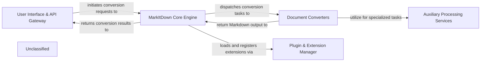

## Details

The `markitdown` project is structured around a core engine that orchestrates document conversion from various formats into Markdown. The `User Interface & API Gateway` serves as the primary interaction point, receiving user requests and forwarding them to the `MarkItDown Core Engine`. The `Core Engine` is responsible for managing the overall conversion workflow, including selecting and dispatching tasks to specialized `Document Converters`. These converters handle format-specific parsing and Markdown generation. To extend its capabilities, the `Core Engine` leverages the `Plugin & Extension Manager` for dynamic loading of additional converters and features. Furthermore, `Document Converters` can utilize `Auxiliary Processing Services` for specialized tasks such as metadata extraction, document pre-processing, and integration with external AI services. The converted Markdown output flows back from the `Document Converters` to the `MarkItDown Core Engine`, and finally to the `User Interface & API Gateway` for presentation to the user.

### User Interface & API Gateway
The entry point for users, encompassing both the command-line interface and the optional web API for remote access. It handles user input, argument parsing, and presents the final conversion results. Responsibilities: User interaction, input validation, output display, API request handling.

**Related Classes/Methods**:

- <a href="https://github.com/microsoft/markitdown/blob/main/packages/markitdown/src/markitdown/__main__.py" target="_blank" rel="noopener noreferrer">`markitdown.__main__`</a>

### MarkItDown Core Engine
The central orchestrator of the `markitdown` library. It initializes the system, manages converter registration, dispatches conversion tasks, and coordinates the overall document transformation workflow. Responsibilities: Conversion workflow management, converter selection, plugin loading, stream information management.

**Related Classes/Methods**:

- <a href="https://github.com/microsoft/markitdown/blob/main/packages/markitdown/src/markitdown/_markitdown.py" target="_blank" rel="noopener noreferrer">`markitdown._markitdown`</a>

### Document Converters
A collection of specialized modules, both built-in and plugin-provided, each responsible for converting a specific document format (e.g., PDF, DOCX, HTML, Image, Audio) into Markdown. Responsibilities: Format-specific parsing, content extraction, Markdown generation.

**Related Classes/Methods**:

- <a href="https://github.com/microsoft/markitdown/blob/main/packages/markitdown/src/markitdown/converters/_docx_converter.py" target="_blank" rel="noopener noreferrer">`markitdown.converters._docx_converter`</a>

### Plugin & Extension Manager
Manages the discovery, loading, and registration of external `markitdown` plugins, allowing for dynamic extension of the core functionality with new `Document Converters` or other features. Responsibilities: Plugin lifecycle management, dynamic feature loading.

**Related Classes/Methods**:

- <a href="https://github.com/microsoft/markitdown/blob/main/packages/markitdown/src/markitdown/_markitdown.py" target="_blank" rel="noopener noreferrer">`markitdown._markitdown:_load_plugins`</a>
- <a href="https://github.com/microsoft/markitdown/blob/main/packages/markitdown/src/markitdown/markitdown/_markitdown.py" target="_blank" rel="noopener noreferrer">`markitdown._markitdown:enable_plugins`</a>

### Auxiliary Processing Services
A collection of utilities and integrations for specialized tasks, including metadata extraction, document pre-processing (e.g., OMath to LaTeX conversion), and interaction with external AI services (e.g., LLMs, Azure Document Intelligence). Responsibilities: Metadata extraction, format-specific pre-processing, external API communication.

**Related Classes/Methods**:

- <a href="https://github.com/microsoft/markitdown/blob/main/packages/markitdown/src/markitdown/converter_utils/docx/pre_process.py" target="_blank" rel="noopener noreferrer">`markitdown.converter_utils.docx.pre_process`</a>
- <a href="https://github.com/microsoft/markitdown/blob/main/packages/markitdown/src/markitdown/converters/_doc_intel_converter.py" target="_blank" rel="noopener noreferrer">`markitdown.converters._doc_intel_converter`</a>

### Unclassified
Component for all unclassified files and utility functions (Utility functions/External Libraries/Dependencies)

**Related Classes/Methods**: _None_

### [FAQ](https://github.com/CodeBoarding/GeneratedOnBoardings/tree/main?tab=readme-ov-file#faq)