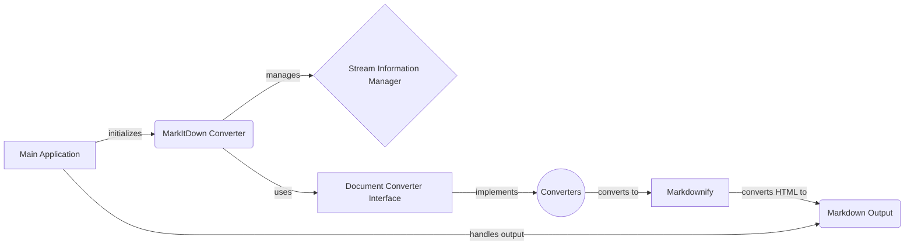

# MarkItDown: High-Level Data Flow Overview

MarkItDown is a versatile document conversion tool that transforms various file formats and data sources into Markdown. It supports local files, streams, URIs, and responses, offering a flexible solution for content conversion.

## Component Descriptions

**A. Main Application:** This is the entry point of the application. It receives input (file path, URL, stream), initializes the `MarkItDown Converter`, and orchestrates the conversion process. It also handles the final output, writing the converted Markdown to a file or standard output. It relates to `MarkItDown Converter` by initializing it and passing the input for conversion, and it relates to `Markdown Output` by writing the final result.

**B. MarkItDown Converter:** This component is the core of the application. It manages the available converters, determines the input type using `Stream Information Manager`, selects the appropriate converter through `Document Converter Interface`, and triggers the conversion. It relates to `Main Application` by receiving the input and returning the converted output, to `Stream Information Manager` by using it to determine the input type, and to `Document Converter Interface` by using it to select the appropriate converter.

**C. Stream Information Manager:** This component analyzes the input stream to determine its type (e.g., file extension, MIME type). This information is then used by the `MarkItDown Converter` to select the appropriate converter. It relates to `MarkItDown Converter` by providing information about the input stream.

**D. Document Converter Interface:** This component defines a standard interface for all converters. It ensures that all converters have a consistent way of being called and used by the `MarkItDown Converter`. It relates to `MarkItDown Converter` by providing a common interface for converters, and to `Converters` by being the interface they implement.

**E. Converters:** This represents a collection of specific converters for different file types (e.g., DOCX, XLSX, PDF, HTML). Each converter implements the `Document Converter Interface` and is responsible for converting its specific file type to HTML. It relates to `Document Converter Interface` by implementing its interface, and to `Markdownify` by passing the converted HTML for final conversion to Markdown.

**F. Markdownify:** This component converts HTML to Markdown. It receives HTML from the `Converters` and applies Markdown formatting rules to generate the final Markdown output. It relates to `Converters` by receiving the converted HTML, and to `Markdown Output` by generating the final Markdown output.

**G. Markdown Output:** This component represents the final Markdown output, which is the result of the conversion process. It relates to `Main Application` by sending the final result.