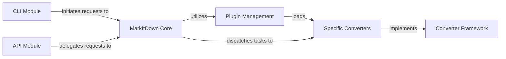

## Details

One paragraph explaining the functionality which is represented by this graph. What the main flow is and what is its purpose.

### MarkItDown Core
The central orchestrator of the conversion process, responsible for managing converters, dispatching requests, and integrating the plugin system.

**Related Classes/Methods**:

- <a href="https://github.com/microsoft/markitdown/blob/main/packages/markitdown/src/markitdown/_markitdown.py#L1-L1" target="_blank" rel="noopener noreferrer">`MarkItDown Core` (1:1)</a>

### Converter Framework
Defines the abstract interface (accepts, convert) that all document converters must implement, ensuring a consistent and extensible architecture.

**Related Classes/Methods**:

- <a href="https://github.com/microsoft/markitdown/blob/main/packages/markitdown/src/markitdown/_base_converter.py#L1-L1" target="_blank" rel="noopener noreferrer">`Converter Framework` (1:1)</a>

### Specific Converters
Concrete implementations of the Converter Framework interface, each handling the conversion logic for a particular document type (e.g., PDF, DOCX, HTML).

**Related Classes/Methods**:

- <a href="https://github.com/microsoft/markitdown/blob/main/packages/markitdown/src/markitdown/converters/#L1-L1" target="_blank" rel="noopener noreferrer">`Specific Converters` (1:1)</a>

### Plugin Management
Handles the dynamic discovery, loading, and registration of both built-in and external Specific Converters, extending the system's capabilities.

**Related Classes/Methods**:

- <a href="https://github.com/microsoft/markitdown/blob/main/packages/markitdown/src/markitdown/_markitdown.py#L1-L1" target="_blank" rel="noopener noreferrer">`Plugin Management` (1:1)</a>

### CLI Module
Provides a command-line interface for users to interact directly with the MarkItDown Core for document conversion.

**Related Classes/Methods**:

- <a href="https://github.com/microsoft/markitdown/blob/main/packages/markitdown/src/markitdown/__main__.py#L1-L1" target="_blank" rel="noopener noreferrer">`CLI Module` (1:1)</a>

### API Module
Exposes the MarkItDown Core's conversion capabilities via an API layer, enabling integration with other services and applications.

**Related Classes/Methods**: _None_

### [FAQ](https://github.com/CodeBoarding/GeneratedOnBoardings/tree/main?tab=readme-ov-file#faq)