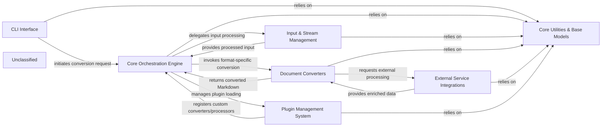

## Details

Markitdown is a document conversion system designed to transform various input formats into Markdown. The system is initiated via a CLI Interface which parses user commands and triggers the Core Orchestration Engine. This engine is central to the process, managing the overall conversion pipeline, coordinating interactions between components, and integrating plugins. It delegates input handling to the Input & Stream Management component, which prepares diverse input types for processing. The core conversion logic resides within Document Converters, a collection of format-specific adapters that transform content into Markdown, potentially leveraging External Service Integrations for enhanced processing. The system's extensibility is managed by the Plugin Management System, allowing dynamic discovery and loading of custom functionalities. All components rely on Core Utilities & Base Models for foundational data structures and shared functionalities, ensuring consistency and reusability across the architecture.

### CLI Interface
Parses command-line arguments, initiates the conversion process, and handles user interaction.

**Related Classes/Methods**:

- <a href="https://github.com/microsoft/markitdown/blob/main/packages/markitdown/src/markitdown/__main__.py" target="_blank" rel="noopener noreferrer">`packages/markitdown/src/markitdown/__main__.py`</a>

### Core Orchestration Engine
Manages the overall conversion pipeline, orchestrates component interactions, and coordinates plugin integration.

**Related Classes/Methods**:

- <a href="https://github.com/microsoft/markitdown/blob/main/packages/markitdown/src/markitdown/_markitdown.py" target="_blank" rel="noopener noreferrer">`packages/markitdown/src/markitdown/_markitdown.py`</a>

### Input & Stream Management
Handles diverse input types (files, URLs, streams) and prepares them for the conversion pipeline by extracting metadata.

**Related Classes/Methods**:

- <a href="https://github.com/microsoft/markitdown/blob/main/packages/markitdown/src/markitdown/_stream_info.py" target="_blank" rel="noopener noreferrer">`packages/markitdown/src/markitdown/_stream_info.py`</a>
- <a href="https://github.com/microsoft/markitdown/blob/main/packages/markitdown/src/markitdown/_uri_utils.py" target="_blank" rel="noopener noreferrer">`packages/markitdown/src/markitdown/_uri_utils.py`</a>

### Document Converters
A collection of format-specific adapters that parse various document types (e.g., PDF, DOCX, HTML) and transform their content into Markdown. Includes specialized utilities like DOCX Math & Pre-processing.

**Related Classes/Methods**:

- <a href="https://github.com/microsoft/markitdown/blob/main/packages/markitdown/src/markitdown/_base_converter.py" target="_blank" rel="noopener noreferrer">`packages/markitdown/src/markitdown/_base_converter.py`</a>
- <a href="https://github.com/microsoft/markitdown/blob/main/packages/markitdown/src/markitdown/converters/_doc_intel_converter.py" target="_blank" rel="noopener noreferrer">`packages/markitdown/src/markitdown/converters/_doc_intel_converter.py`</a>

### External Service Integrations
Interfaces with external APIs (e.g., Azure Document Intelligence, LLMs, web content retrieval) to augment or offload complex processing tasks for document enrichment.

**Related Classes/Methods**:

- <a href="https://github.com/microsoft/markitdown/blob/main/packages/markitdown/src/markitdown/converters/_doc_intel_converter.py" target="_blank" rel="noopener noreferrer">`packages/markitdown/src/markitdown/converters/_doc_intel_converter.py`</a>

### Plugin Management System
Facilitates the dynamic discovery, loading, and registration of external plugins to extend Markitdown's capabilities.

**Related Classes/Methods**:

- <a href="https://github.com/microsoft/markitdown/blob/main/packages/markitdown/src/markitdown/_markitdown.py" target="_blank" rel="noopener noreferrer">`packages/markitdown/src/markitdown/_markitdown.py`</a>

### Core Utilities & Base Models
Provides foundational data structures, abstract base classes for converters, and shared utility functions used across all components.

**Related Classes/Methods**:

- <a href="https://github.com/microsoft/markitdown/blob/main/packages/markitdown/src/markitdown/_base_converter.py" target="_blank" rel="noopener noreferrer">`packages/markitdown/src/markitdown/_base_converter.py`</a>
- <a href="https://github.com/microsoft/markitdown/blob/main/packages/markitdown/src/markitdown/_exceptions.py" target="_blank" rel="noopener noreferrer">`packages/markitdown/src/markitdown/_exceptions.py`</a>

### Unclassified
Component for all unclassified files and utility functions (Utility functions/External Libraries/Dependencies)

**Related Classes/Methods**: _None_

### [FAQ](https://github.com/CodeBoarding/GeneratedOnBoardings/tree/main?tab=readme-ov-file#faq)