```mermaid
graph LR
    Core_Conversion_Engine["Core Conversion Engine"]
    Converter_System["Converter System"]
    External_Service_Integrations["External Service Integrations"]
    Document_Utility_Processors["Document Utility Processors"]
    Plugin_System["Plugin System"]
    Command_Line_Interface_CLI_Layer["Command-Line Interface (CLI) Layer"]
    Model_Context_Protocol_MCP_Server["Model Context Protocol (MCP) Server"]
    Command_Line_Interface_CLI_Layer -- "calls" --> Core_Conversion_Engine
    Model_Context_Protocol_MCP_Server -- "utilizes" --> Core_Conversion_Engine
    Core_Conversion_Engine -- "registers and invokes" --> Converter_System
    Core_Conversion_Engine -- "delegates conversion tasks to" --> Converter_System
    Converter_System -- "utilizes" --> Document_Utility_Processors
    Converter_System -- "interacts with" --> External_Service_Integrations
    Plugin_System -- "registers new converters with" --> Core_Conversion_Engine
    click Core_Conversion_Engine href "https://github.com/CodeBoarding/GeneratedOnBoardings/blob/main/markitdown/Core_Conversion_Engine.md" "Details"
    click Converter_System href "https://github.com/CodeBoarding/GeneratedOnBoardings/blob/main/markitdown/Converter_System.md" "Details"
    click External_Service_Integrations href "https://github.com/CodeBoarding/GeneratedOnBoardings/blob/main/markitdown/External_Service_Integrations.md" "Details"
    click Document_Utility_Processors href "https://github.com/CodeBoarding/GeneratedOnBoardings/blob/main/markitdown/Document_Utility_Processors.md" "Details"
    click Plugin_System href "https://github.com/CodeBoarding/GeneratedOnBoardings/blob/main/markitdown/Plugin_System.md" "Details"
    click Command_Line_Interface_CLI_Layer href "https://github.com/CodeBoarding/GeneratedOnBoardings/blob/main/markitdown/Command_Line_Interface_CLI_Layer.md" "Details"
    click Model_Context_Protocol_MCP_Server href "https://github.com/CodeBoarding/GeneratedOnBoardings/blob/main/markitdown/Model_Context_Protocol_MCP_Server.md" "Details"
```

## Details

The `markitdown` architecture is designed for flexible document processing, with the `Core Conversion Engine` serving as the central control point. This engine orchestrates conversions by leveraging a `Converter System` that defines a common interface and provides specialized implementations for various document types. To enhance conversion quality, these specialized converters can utilize `Document Utility Processors` for pre-processing and integrate with `External Service Integrations` for advanced functionalities like AI-driven analysis. The system's extensibility is a key feature, enabled by a `Plugin System` that allows new converters to be dynamically registered with the core engine. Users can interact with `markitdown` through a `Command-Line Interface (CLI) Layer` for direct operations or via the `Model Context Protocol (MCP) Server`, which exposes the conversion capabilities as a web service, facilitating integration with other AI/ML applications.

### Core Conversion Engine [[Expand]](./Core_Conversion_Engine.md)
The central orchestrator for all document conversion operations, managing converter registration and dispatching requests.

**Related Classes/Methods**:

- <a href="https://github.com/microsoft/markitdown/blob/main/packages/markitdown/src/markitdown/_markitdown.py" target="_blank" rel="noopener noreferrer">`packages.markitdown.src.markitdown._markitdown`</a>

### Converter System [[Expand]](./Converter_System.md)
Defines the contract for all document converters and includes concrete implementations for various formats.

**Related Classes/Methods**:

- <a href="https://github.com/microsoft/markitdown/blob/main/packages/markitdown/src/markitdown/_base_converter.py" target="_blank" rel="noopener noreferrer">`packages.markitdown.src.markitdown._base_converter`</a>
- <a href="https://github.com/microsoft/markitdown/blob/main/packages/markitdown/src/markitdown/converters/__init__.py" target="_blank" rel="noopener noreferrer">`packages.markitdown.src.markitdown.converters`</a>

### External Service Integrations [[Expand]](./External_Service_Integrations.md)
Modules dedicated to interacting with external APIs like Azure Document Intelligence and Large Language Models (LLMs).

**Related Classes/Methods**:

- <a href="https://github.com/microsoft/markitdown/blob/main/packages/markitdown/src/markitdown/converters/_doc_intel_converter.py" target="_blank" rel="noopener noreferrer">`packages.markitdown.src.markitdown.converters._doc_intel_converter`</a>
- <a href="https://github.com/microsoft/markitdown/blob/main/packages/markitdown/src/markitdown/converters/_image_converter.py" target="_blank" rel="noopener noreferrer">`packages.markitdown.src.markitdown.converters._image_converter`</a>

### Document Utility Processors [[Expand]](./Document_Utility_Processors.md)
Provides helper functions and pre-processing capabilities for specific document types.

**Related Classes/Methods**:

- `packages.markitdown.src.markitdown.converter_utils.docx`

### Plugin System [[Expand]](./Plugin_System.md)
Enables the extensibility of the framework by allowing external modules to register new converters.

**Related Classes/Methods**:

- <a href="https://github.com/microsoft/markitdown/blob/main/packages/markitdown-sample-plugin/src/markitdown_sample_plugin/_plugin.py" target="_blank" rel="noopener noreferrer">`packages.markitdown-sample-plugin.src.markitdown_sample_plugin._plugin`</a>

### Command-Line Interface (CLI) Layer [[Expand]](./Command_Line_Interface_CLI_Layer.md)
The user-facing interface for interacting with the library via command-line commands.

**Related Classes/Methods**:

- <a href="https://github.com/microsoft/markitdown/blob/main/packages/markitdown/src/markitdown/__main__.py" target="_blank" rel="noopener noreferrer">`packages.markitdown.src.markitdown.__main__`</a>

### Model Context Protocol (MCP) Server [[Expand]](./Model_Context_Protocol_MCP_Server.md)
A separate application exposing markitdown's capabilities as a web service for integration with AI/ML systems.

**Related Classes/Methods**:

- <a href="https://github.com/microsoft/markitdown/blob/main/packages/markitdown-mcp/src/markitdown_mcp/__main__.py" target="_blank" rel="noopener noreferrer">`packages.markitdown-mcp.src.markitdown_mcp.__main__`</a>

### [FAQ](https://github.com/CodeBoarding/GeneratedOnBoardings/tree/main?tab=readme-ov-file#faq)