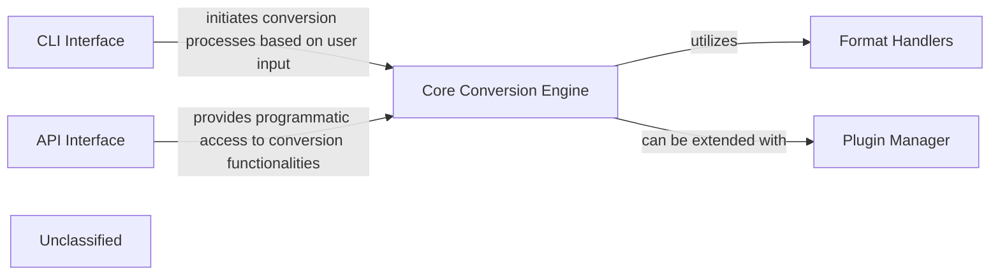

## Details

The `{project_name}` project is structured around a central `Core Conversion Engine` that orchestrates the conversion of various document formats into Markdown. This engine relies on `Format Handlers` to manage the specifics of each file type, ensuring a modular and extensible approach to document conversion. The `Plugin Manager` allows for dynamic extension of capabilities, supporting third-party plugins that can introduce new conversion logic or enhance existing ones. User interaction is facilitated through a `CLI Interface`, which provides a straightforward command-line tool for initiating conversions. Additionally, an `API Interface` offers programmatic access, enabling integration with other systems and automation of conversion tasks. This architecture supports both interactive and automated workflows, making it versatile for a wide range of use cases.

### Core Conversion Engine
Manages the overall conversion logic.

**Related Classes/Methods**:

- <a href="https://github.com/microsoft/markitdown/blob/main/packages/markitdown/src/markitdown/_base_converter.py" target="_blank" rel="noopener noreferrer">`markitdown._base_converter:DocumentConverter`</a>
- <a href="https://github.com/microsoft/markitdown/blob/main/packages/markitdown/src/markitdown/_base_converter.py" target="_blank" rel="noopener noreferrer">`markitdown._base_converter:DocumentConverterResult`</a>

### Format Handlers
Specialized converters for each supported file format.

**Related Classes/Methods**:

- <a href="https://github.com/microsoft/markitdown/blob/main/packages/markitdown/src/markitdown/converters" target="_blank" rel="noopener noreferrer">`markitdown.converters:ImageConverter`</a>
- <a href="https://github.com/microsoft/markitdown/blob/main/packages/markitdown/src/markitdown/converters" target="_blank" rel="noopener noreferrer">`markitdown.converters:PlainTextConverter`</a>
- <a href="https://github.com/microsoft/markitdown/blob/main/packages/markitdown/src/markitdown/converters" target="_blank" rel="noopener noreferrer">`markitdown.converters:HtmlConverter`</a>

### Plugin Manager
Manages plugins for extending functionality.

**Related Classes/Methods**:

- <a href="https://github.com/microsoft/markitdown/blob/main/packages/markitdown/src/markitdown/_markitdown.py" target="_blank" rel="noopener noreferrer">`markitdown._markitdown:_load_plugins`</a>
- <a href="https://github.com/microsoft/markitdown/blob/main/packages/markitdown/src/markitdown/_markitdown.py" target="_blank" rel="noopener noreferrer">`markitdown._markitdown:enable_plugins`</a>

### CLI Interface
Provides a command-line interface for user interaction.

**Related Classes/Methods**:

- <a href="https://github.com/microsoft/markitdown/blob/main/packages/markitdown/src/markitdown/__main__.py" target="_blank" rel="noopener noreferrer">`markitdown.__main__:main`</a>

### API Interface
Offers an API for programmatic access.

**Related Classes/Methods**:

- <a href="https://github.com/microsoft/markitdown/blob/main/packages/markitdown/src/markitdown/_markitdown.py" target="_blank" rel="noopener noreferrer">`markitdown._markitdown:MarkItDown`</a>

### Unclassified
Component for all unclassified files and utility functions (Utility functions/External Libraries/Dependencies)

**Related Classes/Methods**: _None_

### [FAQ](https://github.com/CodeBoarding/GeneratedOnBoardings/tree/main?tab=readme-ov-file#faq)