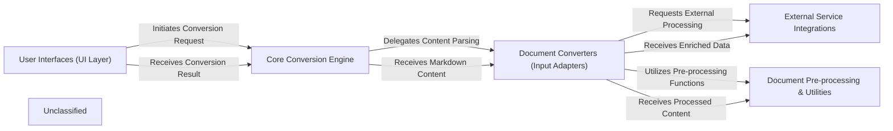

## Details

The `markitdown` architecture is structured around a central `Core Conversion Engine` that orchestrates the transformation of diverse document formats into Markdown. User interactions, whether through command-line tools or a web API, are managed by the `User Interfaces (UI Layer)`, which serves as the primary entry point for conversion requests. The `Core Conversion Engine` intelligently dispatches these requests to specialized `Document Converters (Input Adapters)`, each designed to handle a specific input type. These converters may, in turn, interact with `External Service Integrations` for advanced capabilities like AI-powered document analysis or content enrichment, and leverage `Document Pre-processing & Utilities` for tasks such as mathematical equation conversion. The processed Markdown content is then returned through the `Core Conversion Engine` back to the `User Interfaces (UI Layer)`.

### User Interfaces (UI Layer)
Provides the entry points for users and external systems to interact with `markitdown`. This includes both the command-line interface for direct user interaction and a web API for programmatic access.

**Related Classes/Methods**:

- <a href="https://github.com/microsoft/markitdown//blobpackages/markitdown/src/markitdown/__main__.py#L13-L200" target="_blank" rel="noopener noreferrer">`markitdown.__main__.main`:13-200</a>
- <a href="https://github.com/microsoft/markitdown//blobpackages/markitdown-mcp/src/markitdown_mcp/__main__.py#L82-L123" target="_blank" rel="noopener noreferrer">`markitdown_mcp.__main__.main`:82-123</a>

### Core Conversion Engine
The central orchestrator of the `markitdown` library. It manages the lifecycle of document conversion, including discovering and registering converters, determining the appropriate converter for an input, and executing the conversion pipeline. It also handles initial file type and encoding detection.

**Related Classes/Methods**:

- <a href="https://github.com/microsoft/markitdown//blobpackages/markitdown/src/markitdown/_markitdown.py#L93-L776" target="_blank" rel="noopener noreferrer">`markitdown._markitdown.MarkItDown`:93-776</a>
- <a href="https://github.com/microsoft/markitdown//blobpackages/markitdown/src/markitdown/_markitdown.py" target="_blank" rel="noopener noreferrer">`markitdown._markitdown.MarkItDown.convert`</a>

### Document Converters (Input Adapters)
A collection of specialized modules, each designed to parse a specific document format (e.g., CSV, DOCX, Image, YouTube) and transform its content into a standardized Markdown output. These act as the primary adapters for various input types.

**Related Classes/Methods**:

- <a href="https://github.com/microsoft/markitdown//blobpackages/markitdown/src/markitdown/converters/_csv_converter.py#L38-L77" target="_blank" rel="noopener noreferrer">`markitdown.converters._csv_converter.convert`:38-77</a>
- <a href="https://github.com/microsoft/markitdown//blobpackages/markitdown/src/markitdown/converters/_doc_intel_converter.py#L237-L254" target="_blank" rel="noopener noreferrer">`markitdown.converters._doc_intel_converter.convert`:237-254</a>
- <a href="https://github.com/microsoft/markitdown//blobpackages/markitdown/src/markitdown/converters/_image_converter.py#L39-L85" target="_blank" rel="noopener noreferrer">`markitdown.converters._image_converter.convert`:39-85</a>
- <a href="https://github.com/microsoft/markitdown//blobpackages/markitdown/src/markitdown/converters/_youtube_converter.py#L70-L197" target="_blank" rel="noopener noreferrer">`markitdown.converters._youtube_converter.convert`:70-197</a>

### External Service Integrations
Encapsulates all interactions with external APIs and services, such as Azure Document Intelligence for advanced parsing, Large Language Models (LLMs) for content enrichment (e.g., image descriptions), YouTube API for video data, and dedicated audio transcription services.

**Related Classes/Methods**:

- <a href="https://github.com/microsoft/markitdown//blobpackages/markitdown/src/markitdown/converters/_doc_intel_converter.py" target="_blank" rel="noopener noreferrer">`markitdown.converters._doc_intel_converter`</a>
- <a href="https://github.com/microsoft/markitdown//blobpackages/markitdown/src/markitdown/converters/_image_converter.py" target="_blank" rel="noopener noreferrer">`markitdown.converters._image_converter`</a>
- <a href="https://github.com/microsoft/markitdown//blobpackages/markitdown/src/markitdown/converters/_youtube_converter.py" target="_blank" rel="noopener noreferrer">`markitdown.converters._youtube_converter`</a>
- <a href="https://github.com/microsoft/markitdown//blobpackages/markitdown/src/markitdown/converters/_transcribe_audio.py" target="_blank" rel="noopener noreferrer">`markitdown.converters._transcribe_audio`</a>

### Document Pre-processing & Utilities
Provides specialized utility functions and pre-processing logic used by `Document Converters` to handle specific content types or prepare documents for conversion. This includes tasks like converting mathematical equations in DOCX files.

**Related Classes/Methods**:

- <a href="https://github.com/microsoft/markitdown//blobpackages/markitdown/src/markitdown/converter_utils/docx/pre_process.py#L118-L156" target="_blank" rel="noopener noreferrer">`markitdown.converter_utils.docx.pre_process.pre_process_docx`:118-156</a>
- <a href="https://github.com/microsoft/markitdown//blobpackages/markitdown/src/markitdown/converter_utils/docx/math/omml.py#L170-L400" target="_blank" rel="noopener noreferrer">`markitdown.converter_utils.docx.math.omml.oMath2Latex`:170-400</a>

### Unclassified
Component for all unclassified files and utility functions (Utility functions/External Libraries/Dependencies)

**Related Classes/Methods**: _None_

### [FAQ](https://github.com/CodeBoarding/GeneratedOnBoardings/tree/main?tab=readme-ov-file#faq)