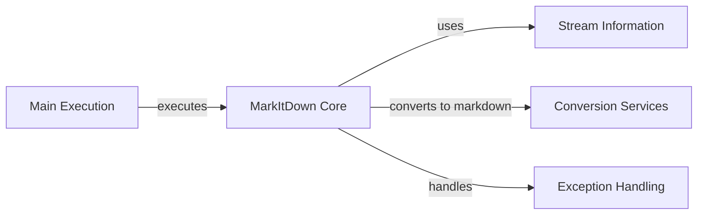

## Component Details

### Main Execution
Handles argument parsing, main program execution, and output handling.
- **Related Classes/Methods**: `repos.markitdown.packages.markitdown.src.markitdown.__main__:main`, `repos.markitdown.packages.markitdown.src.markitdown.__main__._exit_with_error`, `repos.markitdown.packages.markitdown.src.markitdown.__main__._handle_output`

### MarkItDown Core
Core class responsible for managing converters, enabling built-in converters and plugins, and orchestrating the conversion process.
- **Related Classes/Methods**: `repos.markitdown.packages.markitdown.src.markitdown._markitdown.MarkItDown`, `repos.markitdown.packages.markitdown.src.markitdown._markitdown.MarkItDown.__init__`, `repos.markitdown.packages.markitdown.src.markitdown._markitdown.MarkItDown.enable_builtins`, `repos.markitdown.packages.markitdown.src.markitdown._markitdown.MarkItDown.enable_plugins`, `repos.markitdown.packages.markitdown.src.markitdown._markitdown.MarkItDown.convert`, `repos.markitdown.packages.markitdown.src.markitdown._markitdown.MarkItDown.register_converter`, `repos.markitdown.packages.markitdown.src.markitdown._markitdown.MarkItDown.register_page_converter`, `repos.markitdown.packages.markitdown.src.markitdown._markitdown.MarkItDown._get_stream_info_guesses`

### Stream Information
Manages information about the input stream, including file type, encoding, and other metadata.
- **Related Classes/Methods**: `repos.markitdown.packages.markitdown.src.markitdown._stream_info.StreamInfo`, `repos.markitdown.packages.markitdown.src.markitdown._stream_info.StreamInfo:copy_and_update`

### Conversion Services
Handles the conversion of various file types (HTML, multimedia, feeds, documents, text) to markdown.
- **Related Classes/Methods**: `repos.markitdown.packages.markitdown.src.markitdown.converters._html_converter.HtmlConverter`, `repos.markitdown.packages.markitdown.src.markitdown.converters._html_converter.HtmlConverter:convert`, `repos.markitdown.packages.markitdown.src.markitdown.converters._html_converter.HtmlConverter:convert_string`, `repos.markitdown.packages.markitdown.src.markitdown.converters._markdownify._CustomMarkdownify`, `repos.markitdown.packages.markitdown.src.markitdown.converters._markdownify._CustomMarkdownify.convert_soup`, `repos.markitdown.packages.markitdown.src.markitdown.converters._image_converter.ImageConverter`, `repos.markitdown.packages.markitdown.src.markitdown.converters._image_converter.ImageConverter:convert`, `repos.markitdown.packages.markitdown.src.markitdown.converters._audio_converter.AudioConverter`, `repos.markitdown.packages.markitdown.src.markitdown.converters._audio_converter.AudioConverter:convert`, `repos.markitdown.packages.markitdown.src.markitdown.converters._transcribe_audio:transcribe_audio`, `repos.markitdown.packages.markitdown.src.markitdown.converters._rss_converter.RssConverter`, `repos.markitdown.packages.markitdown.src.markitdown.converters._rss_converter.RssConverter:convert`, `repos.markitdown.packages.markitdown.src.markitdown.converters._rss_converter.RssConverter:_parse_atom_type`, `repos.markitdown.packages.markitdown.src.markitdown.converters._rss_converter.RssConverter:_parse_rss_type`, `repos.markitdown.packages.markitdown.src.markitdown.converters._rss_converter.RssConverter:_parse_content`, `repos.markitdown.packages.markitdown.src.markitdown.converters._docx_converter.DocxConverter`, `repos.markitdown.packages.markitdown.src.markitdown.converters._docx_converter.DocxConverter:convert`, `repos.markitdown.packages.markitdown.src.markitdown.converter_utils.docx.pre_process:pre_process_docx`, `repos.markitdown.packages.markitdown.src.markitdown.converter_utils.docx.math.omml.oMath2Latex`, `repos.markitdown.packages.markitdown.src.markitdown.converters._pptx_converter.PptxConverter`, `repos.markitdown.packages.markitdown.src.markitdown.converters._pptx_converter.PptxConverter:convert`, `repos.markitdown.packages.markitdown.src.markitdown.converters._plain_text_converter.PlainTextConverter`, `repos.markitdown.packages.markitdown.src.markitdown.converters._plain_text_converter.PlainTextConverter:convert`

### Exception Handling
Defines custom exceptions for file conversion failures.
- **Related Classes/Methods**: `markitdown._exceptions.FailedConversionAttempt`, `markitdown._exceptions.FileConversionException`, `markitdown._exceptions.UnsupportedFormatException`