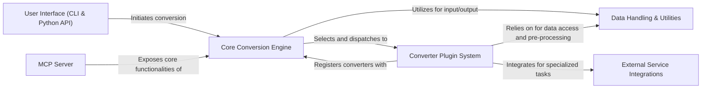

## Details

The feedback is valid and requires architectural changes to include source code references for each component. The previous analysis lacked these crucial details, making it difficult to validate the mapping of abstract components to their actual implementation. I will update the analysis by identifying and adding relevant source file or code references for each component.

### User Interface (CLI & Python API)
Provides the command-line and programmatic interfaces for users to interact with the `markitdown` library, initiating conversion requests.

**Related Classes/Methods**:

- <a href="https://github.com/microsoft/markitdown/blob/main/packages/markitdown/src/markitdown/__main__.py" target="_blank" rel="noopener noreferrer">`packages/markitdown/src/markitdown/__main__.py`</a>
- <a href="https://github.com/microsoft/markitdown/blob/main/packages/markitdown/src/markitdown/_markitdown.py" target="_blank" rel="noopener noreferrer">`packages/markitdown/src/markitdown/_markitdown.py`</a>

### Core Conversion Engine
The central orchestrator that manages converter registration, selects the appropriate converter based on input, and dispatches conversion tasks. It acts as a facade for the conversion process.

**Related Classes/Methods**:

- <a href="https://github.com/microsoft/markitdown/blob/main/packages/markitdown/src/markitdown/_markitdown.py" target="_blank" rel="noopener noreferrer">`packages/markitdown/src/markitdown/_markitdown.py`</a>

### Converter Plugin System
Defines the abstract interface for all converters and encompasses the concrete implementations (built-in converters) for various document and media types, performing the actual content extraction and markdown transformation.

**Related Classes/Methods**:

- <a href="https://github.com/microsoft/markitdown/blob/main/packages/markitdown/src/markitdown/_base_converter.py" target="_blank" rel="noopener noreferrer">`packages/markitdown/src/markitdown/_base_converter.py`</a>
- <a href="https://github.com/microsoft/markitdown/blob/main/packages/markitdown/src/markitdown/converters/" target="_blank" rel="noopener noreferrer">`packages/markitdown/src/markitdown/converters/`</a>

### Data Handling & Utilities
Provides foundational utilities for managing diverse input sources (URIs, streams) and specific pre-processing tasks (e.g., DOCX math conversion), ensuring uniform content access for the conversion process.

**Related Classes/Methods**:

- <a href="https://github.com/microsoft/markitdown/blob/main/packages/markitdown/src/markitdown/_stream_info.py" target="_blank" rel="noopener noreferrer">`packages/markitdown/src/markitdown/_stream_info.py`</a>
- <a href="https://github.com/microsoft/markitdown/blob/main/packages/markitdown/src/markitdown/_uri_utils.py" target="_blank" rel="noopener noreferrer">`packages/markitdown/src/markitdown/_uri_utils.py`</a>
- <a href="https://github.com/microsoft/markitdown/blob/main/packages/markitdown/src/markitdown/converter_utils/docx/math/" target="_blank" rel="noopener noreferrer">`packages/markitdown/src/markitdown/converter_utils/docx/math/`</a>

### External Service Integrations
Encapsulates the logic for interacting with external APIs and services, such as Azure Document Intelligence and OpenAI, which are leveraged by specific converters for advanced document parsing or content analysis.

**Related Classes/Methods**:

- <a href="https://github.com/microsoft/markitdown/blob/main/packages/markitdown/src/markitdown/converters/_doc_intel_converter.py" target="_blank" rel="noopener noreferrer">`packages/markitdown/src/markitdown/converters/_doc_intel_converter.py`</a>
- <a href="https://github.com/microsoft/markitdown/blob/main/packages/markitdown/src/markitdown/converters/_llm_caption.py" target="_blank" rel="noopener noreferrer">`packages/markitdown/src/markitdown/converters/_llm_caption.py`</a>

### MCP Server
A separate service component that exposes the `markitdown` conversion capabilities via a server API, enabling remote access and handling potentially complex or long-running conversion tasks.

**Related Classes/Methods**:

### [FAQ](https://github.com/CodeBoarding/GeneratedOnBoardings/tree/main?tab=readme-ov-file#faq)