```mermaid
graph LR
    Application_Orchestration["Application Orchestration"]
    Core_Conversion_Manager["Core Conversion Manager"]
    Stream_Information_Management["Stream Information Management"]
    Converter_Abstraction_Layer["Converter Abstraction Layer"]
    HTML_Conversion_Engine["HTML Conversion Engine"]
    Document_Format_Conversion_Suite["Document Format Conversion Suite"]
    Web_Content_Integration["Web Content Integration"]
    Multimedia_Processing_Module["Multimedia Processing Module"]
    Plain_Text_Handling["Plain Text Handling"]
    Application_Orchestration -- "initializes" --> Core_Conversion_Manager
    Core_Conversion_Manager -- "converts input using" --> HTML_Conversion_Engine
    HTML_Conversion_Engine -- "converts HTML to Markdown" --> HTML_Conversion_Engine
    Document_Format_Conversion_Suite -- "converts Docx to Markdown" --> HTML_Conversion_Engine
    Web_Content_Integration -- "converts YouTube video info to Markdown" --> Core_Conversion_Manager
    Web_Content_Integration -- "converts RSS/Atom feeds to Markdown" --> HTML_Conversion_Engine
    Plain_Text_Handling -- "converts plain text to Markdown" --> Core_Conversion_Manager
    Multimedia_Processing_Module -- "extracts metadata from images" --> Multimedia_Processing_Module
    Multimedia_Processing_Module -- "extracts metadata from audio files" --> Multimedia_Processing_Module
    Multimedia_Processing_Module -- "transcribes audio files" --> Multimedia_Processing_Module
    Core_Conversion_Manager -- "manages stream information" --> Stream_Information_Management
    Converter_Abstraction_Layer -- "uses stream information" --> Stream_Information_Management
    HTML_Conversion_Engine -- "is a base class for" --> Converter_Abstraction_Layer
    Document_Format_Conversion_Suite -- "is a base class for" --> Converter_Abstraction_Layer
    Web_Content_Integration -- "is a base class for" --> Converter_Abstraction_Layer
    Multimedia_Processing_Module -- "is a base class for" --> Converter_Abstraction_Layer
    Plain_Text_Handling -- "is a base class for" --> Converter_Abstraction_Layer
    Core_Conversion_Manager -- "delegates conversion to" --> Document_Format_Conversion_Suite
    Core_Conversion_Manager -- "delegates conversion to" --> Web_Content_Integration
    Core_Conversion_Manager -- "delegates conversion to" --> Multimedia_Processing_Module
    Core_Conversion_Manager -- "delegates conversion to" --> Plain_Text_Handling
    click Application_Orchestration href "https://github.com/CodeBoarding/GeneratedOnBoardings/blob/main/markitdown/Application Orchestration.md" "Details"
    click Core_Conversion_Manager href "https://github.com/CodeBoarding/GeneratedOnBoardings/blob/main/markitdown/Core Conversion Manager.md" "Details"
    click Stream_Information_Management href "https://github.com/CodeBoarding/GeneratedOnBoardings/blob/main/markitdown/Stream Information Management.md" "Details"
    click Converter_Abstraction_Layer href "https://github.com/CodeBoarding/GeneratedOnBoardings/blob/main/markitdown/Converter Abstraction Layer.md" "Details"
    click HTML_Conversion_Engine href "https://github.com/CodeBoarding/GeneratedOnBoardings/blob/main/markitdown/HTML Conversion Engine.md" "Details"
    click Document_Format_Conversion_Suite href "https://github.com/CodeBoarding/GeneratedOnBoardings/blob/main/markitdown/Document Format Conversion Suite.md" "Details"
    click Web_Content_Integration href "https://github.com/CodeBoarding/GeneratedOnBoardings/blob/main/markitdown/Web Content Integration.md" "Details"
    click Multimedia_Processing_Module href "https://github.com/CodeBoarding/GeneratedOnBoardings/blob/main/markitdown/Multimedia Processing Module.md" "Details"
    click Plain_Text_Handling href "https://github.com/CodeBoarding/GeneratedOnBoardings/blob/main/markitdown/Plain Text Handling.md" "Details"
```

## Component Details

### Application Orchestration
This component serves as the entry point and orchestrates the entire MarkItDown conversion process. It handles command-line arguments, input/output streams, error handling, and the overall application flow. It initializes the core converter and manages the execution of the conversion process.
- **Related Classes/Methods**: `repos.markitdown.packages.markitdown.src.markitdown.__main__:main`, `repos.markitdown.packages.markitdown.src.markitdown.__main__:_exit_with_error`, `repos.markitdown.packages.markitdown.src.markitdown.__main__:_handle_output`

### Core Conversion Manager
The Core Conversion Manager is the central component responsible for managing the conversion process. It handles different input types (files, streams, URLs), loads plugins, registers converters, and dispatches the conversion task to the appropriate converter based on the input type. It also manages stream information and provides a unified interface for conversion operations.
- **Related Classes/Methods**: `repos.markitdown.packages.markitdown.src.markitdown._markitdown.MarkItDown`, `repos.markitdown.packages.markitdown.src.markitdown._markitdown.MarkItDown.__init__`, `repos.markitdown.packages.markitdown.src.markitdown._markitdown.MarkItDown.convert`, `repos.markitdown.packages.markitdown.src.markitdown._markitdown.MarkItDown.convert_local`, `repos.markitdown.packages.markitdown.src.markitdown._markitdown.MarkItDown.convert_stream`, `repos.markitdown.packages.markitdown.src.markitdown._markitdown.MarkItDown.convert_uri`, `repos.markitdown.packages.markitdown.src.markitdown._markitdown.MarkItDown.convert_response`, `repos.markitdown.packages.markitdown.src.markitdown._markitdown.MarkItDown._convert`, `repos.markitdown.packages.markitdown.src.markitdown._markitdown.MarkItDown.enable_builtins`, `repos.markitdown.packages.markitdown.src.markitdown._markitdown.MarkItDown.enable_plugins`, `repos.markitdown.packages.markitdown.src.markitdown._markitdown.MarkItDown.register_converter`, `repos.markitdown.packages.markitdown.src.markitdown._markitdown.MarkItDown.register_page_converter`, `repos.markitdown.packages.markitdown.src.markitdown._markitdown.MarkItDown._get_stream_info_guesses`

### Stream Information Management
This component is responsible for managing information about the input stream, such as filename, extension, MIME type, and URL. It provides methods for copying and updating stream information, ensuring that the correct metadata is associated with the input being processed. This information is used by the converters to handle the input appropriately.
- **Related Classes/Methods**: `repos.markitdown.packages.markitdown.src.markitdown._stream_info.StreamInfo`, `repos.markitdown.packages.markitdown.src.markitdown._stream_info.StreamInfo:copy_and_update`

### Converter Abstraction Layer
This component defines the abstract base class for all specific converters. It specifies the interface that all converters must implement and provides a data structure for conversion results. This ensures that all converters adhere to a common standard, facilitating extensibility and maintainability.
- **Related Classes/Methods**: `repos.markitdown.packages.markitdown.src.markitdown._base_converter.DocumentConverter`, `repos.markitdown.packages.markitdown.src.markitdown._base_converter.DocumentConverterResult`

### HTML Conversion Engine
This component is responsible for converting HTML documents to Markdown. It leverages the Markdownify converter to perform the conversion. It is a core component used by other converters (e.g., DocxConverter, EpubConverter, XlsxConverter) to handle HTML content within those formats.
- **Related Classes/Methods**: `repos.markitdown.packages.markitdown.src.markitdown.converters._html_converter.HtmlConverter`, `repos.markitdown.packages.markitdown.src.markitdown.converters._markdownify._CustomMarkdownify`

### Document Format Conversion Suite
This component provides specialized converters for various document formats like Docx, Pptx, Epub, and Xlsx. They extract content from these formats and convert it to Markdown, often leveraging the HTML Conversion Engine for handling HTML content within the documents. They provide format-specific logic for extracting and converting content.
- **Related Classes/Methods**: `repos.markitdown.packages.markitdown.src.markitdown.converters._docx_converter.DocxConverter`, `repos.markitdown.packages.markitdown.src.markitdown.converter_utils.docx.pre_process`, `repos.markitdown.packages.markitdown.src.markitdown.converters._pptx_converter.PptxConverter`, `repos.markitdown.packages.markitdown.src.markitdown.converters._epub_converter.EpubConverter`, `repos.markitdown.packages.markitdown.src.markitdown.converters._xlsx_converter.XlsxConverter`, `repos.markitdown.packages.markitdown.src.markitdown.converters._xlsx_converter.XlsConverter`

### Web Content Integration
This component handles the conversion of content from web-based sources like YouTube videos and RSS/Atom feeds. They retrieve data from these sources and format it into Markdown. They provide integration with external web services.
- **Related Classes/Methods**: `repos.markitdown.packages.markitdown.src.markitdown.converters._youtube_converter.YouTubeConverter`, `repos.markitdown.packages.markitdown.src.markitdown.converters._rss_converter.RssConverter`

### Multimedia Processing Module
This component is responsible for handling multimedia files like images and audio. It extracts metadata using ExifTool and, in the case of audio, transcribes the content using a transcription service. They provide specialized processing for multimedia content.
- **Related Classes/Methods**: `repos.markitdown.packages.markitdown.src.markitdown.converters._image_converter.ImageConverter`, `repos.markitdown.packages.markitdown.src.markitdown.converters._exiftool.exiftool_metadata`, `repos.markitdown.packages.markitdown.src.markitdown.converters._audio_converter.AudioConverter`, `repos.markitdown.packages.markitdown.src.markitdown.converters._transcribe_audio:transcribe_audio`

### Plain Text Handling
This component is a simple converter that handles plain text files. It simply returns the text content as Markdown without any further processing. It serves as a basic converter for text-based input.
- **Related Classes/Methods**: `repos.markitdown.packages.markitdown.src.markitdown.converters._plain_text_converter.PlainTextConverter`