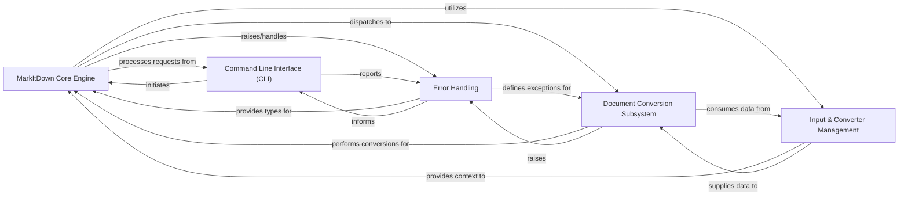

## Component Details

The `markitdown` project is designed around a modular architecture, primarily focused on converting various document and content types into Markdown. The analysis of its Control Flow Graph (CFG) and source code reveals a clear separation of concerns, with a central engine orchestrating the conversion process through a pluggable converter system.

### MarkItDown Core Engine
This is the central orchestrator of the entire `markitdown` library. It is responsible for initializing the conversion environment, registering all built-in and plugin converters, and dispatching conversion requests based on the input source type (local file, URI, stream, HTTP response). It acts as the primary interface for users and other components to initiate document conversions.

**Related Classes/Methods**:

- <a href="https://github.com/microsoft/markitdown/blob/master/packages/markitdown/src/markitdown/_markitdown.py#L92-L770" target="_blank" rel="noopener noreferrer">`markitdown._markitdown.MarkItDown` (92:770)</a>

### Input & Converter Management
This component handles the initial processing of input data, encapsulating all relevant metadata about a stream or file (content, URI, file extension, MIME type, character set). It intelligently guesses file types and other stream properties, which is critical for the `MarkItDown Core Engine` to select the correct converter. It also manages the framework for how converters are defined and interact.

**Related Classes/Methods**:

- <a href="https://github.com/microsoft/markitdown/blob/master/packages/markitdown/src/markitdown/_stream_info.py#L5-L31" target="_blank" rel="noopener noreferrer">`markitdown._stream_info.StreamInfo` (5:31)</a>
- <a href="https://github.com/microsoft/markitdown/blob/master/packages/markitdown/src/markitdown/_markitdown.py#L660-L759" target="_blank" rel="noopener noreferrer">`markitdown._markitdown.MarkItDown._get_stream_info_guesses` (660:759)</a>
- <a href="https://github.com/microsoft/markitdown/blob/master/packages/markitdown/src/markitdown/_uri_utils.py#L7-L15" target="_blank" rel="noopener noreferrer">`markitdown._uri_utils.file_uri_to_path` (7:15)</a>
- <a href="https://github.com/microsoft/markitdown/blob/master/packages/markitdown/src/markitdown/_uri_utils.py#L18-L51" target="_blank" rel="noopener noreferrer">`markitdown._uri_utils.parse_data_uri` (18:51)</a>
- <a href="https://github.com/microsoft/markitdown/blob/master/packages/markitdown/src/markitdown/_base_converter.py#L41-L104" target="_blank" rel="noopener noreferrer">`markitdown._base_converter.DocumentConverter` (41:104)</a>
- <a href="https://github.com/microsoft/markitdown/blob/master/packages/markitdown/src/markitdown/_base_converter.py#L4-L38" target="_blank" rel="noopener noreferrer">`markitdown._base_converter.DocumentConverterResult` (4:38)</a>

### Document Conversion Subsystem
This is a collection of specialized converters, each designed to transform a specific document or content type (e.g., HTML, DOCX, XLSX, PPTX, YouTube, RSS, Audio, Image, Document Intelligence, and custom plugins) into Markdown. Many converters leverage the internal HTML-to-Markdown conversion utility as an intermediate step. This subsystem encapsulates the diverse logic required for handling various input formats.

**Related Classes/Methods**:

- <a href="https://github.com/microsoft/markitdown/blob/master/packages/markitdown/src/markitdown/converters/_html_converter.py#L19-L89" target="_blank" rel="noopener noreferrer">`markitdown.converters._html_converter.HtmlConverter` (19:89)</a>
- <a href="https://github.com/microsoft/markitdown/blob/master/packages/markitdown/src/markitdown/converters/_markdownify.py#L7-L110" target="_blank" rel="noopener noreferrer">`markitdown.converters._markdownify._CustomMarkdownify` (7:110)</a>
- <a href="https://github.com/microsoft/markitdown/blob/master/packages/markitdown/src/markitdown/converters/_docx_converter.py#L27-L79" target="_blank" rel="noopener noreferrer">`markitdown.converters._docx_converter.DocxConverter` (27:79)</a>
- <a href="https://github.com/microsoft/markitdown/blob/master/packages/markitdown/src/markitdown/converters/_xlsx_converter.py#L35-L94" target="_blank" rel="noopener noreferrer">`markitdown.converters._xlsx_converter.XlsxConverter` (35:94)</a>
- <a href="https://github.com/microsoft/markitdown/blob/master/packages/markitdown/src/markitdown/converters/_pptx_converter.py#L33-L251" target="_blank" rel="noopener noreferrer">`markitdown.converters._pptx_converter.PptxConverter` (33:251)</a>
- <a href="https://github.com/microsoft/markitdown/blob/master/packages/markitdown/src/markitdown/converter_utils/docx/pre_process.py#L117-L155" target="_blank" rel="noopener noreferrer">`markitdown.converter_utils.docx.pre_process.pre_process_docx` (117:155)</a>
- <a href="https://github.com/microsoft/markitdown/blob/master/packages/markitdown/src/markitdown/converter_utils/docx/math/omml.py#L169-L399" target="_blank" rel="noopener noreferrer">`markitdown.converter_utils.docx.math.omml.oMath2Latex` (169:399)</a>
- <a href="https://github.com/microsoft/markitdown/blob/master/packages/markitdown/src/markitdown/converters/_youtube_converter.py#L36-L237" target="_blank" rel="noopener noreferrer">`markitdown.converters._youtube_converter.YouTubeConverter` (36:237)</a>
- <a href="https://github.com/microsoft/markitdown/blob/master/packages/markitdown/src/markitdown/converters/_rss_converter.py#L28-L191" target="_blank" rel="noopener noreferrer">`markitdown.converters._rss_converter.RssConverter` (28:191)</a>
- <a href="https://github.com/microsoft/markitdown/blob/master/packages/markitdown/src/markitdown/converters/_doc_intel_converter.py#L124-L248" target="_blank" rel="noopener noreferrer">`markitdown.converters._doc_intel_converter.DocumentIntelligenceConverter` (124:248)</a>
- <a href="https://github.com/microsoft/markitdown/blob/master/packages/markitdown/src/markitdown/converters/_audio_converter.py#L22-L100" target="_blank" rel="noopener noreferrer">`markitdown.converters._audio_converter.AudioConverter` (22:100)</a>
- <a href="https://github.com/microsoft/markitdown/blob/master/packages/markitdown/src/markitdown/converters/_image_converter.py#L15-L137" target="_blank" rel="noopener noreferrer">`markitdown.converters._image_converter.ImageConverter` (15:137)</a>
- <a href="https://github.com/microsoft/markitdown/blob/master/packages/markitdown-sample-plugin/src/markitdown_sample_plugin/_plugin.py#L33-L70" target="_blank" rel="noopener noreferrer">`markitdown_sample_plugin._plugin.RtfConverter` (33:70)</a>
- <a href="https://github.com/microsoft/markitdown/blob/master/packages/markitdown/src/markitdown/converters/_wikipedia_converter.py#L19-L86" target="_blank" rel="noopener noreferrer">`markitdown.converters._wikipedia_converter.WikipediaConverter` (19:86)</a>
- <a href="https://github.com/microsoft/markitdown/blob/master/packages/markitdown/src/markitdown/converters/_bing_serp_converter.py#L22-L119" target="_blank" rel="noopener noreferrer">`markitdown.converters._bing_serp_converter.BingSerpConverter` (22:119)</a>

### Command Line Interface (CLI)
This component provides the primary command-line entry point for the `markitdown` application. It parses user arguments, initiates the `MarkItDown Core Engine` with the specified conversion parameters, and manages the output or error reporting back to the user's console.

**Related Classes/Methods**:

- <a href="https://github.com/microsoft/markitdown/blob/master/packages/markitdown/src/markitdown/__main__.py#L12-L199" target="_blank" rel="noopener noreferrer">`markitdown.__main__.main` (12:199)</a>
- <a href="https://github.com/microsoft/markitdown/blob/master/packages/markitdown-mcp/src/markitdown_mcp/__main__.py#L20-L22" target="_blank" rel="noopener noreferrer">`markitdown_mcp.__main__.convert_to_markdown` (20:22)</a>

### Error Handling
This component defines a standardized set of custom exception classes used throughout the `markitdown` project to report various errors encountered during the document conversion process. This ensures consistent and clear error reporting, aiding in debugging and improving the user experience by providing specific failure reasons.

**Related Classes/Methods**:

- <a href="https://github.com/microsoft/markitdown/blob/master/packages/markitdown/src/markitdown/_exceptions.py#L51-L75" target="_blank" rel="noopener noreferrer">`markitdown._exceptions.FileConversionException` (51:75)</a>
- <a href="https://github.com/microsoft/markitdown/blob/master/packages/markitdown/src/markitdown/_exceptions.py#L33-L38" target="_blank" rel="noopener noreferrer">`markitdown._exceptions.UnsupportedFormatException` (33:38)</a>
- <a href="https://github.com/microsoft/markitdown/blob/master/packages/markitdown/src/markitdown/_exceptions.py#L18-L30" target="_blank" rel="noopener noreferrer">`markitdown._exceptions.MissingDependencyException` (18:30)</a>
- <a href="https://github.com/microsoft/markitdown/blob/master/packages/markitdown/src/markitdown/_exceptions.py#L41-L48" target="_blank" rel="noopener noreferrer">`markitdown._exceptions.FailedConversionAttempt` (41:48)</a>

### [FAQ](https://github.com/CodeBoarding/GeneratedOnBoardings/tree/main?tab=readme-ov-file#faq)