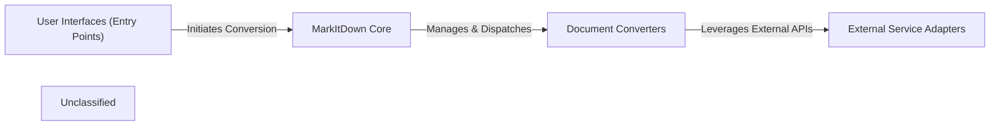

## Details

The MarkItDown project is structured around a core conversion engine that processes various document types into Markdown. User interactions primarily occur through a command-line interface. The central `MarkItDown Core` orchestrates the conversion process, dynamically identifying input types and dispatching tasks to specialized `Document Converters`. These converters handle the specific logic for transforming different formats. For advanced processing, certain `Document Converters` leverage `External Service Adapters` to interact with external APIs like Azure Document Intelligence or Large Language Models, enhancing their conversion capabilities. This modular design allows for easy extension with new document formats and external service integrations.

### User Interfaces (Entry Points)
Provides the primary interfaces for users to interact with the MarkItDown library, primarily through command-line execution.

**Related Classes/Methods**:

### MarkItDown Core [[Expand]](./MarkItDown_Core.md)
The central orchestrator and plugin manager of the MarkItDown library. It initializes the system, manages the discovery and registration of built-in and external converters, identifies input file types, fetches external content, and dispatches conversion tasks to the appropriate Document Converters.

**Related Classes/Methods**:

### Document Converters [[Expand]](./Document_Converters.md)
A collection of specialized modules, each responsible for converting a specific document format (e.g., XLSX, PPTX, EPUB, PDF, HTML, Images, YouTube, RSS) into Markdown. These converters implement the core logic for parsing and transforming various input types.

**Related Classes/Methods**:

### External Service Adapters
Encapsulates the logic for communicating with external APIs and services, such as Azure Document Intelligence or Large Language Models (LLMs), providing a standardized interface for Document Converters to leverage external processing capabilities.

**Related Classes/Methods**:

### Unclassified
Component for all unclassified files and utility functions (Utility functions/External Libraries/Dependencies)

**Related Classes/Methods**: _None_

### [FAQ](https://github.com/CodeBoarding/GeneratedOnBoardings/tree/main?tab=readme-ov-file#faq)